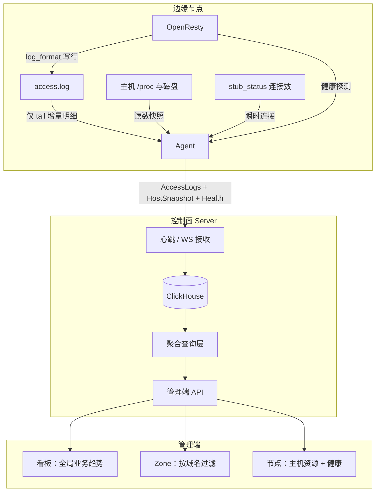

# 边缘可观测与业务流量统计重构设计

你会学到：当前观测链路为何出现「看板 OpenResty 出站」与「Zone 已提供数据」不一致、字段与聚合为何冗余，以及目标架构如何让 **Agent 只上报事实、Server 只解释事实**，业务流量以访问日志为唯一真相源。

---

## 1. 目标

### 1.1 要解决的问题

1. **双真相源**：业务吞吐同时来自访问日志聚合与 OpenResty 观测差分，数值长期对不上。
2. **Agent 越权计算**：边缘预聚合 `TrafficReport`、吞吐累计，控制面再聚合一遍，语义难演进、难对账。
3. **字段语义重叠**：「OpenResty 出站」与「已提供数据」对用户是同一业务问题，系统却用两套字段、两条管道。
4. **瞬时与累计混用**：60 秒窗口计数被当成进程累计做 24h 差分，造成严重偏低。
5. **UI 诱导错误对比**：看板与 Zone 页使用相近「流量/数据」文案，却未声明范围与口径差异。

### 1.2 重构目标

| 目标 | 说明 |
| --- | --- |
| **单一业务真相** | 请求数、已提供数据、UV、状态码分布、Top 域名等 **只** 从访问日志（及其 Server 侧派生汇总）得出 |
| **Agent 只上报事实** | 明细日志 + 机器读数 + 健康瞬时态；**禁止** 业务 UV/TopN/24h 总量等预聚合 |
| **字段收敛** | 一个业务概念对应一个权威字段；机器网卡与业务交付严格分名 |
| **可对账** | 全局「已提供数据」≈ 各 Zone「已提供数据」之和（差仅为未绑定/未知 Host） |
| **可演进** | 改时间窗、TopN、归属规则只改 Server，不升 Agent |

### 1.3 非目标（本设计不覆盖）

* 建成通用日志平台、全量日志长期归档或检索产品。
* 替换 ClickHouse / 取消分析库依赖。
* 改造 Relay / OpenFlared 的主机指标采集（可对齐原则，但不在本轮协议主路径）。
* 实时流式告警引擎、APM 链路追踪（OpenTelemetry 服务端已有，与本业务流量模型正交）。

---

## 2. 范围与约束

### 2.1 产品约束（继承）

* 单租户、全局单激活配置；观测不引入多租户计费隔离。
* ClickHouse 为访问日志与时序观测的强制分析存储。
* Agent 无入向控制、Pull 模型；离线期间本地 OpenResty 继续服务，观测可本地缓冲后补传。

### 2.2 工程约束

* Agent 保持轻量：解析日志行、读 `/proc`、健康检查；不做业务分析。
* 控制面 API 错误仍走统一信封与 `response.Abort*`。
* 访问日志字段变更须同时更新 OpenResty `log_format` 与 Agent 解析器，并保证向后兼容至少一个小版本。

---

## 3. 设计原则

### 原则 P1：Agent 上报事实，Server 解释事实

```text
Agent  = 采集 + 可靠投递（原始/近原始）
Server = 入库 + 聚合 + 归属 + 趋势 + 对账
```

**允许的边缘处理（采集）**

* 将 JSON access.log 行解析为结构化字段
* path 长度上限、丢弃非法行、跳过观测端口自身请求
* 读取网卡/CPU/内存等计数器 **原值**
* 批量、压缩、离线缓冲与重试

**禁止的边缘处理（业务计算）**

* UV / Top 域名 / 状态码直方图 / 窗口 request_count 作为权威指标
* 为看板单独维护「业务入出站累计」
* Zone / 域名归属统计、国家分布（国家可在 Server 入库时解析）

### 原则 P2：业务流量唯一真相 = 访问日志

| 业务问题 | 唯一答案 |
| --- | --- |
| 提供了多少数据 | `sum(bytes_sent)` |
| 多少请求 | `count()` |
| 多少独立访客 | `uniqExact(remote_addr)`（或产品约定哈希） |
| 状态码 / Top 域名 | 对日志 `group by` |

### 原则 P3：三层指标互不混用

| 层 | 名称 | 用途 | 典型字段 |
| --- | --- | --- | --- |
| L1 业务交付 | Business Traffic | 用户与 Zone 对账、看板业务趋势 | access log |
| L2 边缘健康 | Edge Health | OpenResty 是否活着、当前连接 | status、connections |
| L3 宿主机资源 | Host Capacity | 容量规划、机器是否打满 | CPU、内存、磁盘、**网卡** |

禁止将 L3 网卡或 L2 瞬时计数命名为「已提供数据」；禁止将 L1 与 L3 画在同一摘要卡片上却不标注语义。

### 原则 P4：一个业务概念一个字段

* **已提供数据** ≡ 响应体交付量 ≡ 历史文案中的「OpenResty 出站（业务含义）」→ **只保留 `bytes_sent` 聚合**
* **接收数据**（可选）≡ 请求侧体量 → 日志 `request_length` 聚合
* **宿主机出站** ≡ `network_tx` 差分，文案必须含「宿主机/网卡」

---

## 4. 现状问题（基线）

### 4.1 当前数据流（冗余）

```text
一次 HTTP 请求
  │
  ├─ access.log 一行
  │     → Agent tail → AccessLogs[]
  │     → CH of_node_access_logs
  │     → Zone「已提供数据」✅
  │
  ├─ Lua shared dict 窗口/累计计数
  │     → /openflare/observability
  │     → TrafficReport + OpenrestyObservation(rx/tx)
  │     → CH request_reports / obs_openresty
  │     → 看板「OpenResty 入/出站」❌ 易与 Zone 不一致
  │
  ├─ access.log 二次汇总（观测 endpoint 失败时回退）
  │     → 又一份 TrafficReport / 吞吐
  │
  └─ 宿主机 network_rx/tx
        → Snapshot → 网络趋势中的「主机」曲线
```

### 4.2 字段重叠

| 用户感知 | 系统字段 A | 系统字段 B | 问题 |
| --- | --- | --- | --- |
| 出站 / 已提供 | `openresty_tx_bytes` | `bytes_sent` | 业务语义重复 |
| 入站 | `openresty_rx_bytes` | `request_length`（日志） | 业务语义重复 |
| 请求数 | `TrafficReport.request_count` | `count(access_logs)` | 聚合重复且窗口易重计 |
| 出站（机器） | `network_tx_bytes` | （无业务对应） | 应单独命名，勿与业务对账 |

### 4.3 典型故障模式

1. 窗口计数被当累计差分 → 24h 业务吞吐严重偏低。  
2. 小时 rollup `max−min` 对重置型计数失效。  
3. Zone 用日志、看板用观测 → 用户认为系统算错。  
4. 改口径需同步改 Lua、Agent 状态累计、Server 差分、前端文案。

---

## 5. 目标架构

### 5.1 目标数据流



### 5.2 职责矩阵

| 能力 | Agent | Server | 前端 |
| --- | --- | --- | --- |
| 写 access.log | OpenResty | — | — |
| 读并上报明细 | ✅ | 入库 | — |
| sum/count/uniq/TopN | ❌ | ✅ | 展示 |
| Zone 域名过滤 | ❌ | ✅ | 选择 Zone |
| 主机 CPU/内存/网卡 | 读原值上报 | 差分/平均 | 节点/看板资源区 |
| OpenResty 连接数 | 读瞬时上报 | 最近值 | 节点健康 |
| 业务 24h 入出站 | ❌ | 日志聚合 | 统一称「已提供/接收数据」 |

---

## 6. 指标与字段模型

### 6.1 权威字段表（目标）

#### L1 业务交付（来自访问日志）

| 概念 | 存储字段 | 聚合 | 展示名 |
| --- | --- | --- | --- |
| 请求时间 | `logged_at` | 时间窗过滤 | — |
| 节点 | `node_id` | group | — |
| 客户端 IP | `remote_addr` | `uniq` → UV | 唯一访问者 |
| Host | `host` | group / Zone 映射 | 域名 |
| 路径 | `path` | 可选 | — |
| 状态码 | `status_code` | group | 状态码分布 |
| **已提供数据** | **`bytes_sent`** | **`sum`** | **已提供数据** |
| **接收数据** | **`request_length`** | **`sum`** | **接收数据**（可选展示） |
| 地区 | `region`（Server 解析写入） | group | 来源地区 |

> 说明：OpenResty `log_format` 中 JSON 键名可继续叫 `bytes_sent`，值必须来自 **`$body_bytes_sent`**（与现网一致），表示响应体交付量，即「已提供数据」。

#### L2 边缘健康（瞬时，不做 24h 业务总量）

| 概念 | 字段 | 说明 |
| --- | --- | --- |
| OpenResty 健康 | `openresty_status` / message | 已有 |
| 当前连接 | `openresty_connections` | stub_status |
| （可选）近窗 QPS 粗估 | 仅节点详情「此刻」，**不得**作为 24h 总量权威 | 若实现须标明「瞬时」 |

#### L3 宿主机资源

| 概念 | 字段 | 展示名 |
| --- | --- | --- |
| CPU / 内存 / 磁盘占用 | 现有 snapshot | 保持 |
| 网卡累计字节 | `network_rx_bytes` / `network_tx_bytes` | **宿主机网卡入/出站** |
| 磁盘 IO 累计 | `disk_read_bytes` / `disk_write_bytes` | 磁盘读/写 |

### 6.2 废弃或降级字段

| 现字段 | 处置 | 原因 |
| --- | --- | --- |
| `openresty_tx_bytes` | **废弃业务用途**；迁移期可读但 UI 不再展示为业务出站 | 与 `bytes_sent` 重复 |
| `openresty_rx_bytes` | **废弃业务用途**；由 `request_length` 聚合替代 | 与日志重复 |
| `TrafficReport` 全量 | **废弃权威地位**；迁移期可停写或仅兼容旧 Agent | 边缘预聚合 |
| `TrafficReport.top_domains` / `status_codes` / `unique_visitor_count` | 改由 Server 查日志 | 同上 |
| Agent state 内业务 lifetime 累计 | 删除 | 违背 P1 |
| Lua shared dict 业务吞吐/窗口请求计数 | 删除或仅保留本地诊断 | 非投递主路径 |

### 6.3 命名对照（前端文案强制）

| 禁止混用文案 | 正确文案 | 数据来源 |
| --- | --- | --- |
| OpenResty 出站（指业务量） | **已提供数据** | `sum(bytes_sent)` |
| OpenResty 入站（指业务量） | **接收数据** | `sum(request_length)` |
| 网络出站（未说明） | **宿主机网卡出站** | `network_tx` 差分 |
| 已提供数据 vs 出站 两套卡片 | **只保留一套业务卡片** | 日志 |

---

## 7. Agent 设计

### 7.1 心跳载荷（目标协议）

保留并强化：

```text
NodePayload
  identity / version / openresty_status
  profile                  # 主机概况（低频）
  snapshot                 # L3 资源读数（含网卡累计原值）
  openresty_connections    # L2 瞬时（可挂在精简 observation 或 snapshot 扩展）
  access_logs[]            # L1 明细（主路径）
  health_events[]
  buffered_observability[] # 缓冲的是上述事实，不是报表
  waf_ip_group_checksums
```

移除或标记 deprecated（兼容窗口内 Server 忽略写入分析权威路径）：

```text
traffic_report                 # deprecated
openresty_observation.rx/tx    # deprecated（connections 迁出后可删结构）
```

### 7.2 Access log 上报要求

每条明细至少包含：

| 字段 | 必填 | 备注 |
| --- | --- | --- |
| `logged_at_unix` | ✅ | 请求完成时间 |
| `remote_addr` | ✅ | UV |
| `host` | ✅ | Zone 映射 |
| `path` | ✅ | 可截断 |
| `status_code` | ✅ | |
| `bytes_sent` | ✅ | body 字节，已提供数据 |
| `request_length` | ✅（协议补齐） | 接收数据；旧 Agent 可缺省为 0 |

Agent 职责：

1. 按 offset tail `access.log`（截断/轮转时重置 offset，**只上报文件中仍存在的新行**）。  
2. 结构化解析后批量放入心跳 / WS。  
3. 离线写入本地 buffer，连通后按窗口补传。  
4. **不对明细做 sum/count/uniq。**

### 7.3 主机 Snapshot

* 继续上报网卡/磁盘 **累计计数器原值**（非业务预聚合）。  
* Server 侧对累计值做相邻采样非负差分 → 宿主机趋势。  
* 这与「已提供数据」无关，UI 必须分区展示。

### 7.4 OpenResty 本地观测

**收敛后建议：**

* 保留：健康检查、`stub_status` 当前连接。  
* 删除主路径依赖：`log.lua` 中对 request/status/domain/rx/tx 的 shared dict 业务计数，以及 `/openflare/observability` 作为 TrafficReport 来源。  
* 若短期内保留 endpoint 供调试，不得再写入 Server 权威分析表。

### 7.5 与 Agent 设计文档的关系

本设计强化 [Agent 与发布模型](./agent-design.md) 中的「纯粹数据落地」：

* 配置与证书：落地与上报应用状态。  
* 观测：只搬运事实，不搬运业务结论。

---

## 8. Server 设计

### 8.1 入库

| 输入 | 表 | 说明 |
| --- | --- | --- |
| `access_logs[]` | `of_node_access_logs` | 权威业务明细；补齐 `request_length` 列（若尚无） |
| `snapshot` | `of_node_metric_snapshots` | L3；网卡/磁盘累计 |
| 连接数 / 健康 | 现有节点状态或精简 obs 表 | L2 |
| `traffic_report` / openresty rx/tx | **停止作为权威写入** 或兼容期双写但不读 | 迁移后删除写入 |

GeoIP：继续在 Server 入库路径解析 `remote_addr` → `region`，不在 Agent 做。

### 8.2 聚合层（统一）

所有业务趋势与 Zone 统计共用同一查询语义：

```text
过滤：logged_at ∈ [since, until]
可选：node_id / host IN (...)
指标：
  request_count     = count()
  unique_visitors   = uniqExact(remote_addr)
  bytes_provided    = sum(bytes_sent)      -- 已提供数据
  bytes_received    = sum(request_length)  -- 接收数据
  按 hour/bucket 折叠 series
  按 status_code / host / region 分布
```

实现位置：

* Zone：`GET .../zones/:id/stats`（已有，对齐字段命名）  
* 看板：overview 的 traffic / 业务网络趋势 **改为调用同一聚合**（全局、无 host 过滤或 Top 过滤）  
* 节点详情：业务量 = 该 `node_id` 过滤的同一聚合；主机网卡仍走 metric 差分  

### 8.3 派生汇总（可选性能路径）

当明细查询在 24h 全量节点上过重时，允许 **Server 侧** 物化视图：

```text
of_access_log_hourly
  (hour, node_id, host, request_count, bytes_sent, bytes_received, ...)
```

约束：

* 仅由 CH 从 `of_node_access_logs` 派生，**禁止** Agent 直接写该表。  
* Zone / 看板优先读 rollup，缺口回退明细（与现有 metric hourly 策略类似）。

### 8.4 停用的分析路径

| 路径 | 迁移后 |
| --- | --- |
| `BuildNetworkTrendPoints` 对 openresty_rx/tx 差分 | 删除或仅保留 network_* 主机曲线 |
| `of_node_obs_openresty` 吞吐字段 | 停止写入；TTL 过期后删表或缩列 |
| `of_node_request_reports` + traffic hourly | 业务趋势不再依赖；可整表废弃 |
| Dashboard compact 中 openresty_tx 序列 | 改为 bytes_provided 序列 |

---

## 9. API 与前端

### 9.1 语义统一的响应字段

建议在业务统计 API 中统一使用：

```json
{
  "request_count": 0,
  "unique_visitors": 0,
  "bytes_provided": 0,
  "bytes_received": 0,
  "series": [
    {
      "bucket_started_at": "...",
      "request_count": 0,
      "unique_visitors": 0,
      "bytes_provided": 0,
      "bytes_received": 0
    }
  ]
}
```

兼容：旧字段 `bytes_sent` 可在一个版本内作为 `bytes_provided` 的别名返回，文档标注 deprecated。

### 9.2 看板

* **业务区**：请求趋势、已提供数据、接收数据（可选）、状态码、Top 域名、来源地区 —— 全部 L1。  
* **资源区**：CPU/内存、**宿主机网卡**、磁盘 IO —— 全部 L3。  
* **禁止**：在业务区展示「OpenResty 入/出站」作为与 Zone 对账的指标。

「24 小时网络与磁盘趋势」建议拆分或改标题：

* 「24 小时业务流量」→ `bytes_provided` / `bytes_received` / 请求  
* 「24 小时宿主机网络与磁盘」→ `network_*` / `disk_*`

### 9.3 Zone `/websites/:id`

* 保持「已提供的数据总计」等卡片。  
* 数据与看板业务区 **同一聚合函数**，仅 `hosts = zone 域名列表`。  
* 文档与 UI 可注明：全局看板含全部 Host；本页仅本 Zone。

### 9.4 节点详情

* 业务吞吐：该节点 `sum(bytes_sent)` 等。  
* OpenResty：健康 + 当前连接。  
* 网卡：明确「宿主机」。

---

## 10. OpenResty 与日志格式

### 10.1 保持

现有 JSON `log_format` 核心字段：

```text
ts, host, path, remote_addr, status, request_time,
bytes_sent (= $body_bytes_sent), request_length
```

### 10.2 变更

* 不再依赖 log phase 写入业务 shared dict 计数作为控制面输入。  
* 观测端口请求继续不写业务统计（或 access_log off）。

### 10.3 Agent 解析

* 协议 `NodeAccessLog` 增加 `request_length`。  
* 旧日志行缺字段时按 0，不阻断整批。

---

## 11. 兼容与迁移

### 11.1 阶段划分

| 阶段 | 内容 | 结果 |
| --- | --- | --- |
| **M1 读路径切换** | 看板/节点业务趋势改为 access log 聚合；UI 文案改为已提供/接收数据 | 对账立刻成立；旧字段可仍写入 |
| **M2 协议补齐** | AccessLog 上报 `request_length`；Server 入库 | 接收数据可用 |
| **M3 停写预聚合** | Server 忽略/停写 TrafficReport 与 openresty rx/tx 权威路径 | 减负 |
| **M4 Agent 瘦身** | 移除边缘 TrafficReport 构建、Lua 业务计数、lifetime 累计 state | 符合 P1 |
| **M5 清理** | 删除废弃 CH 表/列、API 字段、前端类型 | 无冗余 |

### 11.2 兼容策略

* 旧 Agent 仍发 `TrafficReport`：Server **不用于** 看板业务趋势。  
* 旧 Agent 无 `request_length`：`bytes_received` 为 0 或不展示。  
* 明细缺失时段：业务图为空或仅部分；**不得**回退到 openresty_tx 冒充已提供数据（避免再次双真相）。

### 11.3 数据回填

* 历史「已提供数据」以 access log 为准，无需从 openresty 观测回填。  
* 历史看板 openresty 曲线可保留只读至 TTL，或直接隐藏。

---

## 12. 存储与容量

* 业务趋势依赖明细或 hourly rollup，需关注 `of_node_access_logs` TTL 与采样。  
* 若明细量过大：优先 **Server 侧 rollup**，而不是恢复 Agent 预聚合。  
* 可对 path 高基数场景限制明细 path 长度（已有），聚合默认不按完整 path 做全局 Top。

---

## 13. 验证标准

### 13.1 对账

在仅有单一 Zone 产生流量的环境：

```text
看板「已提供数据」(24h) ≈ Zone「已提供的数据总计」(24h)
误差仅来自时间窗对齐（整点截断）与未计入 Host
```

多 Zone 时：

```text
sum(各 Zone 已提供) + sum(未归属 Host) = 全局已提供
```

### 13.2 回归

* Agent 单测：只解析与 offset，不出现业务 sum 断言为「上报契约」。  
* Server：Zone stats 与 dashboard business traffic 共用聚合测例。  
* 前端：文案快照/测试中不再出现业务含义的「OpenResty 出站」与「已提供数据」双卡片。

### 13.3 性能

* 24h 看板聚合 P95 可接受（必要时 hourly MV）。  
* 心跳 payload 体积：明细批量有上限；超限拆缓冲，不在 Agent 做摘要替代。

---

## 14. 风险与权衡

| 风险 | 缓解 |
| --- | --- |
| 明细量大导致 CH 与心跳变重 | 批量、压缩、采样策略评估；Server rollup；限制单次条数 |
| 短暂丢失日志导致业务量偏低 | 本地 buffer 与轮转处理；监控 access log 采集滞后 |
| 用户仍对比「网卡出站」与「已提供」 | UI 分区与文案强制「宿主机」前缀 |
| 旧 Agent 长期在线 | 兼容期忽略预聚合；文档要求升级 Agent 以获得接收数据 |

**为何不保留 Agent 预聚合作为优化？**

* 省带宽的代价是再次分裂真相、口径漂移、本次问题重演。  
* 优化应落在 Server 派生表与查询，而不是边缘业务计算。

---

## 15. 关键决策摘要

| 决策 | 选择 | 否决方案 |
| --- | --- | --- |
| 业务流量真相 | 访问日志 | OpenResty dict / TrafficReport |
| Agent 角色 | 只上报事实 | 边缘 UV/TopN/吞吐累计 |
| 「出站」与「已提供」 | 合并为已提供数据 | 双字段双管道长期并存 |
| 网卡流量 | 独立 L3，单独文案 | 与业务出站并列对账 |
| 性能 | CH rollup | Agent 预聚合 |
| 迁移 | 先切读路径再瘦身 Agent | 先删明细依赖预聚合 |

---

## 16. 文档与代码映射（落地时）

| 区域 | 主要路径 |
| --- | --- |
| 协议 | `pkg/protocol/agent.go` |
| Agent 采集 | `internal/apps/agent/observability/`、`heartbeat/` |
| OpenResty 日志与 Lua | `pkg/render/openresty/`、`internal/apps/agent/nginx/observability_assets.go` |
| Server 入库 | `internal/apps/openflare/agent/observability.go` |
| 日志聚合 | `internal/repository/analytics/node_access_log*.go`、`internal/apps/openflare/zone/stats.go` |
| 看板 | `internal/apps/openflare/dashboard/`、`internal/apps/openflare/observability/analytics.go` |
| 前端 | `frontend/app/(main)/page.tsx`、`components/dashboard/*`、`websites/.../zone-overview.tsx` |

实现计划见：`docs/plan/20260717-observability-redesign.md`。

**推荐阅读顺序：**

1. **[观测数据传输模型](./observability-transport-model.md)**（最新：传什么、从哪采、频率、示例 JSON）  
2. [Agent 上报协议与观测落库数据模型](./observability-data-model.md)（协议字段与 DDL）

---

## 17. 修订记录

| 日期 | 说明 |
| --- | --- |
| 2026-07-17 | 初稿：针对双真相、Agent 预聚合、字段冗余给出目标架构与迁移阶段 |
| 2026-07-17 | 增补协议/表结构专章链接 `observability-data-model.md` |
