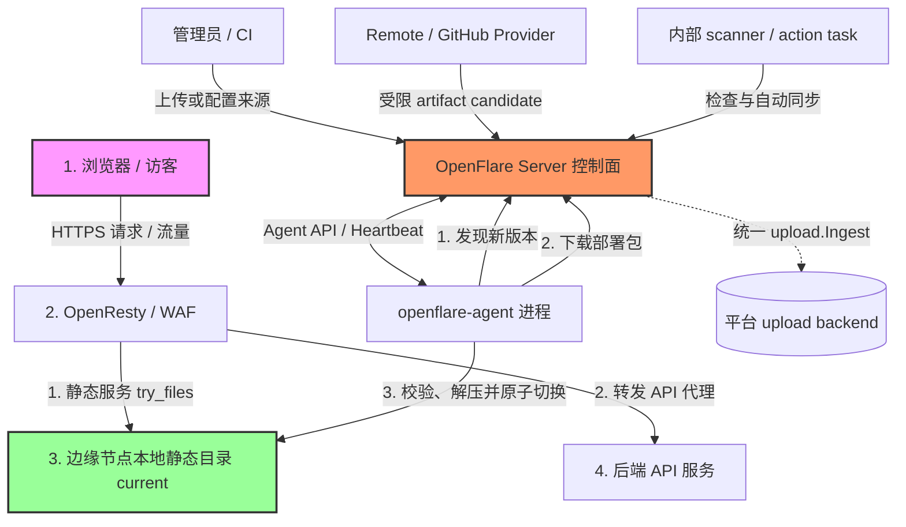

# Pages 静态托管设计文档

你会学到：OpenFlare Pages 静态站点托管的架构设计、不可变部署与安全解压流程、OpenResty 的静态服务与 API 反向代理配置渲染，以及控制面与 Agent 的协同工作流。

---

## 需求分析

在现代 Web 运维中，除了动态应用的反向代理，静态前端站点（如 React、Vue 等构建的单页应用 SPA，或者 Hugo、VitePress 等静态生成器产物）的部署与托管也是极高频的场景。
传统方案中，静态站点的发布通常面临以下痛点：
1. **发布与反代配置脱节**：前端构建产物上传到 Nginx 宿主机后，还需要手动或通过其他脚本修改 Nginx 虚拟主机配置，容易出错且缺乏版本控制。
2. **多节点分发困难**：当控制面管理多台边缘节点时，将静态文件同步分发到所有节点，并确保文件一致性，需要维护复杂的同步脚本（如 rsync 等）。
3. **回滚缺乏一致性**：一旦新前端包发布失败或存在严重缺陷，不仅要恢复静态文件，还要恢复对应的反代规则，很难做到原子回滚。

为了解决这些问题，OpenFlare 引入了受 Cloudflare Pages 启发的 **Pages 静态托管** 功能。该功能将“预构建产物导入”与“网站代理规则配置”纳入同一控制面，依托 OpenFlare 的 pull-based（拉取式）协同架构，以不可变 deployment、单节点原子切换和周期对账实现多 Agent 最终收敛，并支持快速回滚。

---

## 核心功能

Pages 静态托管子系统包含以下核心能力：
* **预构建产物部署**：支持直接上传静态资源压缩包，也可为项目保存一个 Remote URL 或公开 GitHub Release asset 来源。外部来源只由 Server 访问，成功同步后统一创建或复用不可变 deployment 并原子激活。
* **不可变部署快照**：本地上传每次创建新的候选 deployment；持久来源同步按 source identity/revision 创建或复用 deployment 并激活。所有部署都有唯一 ID 和整包 SHA-256，支持按系统配置保留最近 N 个历史版本并随时回滚。
* **检查与自动更新**：GitHub latest 可按项目间隔定时检查；默认只提示可用更新，管理员显式开启后才按检查到的精确 revision 自动同步并发布。
* **SPA Fallback 支持**：支持对单页应用（SPA）进行 Fallback 路由配置，请求找不到静态文件时自动重定向到入口文件。
* **内置 API 反代服务**：支持在 Pages 规则内一键启用 API 代理，消除跨域问题，将请求转发给指定的后端服务。
* **安全包校验与解压缩**：内置路径逃逸防御、防软链接劫持、文件大小/数量上限与可配置上传包体积控制，保障节点物理安全。
* **可配置限额**：管理员可在运维设置中调整「部署包大小上限」与「历史部署保留数」。

### 部署源与未来构建边界

项目当前支持 manual、Remote URL、GitHub Release 三种来源视图。无 source 记录即 manual；切换或删除 source 不删除历史 deployment，也不改变当前 active deployment。Remote URL 只允许手动“同步并发布”；GitHub Release 支持 latest/tag 手动检查与同步，只有 latest 可选择定时检查和自动更新。

source 是可变配置，deployment 是不可变事实。source 配置与运行态游标、状态、租约分别存储；deployment 只保存创建时的安全 provenance 快照。所有产物都复用“下载或接收产物 → 真实字节与入口校验 → `upload.Ingest` → deployment”的 artifact pipeline：manual 上传停在 candidate，等待管理员显式激活；持久来源 sync 才在同一业务事务中 create-or-load 并原子激活。Agent 只消费 active deployment，不感知来源类型。

后续从 Git 仓库拉取源码并自动构建时，将新增独立 `git_repository` provider 与隔离的 build executor。它输出受限的预构建产物后继续复用上述导入管线；不得把 clone、依赖安装或任意构建命令下发给 Agent，也不得把 branch/build/env 字段塞入现有 `github_release` source。当前 V2 不增加这些未来字段或空任务，只稳定 provider 输出、source discriminated view 与 deployment provenance 三个扩展边界。

管理端信息架构参考 Cloudflare Pages 当前把 [Git integration](https://developers.cloudflare.com/pages/configuration/git-integration/) 与 [Direct Upload](https://developers.cloudflare.com/pages/get-started/direct-upload/) 分离、并统一展示生产状态与历史部署的方式：OpenFlare 项目详情按“当前生产部署 → 部署源 → 部署历史”组织。OpenFlare 仍允许切换来源并保留历史部署，不采用 Cloudflare 项目创建后来源不可切换的限制。

---

## Pages 静态托管架构

Pages 静态托管在逻辑上分为 **控制面 (Control Plane)** 与 **数据面 (Data Plane)**。



* **控制面（Control Plane）**：Server 接收本地上传，或通过受限 Provider 获取 Remote/GitHub 预构建产物；action task 与内部 scanner 负责检查、同步和自动更新。所有产物经统一 inspect 与 `upload.Ingest` 写入平台存储后端；manual 上传创建新的 candidate，持久来源 sync 则 create-or-load deployment 并原子激活。配置发布时只编译稳定的项目锚点与静态服务元数据。
* **数据面（Data Plane）**：Agent 在心跳/WS 对账中发现配置引用的 Pages 项目，通过专属 API 拉取该项目当前激活包并执行校验解压缩。OpenResty 在本地提供静态文件服务；Agent 不感知产物来自上传、Remote、GitHub 或未来 build executor。

---

## 数据模型与元数据设计

### 1. 核心数据库实体
* **Pages 项目 (`of_pages_projects`)**：
  * 记录项目的业务名称、Slug 标识（URL 友好型）、启用状态、静态服务根目录（RootDir，可为空）、入口文件名（EntryFile，默认 `index.html`）、SPA Fallback 设置，以及 API 反向代理配置（APIProxyPath, APIProxyPass, APIProxyRewrite）。
* **部署源配置 (`of_pages_project_sources`)**：
  * 每个项目最多一条可变来源配置，使用 `source_type` 区分 Remote URL 与 GitHub Release。`config_version` 用于 fence 旧任务；Remote 完整 URL 只保存在配置表中，不会进入响应、日志、任务 payload 或 deployment provenance。V2 不承诺数据库列加密。
* **部署源运行态 (`of_pages_project_source_runtime`)**：
  * 与 source 1:1 保存 ETag、seen/applied revision、最近检查/同步、下次检查、错误和 lease。状态固定为 `idle | checking | update_available | syncing | failed | attention`，排队/完成状态由 `TaskExecution` 承担。
* **Pages 部署 (`of_pages_deployments`)**：
  * 记录不可变部署事实：项目内递增部署号、整包 SHA-256、`upload_id`、文件数/总字节、创建者，以及可空的 source identity/revision、来源安全快照与 trigger。`artifact_path` 仅为旧数据兼容字段，不再是新部署的存储真相。
* **部署文件清单 (`of_pages_deployment_files`)**：
  * 存储每次部署的完整常规文件路径与实际字节数，供控制台展示与统计。
  * 不再为包内每个文件计算内容哈希；完整性由**整包** SHA-256（`of_pages_deployments.checksum`）保证，Agent 拉取时校验整包 hash。
  * 控制面 inspect 通过文件句柄读取归档，流式消费每个常规文件体并核对声明大小与实际字节，避免将整包 `ReadFile` 进内存，也避免逐文件落盘计算 hash。

### 2. 路由关联与快照
`proxy_routes` 路由规则通过 `upstream_type = "pages"` 及 `pages_project_id` 关联 Pages 项目。当路由类型为 `pages` 且该项目存在已激活的部署时，才允许将该路由加入发布流程。
发布时生成的版本快照中包含 `snapshotPagesDeployment`，主要结构为：
```json
{
  "project_id": 1,
  "project_slug": "my-spa-app",
  "deployment_id": 12,
  "deployment_number": 3,
  "checksum": "a7b3c2...",
  "entry_file": "index.html",
  "spa_fallback_enabled": true,
  "spa_fallback_path": "/index.html",
  "api_proxy_enabled": true,
  "api_proxy_path": "/api",
  "api_proxy_pass": "http://api.internal:8000",
  "api_proxy_rewrite": "/api/(.*) /$1",
  "local_root": "__OPENFLARE_PAGES_DIR__/projects/1/current"
}
```

### 3. 与主配置版本的双轨关系（项目锚点 + latest 拉取）
* **主配置版本**与 **Pages 部署** 是两套独立的版本体系。
* 主配置中 Pages 路由的稳定锚点是 **`pages_project_id`（项目 ID）**，不是某次部署 ID。
* OpenResty `root` 使用项目级路径：`__OPENFLARE_PAGES_DIR__/projects/{project_id}/current`，激活切换时路径不变，无需为换包而重发主配置。
* Agent 按项目请求「最新激活包」（类似 `github/release/latest`）：
  * `GET /api/v1/agent/pages/projects/:project_id/latest/hash`
  * `GET /api/v1/agent/pages/projects/:project_id/latest/package`
  * 控制面根据该项目**当前激活部署**返回 deployment ID、哈希、包大小与展开清单元数据。Agent 用 deployment ID 与其它 latest 元数据识别下载期间的指针竞态，但主配置和本地目录的稳定锚点仍是 project ID。
* 因此：在项目内切换激活部署后，**不必发布主配置**；Agent 在周期性对账时轮询 latest hash，发现变化即下载并切换 `current`。
* 快照中的 `pages_deployment` 字段仍可记录发布时元数据（入口文件、SPA/API 代理等），但不作为 Agent 拉包的版本锁定。

---

## Server 端 (控制面) 职责与生命周期

### 1. 部署包安全校验与分析
为了避免不可信产物攻击服务器，控制面对本地上传和所有外部来源执行同一套严格校验：
* **格式支持**：`zip`、`tar.gz` / `tgz`、`tar.xz` / `txz`、`tar.bz2` / `tbz2`、`tar`、`7z`。
* **大小限制**：压缩包体积由系统配置 `pages_max_package_size_mb` 控制（默认 100 MiB，范围 1～2048）；展开后的单文件与总体积上限为「包大小 × 4」且不低于 100 MiB。inspect 始终流式读取常规文件体，核对声明大小与实际字节并按实际值执行上限。
* **数量限制**：压缩包中包含的静态文件总数不得超过 1,000 个。
* **软链接阻断**：遍历归档文件，一旦检测到任何软链接，立即抛出错误并拒绝上传，防御软链接劫持攻击。
* **路径逃逸防御**：对每个压缩文件路径进行 `Clean` 并检查是否包含 `..` 或以 `/` 开头，防御目录跨越漏洞，防止写入系统敏感路径。
* **入口文件校验**：项目指定的入口文件（例如 `index.html`，可在 `project.RootDir` 下）必须在部署包中存在，否则拒绝上传。
* **公共根目录去噪**：许多打包工具会包含一个多余的主文件夹作为公共根前缀。控制面自动探测公共根前缀并将其安全剥离。
* **整包完整性**：上传/导入时对压缩包字节计算一次 SHA-256，写入部署记录；Agent 拉包后按整包 hash 对账。包内单文件不做内容哈希。
* **实际体积复核**：`InspectOptions.VerifySizes` 只保留兼容意义；当前 inspect 无论该值为何都会读取常规文件体、核对声明值并累计实际大小，但仍不为单文件计算内容 hash。
* **历史保留**：系统配置 `pages_max_history_count`（默认 20，0 表示不限制）在部署成功后执行裁剪。通常语义为：**每个项目最多保留 N 条部署**；当前激活部署始终保留，其余名额按部署 ID 从新到旧填充。`history_count=1` 时，manual 上传会临时保留 active 与最新 candidate 两条，下一次上传替换旧 candidate；candidate 激活后恢复严格上限。超出的非激活 deployment 与文件清单会删除，对应 upload record 通过平台原语幂等软删除；Pages 不直接物理删除可能被 dedup 共享的 blob。部署已成功时裁剪失败只记日志、不回滚激活；并发操作下可能短暂超过 N，后续裁剪会收敛回 N。主配置版本回滚不依赖旧 Pages 包（见上节双轨关系）。

### 2. 部署包存储规划
控制面通过统一上传框架（`upload.Ingest`）把本地、Remote 和 GitHub 产物存入配置的本地/S3 后端，并在数据库中记录 `upload_id` 与文件清单。**大体积静态包不写入 config_versions 记录和任何配置推送通道**，以保障控制面数据同步的轻量与高效。

### 3. 来源检查、自动更新与上传补偿

* `openflare:pages_source_action` 执行管理员 check/sync 或 scanner 派发的精确 revision sync；payload 不携带 URL、Token、ETag 或 lease token。手动 sync 只接受真实用户 actor，自动 sync 只接受系统 actor 与 `scheduled_auto_update` trigger。
* `openflare:pages_source_scan` 是固定 `*/5 * * * *` 的 internal-only TaskHandler，只接受 `{}`，不会出现在通用任务类型与排程管理界面。每轮按“恢复过期 lease → 补偿 orphan upload → 扫描到期来源”执行。
* scanner 按 `next_check_at, source_id` 稳定排序，每批最多串行检查 20 个 GitHub latest source；ETag/304 仍推进检查时间，403/429 记录状态码和实际退避截止时间，单来源失败不阻塞后续来源。
* 发现更新总会先保存 seen cursor。只有 `auto_update_enabled=true` 且状态为普通 `update_available` 时，才携带本次检查得到的精确 revision 派发同步；`attention`、Remote 和固定 tag 不会自动发布。人工激活其它 deployment 会 fence 在途任务并关闭 auto。
* orphan 补偿每轮最多检查 100 条至少隔离 2 小时的 upload record，并要求 system owner、Pages 保留 type、V2 marker、无 deployment 引用。候选在 `project → source → runtime → upload` 锁序内复查，只通过上传框架软删除 record 和更新统计，不直接物理删除可能被 dedup 共享的 blob。

---

## Agent 端 (数据落地) 职责与自愈

Agent 运行在各边缘代理节点上：首次应用引用 Pages 项目的配置时，以及后续周期性 latest 对账时，都会把当前激活的静态资源“原子”地拉取到节点本地。

### 1. 按项目拉取 latest
1. Agent 从激活主配置中解析 `UpstreamType == "pages"` 的路由，收集稳定锚点 **`pages_project_id`**。
2. 对每个项目调用 `GET /api/v1/agent/pages/projects/:project_id/latest/hash` 获取控制面当前激活包哈希（类似 latest 指针）。
3. 若本地 `projects/{project_id}/releases/{hash}` 尚未就绪，再把 `.../latest/package` 流式下载到临时文件，执行真实响应上限与 SHA-256；下载后 **再次请求 hash**，避免激活切换造成的竞态，不一致则有限次重试。
4. 请求头携带节点 `X-Agent-Token`。

### 2. 安全解压缩、原子切换与只保留最新
1. 包体绝对上限为 2 GiB；下载内容的 SHA-256 须与「下载后再次查询」的 latest hash 一致，整个包不会进入 `[]byte`。
2. 解压至 `projects/{project_id}/releases/.{hash}-<random>.tmp` 随机 staging 目录（支持 zip / tar.* / 7z），拒绝路径逃逸、链接和特殊文件。Agent 同时服从 Server metadata 上限与本地绝对上限：最多 1,000 个文件，单文件及总量最多 8 GiB。
3. 解压完成后遍历实际文件树，精确复核文件数与总字节是否等于 Server metadata；不一致时拒绝切换。
4. 写入 `.openflare-pages.json` 后 rename 为 `releases/{hash}`。
5. **原子切换** `projects/{project_id}/current` 指向新 release（优先 symlink，失败则拷贝）。
6. **仅当新包已就绪且 current 切换成功后**，删除该项目下其它 `releases/*`（含 `.tmp`），**不保留历史部署包**。边缘节点每个项目永远只保留一份最新内容。
7. 多项目对账时 **隔离失败**：单个项目失败记日志并继续其它项目，最后汇总返回错误。

---

## OpenResty (静态服务与代理) 配置渲染

对于 Pages 托管站点，控制面自动渲染对应的 `server` 块，取代常规代理路由中的 `proxy_pass`。

### 1. 静态服务指令渲染
* **`root` 与 `index`**：
  Server 将 `root` 指向项目级占位路径 `__OPENFLARE_PAGES_DIR__/projects/{project_id}/current`（可再追加 `RootDir`）。激活切换只换目录内容，路径不变，无需为换包重发主配置。
  ```nginx
  server {
      listen 80;
      server_name myapp.example.com;
      
      root "/var/lib/openflare/pages/projects/3/current";
      index "index.html";
      ...
  }
  ```

### 2. try_files 与 SPA Fallback 机制
* **禁用 SPA Fallback (默认)**：
  仅匹配物理存在的文件，否则返回 strict 404：
  ```nginx
  location / {
      try_files $uri $uri/ =404;
  }
  ```
* **启用 SPA Fallback**：
  若请求的文件不存在，重定向到项目配置的入口 Fallback 文件（通常为 `/index.html`）：
  ```nginx
  location / {
      try_files $uri $uri/ /index.html;
  }
  ```

### 3. API 反向代理与重写 (Rewrite) 渲染
当静态前端项目需要请求后端 API 且不希望面临跨域问题时，可开启 API 反代。OpenResty 渲染器会自动在其对应的静态 `server` 块内嵌套专属的 API `location` 分支：
```nginx
server {
    listen 80;
    server_name myapp.example.com;
    ...
    # API 代理路径匹配
    location /api {
        # 如果配置了 Rewrite 规则，应用重写逻辑
        rewrite ^/api/(.*)$ /v1/$1 break;
        rewrite ^/api$ / break;

        proxy_pass http://api.internal:8000;
        proxy_http_version 1.1;
        proxy_set_header Host $http_host;
        proxy_set_header X-Real-IP $remote_addr;
        proxy_set_header X-Forwarded-For $proxy_add_x_forwarded_for;
        proxy_set_header X-Forwarded-Proto $scheme;
        proxy_set_header Upgrade $http_upgrade;
        proxy_set_header Connection $connection_upgrade;
    }

    location / {
        try_files $uri $uri/ /index.html;
    }
}
```

---

## 交互逻辑与同步流程

一次完整的预构建产物导入与生效生命周期如下。首次绑定项目需要发布主配置；后续 active deployment 变化通过项目 latest 独立收敛：

```text
  [管理员 / scanner]       [Server 控制面]             [Agent]                  [OpenResty]
          |                       |                         |                           |
          |-- manual 上传 ------>|-- inspect / Ingest ---->|                           |
          |                       |-- 创建 candidate        |                           |
          |-- 显式激活 candidate ->|-- 切换 active           |                           |
          |                       |                         |                           |
          |-- source sync ------>|-- inspect / Ingest      |                           |
          |                       |-- create/load + 原子激活 |                           |
          |                       |                         |                           |
          |-- 首次绑定项目并发布 ->|-- 广播项目锚点 -------->|-- 写入/重载路由 ---------->|
          |                       |                         |                           |
          |-- 后续激活/同步/回滚 ->|-- active latest 改变 ---|                           |
          |                       |<-- latest 元数据对账 ----|                           |
          |                       |--- 流式返回 package ---->|                           |
          |                       |                         |-- 校验、解压、复核 --------|
          |                       |                         |-- 原子切换 current -------->|
```
