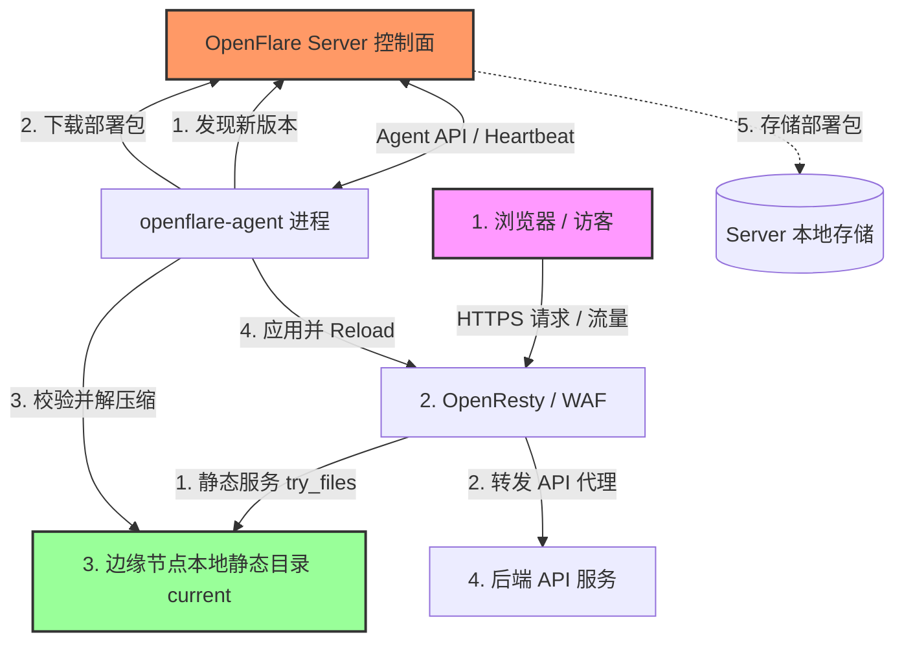

# Pages 静态托管设计文档

你会学到：OpenFlare Pages 静态站点托管的架构设计、不可变部署与安全解压流程、OpenResty 的静态服务与 API 反向代理配置渲染，以及控制面与 Agent 的协同工作流。

---

## 需求分析

在现代 Web 运维中，除了动态应用的反向代理，静态前端站点（如 React、Vue 等构建的单页应用 SPA，或者 Hugo、VitePress 等静态生成器产物）的部署与托管也是极高频的场景。
传统方案中，静态站点的发布通常面临以下痛点：
1. **发布与反代配置脱节**：前端构建产物上传到 Nginx 宿主机后，还需要手动或通过其他脚本修改 Nginx 虚拟主机配置，容易出错且缺乏版本控制。
2. **多节点分发困难**：当控制面管理多台边缘节点时，将静态文件同步分发到所有节点，并确保文件一致性，需要维护复杂的同步脚本（如 rsync 等）。
3. **回滚缺乏一致性**：一旦新前端包发布失败或存在严重缺陷，不仅要恢复静态文件，还要恢复对应的反代规则，很难做到原子回滚。

为了解决这些问题，OpenFlare 引入了受 Cloudflare Pages 启发的 **Pages 静态托管** 功能。该功能将“前端部署包上传”与“网站代理规则配置”合二为一，依托 OpenFlare 的 pull-based（拉取式）协同架构，实现静态文件分发与反代配置发布的强一致性、不可变性与一键秒级回滚。

---

## 核心功能

Pages 静态托管子系统包含以下核心能力：
* **Direct Upload 部署模式**：支持直接上传预构建的静态资源压缩包（`zip`、`tar.gz`、`tar.xz`、`tar.bz2`、`tar`、`7z`），或填写 URL 由控制面代为下载导入（允许内网地址与自签证书），省去复杂的 Git 集成和构建环境依赖。
* **不可变部署快照**：每次上传产生一个带唯一 ID 和 SHA-256 Checksum 的不可变部署记录。支持按系统配置保留最近 N 个历史部署，并可随时激活和回滚。
* **SPA Fallback 支持**：支持对单页应用（SPA）进行 Fallback 路由配置，请求找不到静态文件时自动重定向到入口文件。
* **内置 API 反代服务**：支持在 Pages 规则内一键启用 API 代理，消除跨域问题，将请求转发给指定的后端服务。
* **安全包校验与解压缩**：内置路径逃逸防御、防软链接劫持、文件大小/数量上限与可配置上传包体积控制，保障节点物理安全。
* **可配置限额**：管理员可在运维设置中调整「部署包大小上限」与「历史部署保留数」。

---

## Pages 静态托管架构

Pages 静态托管在逻辑上分为 **控制面 (Control Plane)** 与 **数据面 (Data Plane)**。



* **控制面（Control Plane）**：Server 接收前端上传的部署包，并将包存储于本地磁盘，元数据写入数据库。配置发布时，编译出带有 `pages_deployment` 详情的不可变全局版本快照。
* **数据面（Data Plane）**：Agent 在心跳同步中发现版本更新并引用了 Pages 部署，通过专属 API 下载对应的部署包并执行校验解压缩。OpenResty 拦截域名请求，在本地提供静态文件服务。

---

## 数据模型与元数据设计

### 1. 核心数据库实体
* **Pages 项目 (`pages_projects`)**：
  * 记录项目的业务名称、Slug 标识（URL 友好型）、启用状态、静态服务根目录（RootDir，可为空）、入口文件名（EntryFile，默认 `index.html`）、SPA Fallback 设置，以及 API 反向代理配置（APIProxyPath, APIProxyPass, APIProxyRewrite）。
* **Pages 部署 (`pages_deployments`)**：
  * 记录单次上传生成的不可变快照。包含：部署号 (DeploymentNumber, 递增序列)、SHA-256 Checksum 校验和、部署状态 (uploaded/active)、部署包的本地存储路径、解压后的文件数与总字节数。
* **部署文件清单 (`pages_deployment_files`)**：
  * 存储每次部署的完整静态文件树路径、文件大小及单个文件哈希。用于审计和后续校验。

### 2. 路由关联与快照
`proxy_routes` 路由规则通过 `upstream_type = "pages"` 及 `pages_project_id` 关联 Pages 项目。当路由类型为 `pages` 且该项目存在已激活的部署时，才允许将该路由加入发布流程。
发布时生成的版本快照中包含 `snapshotPagesDeployment`，主要结构为：
```json
{
  "project_id": 1,
  "project_slug": "my-spa-app",
  "deployment_id": 12,
  "deployment_number": 3,
  "checksum": "a7b3c2...",
  "entry_file": "index.html",
  "spa_fallback_enabled": true,
  "spa_fallback_path": "/index.html",
  "api_proxy_enabled": true,
  "api_proxy_path": "/api",
  "api_proxy_pass": "http://api.internal:8000",
  "api_proxy_rewrite": "/api/(.*) /$1",
  "local_root": "__OPENFLARE_PAGES_DIR__/deployments/12/current"
}
```

### 3. 与主配置版本的双轨关系（项目锚点 + latest 拉取）
* **主配置版本**与 **Pages 部署** 是两套独立的版本体系。
* 主配置中 Pages 路由的稳定锚点是 **`pages_project_id`（项目 ID）**，不是某次部署 ID。
* OpenResty `root` 使用项目级路径：`__OPENFLARE_PAGES_DIR__/projects/{project_id}/current`，激活切换时路径不变，无需为换包而重发主配置。
* Agent 按项目请求「最新激活包」（类似 `github/release/latest`）：
  * `GET /api/v1/agent/pages/projects/:project_id/latest/hash`
  * `GET /api/v1/agent/pages/projects/:project_id/latest/package`
  * 控制面根据该项目**当前激活部署**返回哈希与压缩包；Agent 不关心具体 deployment_id。
* 因此：在项目内切换激活部署后，**不必发布主配置**；Agent 在周期性对账时轮询 latest hash，发现变化即下载并切换 `current`。
* 快照中的 `pages_deployment` 字段仍可记录发布时元数据（入口文件、SPA/API 代理等），但不作为 Agent 拉包的版本锁定。

---

## Server 端 (控制面) 职责与生命周期

### 1. 部署包安全校验与分析
为了避免不可信的用户上传恶意压缩包攻击服务器，控制面在 `UploadDeployment` 时执行严格校验：
* **格式支持**：`zip`、`tar.gz` / `tgz`、`tar.xz` / `txz`、`tar.bz2` / `tbz2`、`tar`、`7z`。
* **大小限制**：压缩包体积由系统配置 `pages_max_package_size_mb` 控制（默认 100 MiB，范围 1～2048）；展开后总体积上限为「包大小 × 4」且不低于 100 MiB。
* **数量限制**：压缩包中包含的静态文件总数不得超过 1,000 个。
* **软链接阻断**：遍历归档文件，一旦检测到任何软链接，立即抛出错误并拒绝上传，防御软链接劫持攻击。
* **路径逃逸防御**：对每个压缩文件路径进行 `Clean` 并检查是否包含 `..` 或以 `/` 开头，防御目录跨越漏洞，防止写入系统敏感路径。
* **入口文件校验**：项目指定的入口文件（例如 `index.html`，可在 `project.RootDir` 下）必须在部署包中存在，否则拒绝上传。
* **公共根目录去噪**：许多打包工具会包含一个多余的主文件夹作为公共根前缀。控制面自动探测公共根前缀并将其安全剥离。
* **历史保留**：系统配置 `pages_max_history_count`（默认 20，0 表示不限制）在每次上传成功后执行裁剪。语义为：**每个项目最多保留 N 条部署**；当前激活部署始终保留；其余名额按部署 ID 从新到旧填充；超出的非激活部署连同文件清单与存储对象一并删除。上传已成功时裁剪失败只记日志、不回滚上传；并发上传下可能短暂超过 N，后续上传的裁剪会收敛回 N。主配置版本回滚不依赖旧 Pages 包（见上节双轨关系）。

### 2. 部署包存储规划
控制面通过统一上传框架（`upload.Ingest`）存储原始部署包，并在数据库中记录 `upload_id` 与文件清单。**大体积静态包不写入 config_versions 记录和任何配置推送通道**，以保障控制面数据同步的轻量与高效。

---

## Agent 端 (数据落地) 职责与自愈

Agent 运行在各边缘代理节点上，在应用配置版本前，必须先将 Pages 静态资源“原子”地拉取到节点本地。

### 1. 按项目拉取 latest
1. Agent 从激活主配置中解析 `UpstreamType == "pages"` 的路由，收集稳定锚点 **`pages_project_id`**。
2. 对每个项目调用 `GET /api/v1/agent/pages/projects/:project_id/latest/hash` 获取控制面当前激活包哈希（类似 latest 指针）。
3. 若本地 `projects/{project_id}/releases/{hash}` 尚未就绪，再下载 `.../latest/package`。下载后 **再次请求 hash** 与包内容 SHA-256 对齐，避免激活切换造成的竞态；不一致则有限次重试。
4. 请求头携带节点 `X-Agent-Token`。

### 2. 安全解压缩、原子切换与只保留最新
1. 下载字节计算 SHA-256，须与「下载后再次查询」的 latest hash 一致。
2. 解压至 `projects/{project_id}/releases/{hash}.tmp`（支持 zip / tar.* / 7z）。Agent 信任控制面业务校验，仅做路径逃逸/软链防护。
3. 写入 `.openflare-pages.json` 后 rename 为 `releases/{hash}`。
4. **原子切换** `projects/{project_id}/current` 指向新 release（优先 symlink，失败则拷贝）。
5. **仅当新包已就绪且 current 切换成功后**，删除该项目下其它 `releases/*`（含 `.tmp`），**不保留历史部署包**。边缘节点每个项目永远只保留一份最新内容。
6. 多项目对账时 **隔离失败**：单个项目失败记日志并继续其它项目，最后汇总返回错误。

---

## OpenResty (静态服务与代理) 配置渲染

对于 Pages 托管站点，控制面自动渲染对应的 `server` 块，取代常规代理路由中的 `proxy_pass`。

### 1. 静态服务指令渲染
* **`root` 与 `index`**：
  Server 将 `root` 指向项目级占位路径 `__OPENFLARE_PAGES_DIR__/projects/{project_id}/current`（可再追加 `RootDir`）。激活切换只换目录内容，路径不变，无需为换包重发主配置。
  ```nginx
  server {
      listen 80;
      server_name myapp.example.com;
      
      root "/var/lib/openflare/pages/projects/3/current";
      index "index.html";
      ...
  }
  ```

### 2. try_files 与 SPA Fallback 机制
* **禁用 SPA Fallback (默认)**：
  仅匹配物理存在的文件，否则返回 strict 404：
  ```nginx
  location / {
      try_files $uri $uri/ =404;
  }
  ```
* **启用 SPA Fallback**：
  若请求的文件不存在，重定向到项目配置的入口 Fallback 文件（通常为 `/index.html`）：
  ```nginx
  location / {
      try_files $uri $uri/ /index.html;
  }
  ```

### 3. API 反向代理与重写 (Rewrite) 渲染
当静态前端项目需要请求后端 API 且不希望面临跨域问题时，可开启 API 反代。OpenResty 渲染器会自动在其对应的静态 `server` 块内嵌套专属的 API `location` 分支：
```nginx
server {
    listen 80;
    server_name myapp.example.com;
    ...
    # API 代理路径匹配
    location /api {
        # 如果配置了 Rewrite 规则，应用重写逻辑
        rewrite ^/api/(.*)$ /v1/$1 break;
        rewrite ^/api$ / break;

        proxy_pass http://api.internal:8000;
        proxy_http_version 1.1;
        proxy_set_header Host $http_host;
        proxy_set_header X-Real-IP $remote_addr;
        proxy_set_header X-Forwarded-For $proxy_add_x_forwarded_for;
        proxy_set_header X-Forwarded-Proto $scheme;
        proxy_set_header Upgrade $http_upgrade;
        proxy_set_header Connection $connection_upgrade;
    }

    location / {
        try_files $uri $uri/ /index.html;
    }
}
```

---

## 交互逻辑与同步流程

一次完整的 Pages 上传与全局生效的生命周期如下：

```text
  [ 前端管理员 ]          [ Server (控制面) ]           [ Agent (数据落地) ]         [ OpenResty ]
       |                         |                           |                          |
       |--- 1. 上传 ZIP 包 ----->|                           |                          |
       |                         |--- 2. 安全校验与解压分析 ----|                          |
       |                         |--- 3. 归档包与持久化清单 ---|                          |
       |                         |                           |                          |
       |--- 4. 绑定路由并发布 -->|                           |                          |
       |                         |--- 5. 生成新配置版本并广播 ->|                          |
       |                         |                           |                          |
       |                         |                           |--- 6. 下载 ZIP 部署包 -->|
       |                         |                           |<-- 7. 返回文件数据 -------|
       |                         |                           |                          |
       |                         |                           |--- 8. 强一致性 Checksum -|
       |                         |                           |--- 9. 安全解压缩 -------|
       |                         |                           |--- 10. 原子切换 current -|
       |                         |                           |--- 11. 测试与重载配置 ---->|
       |                         |                           |<-- 12. 重载成功 ---------|
       |                         |<-- 13. 上报 Apply Success |                          |
       |                         |                           |                          |
```
