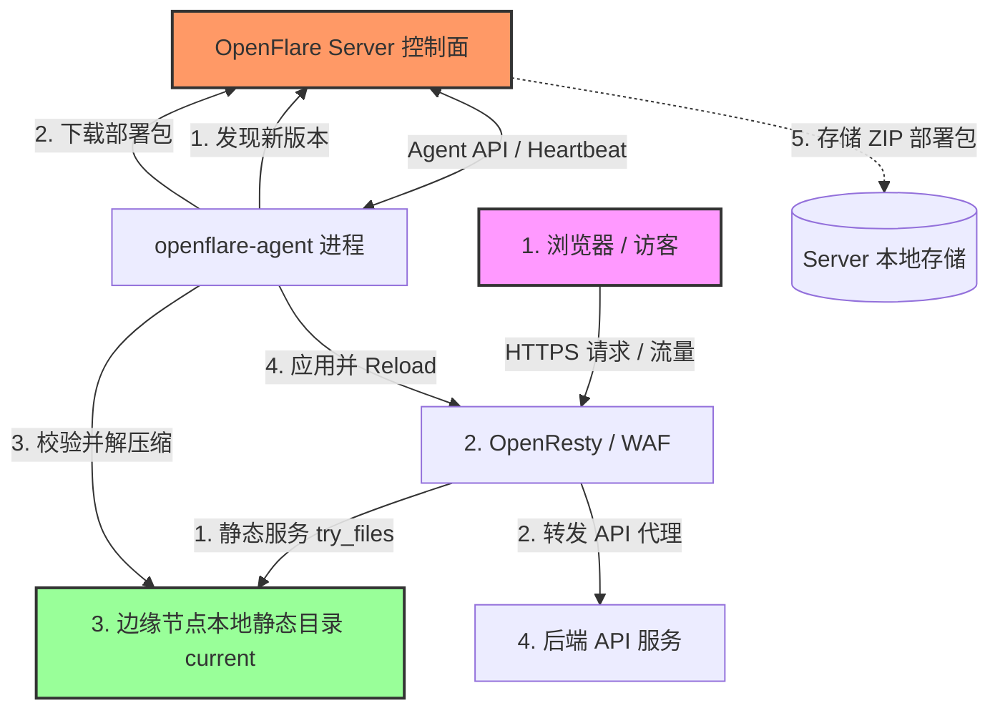

# Pages 静态托管设计文档

你会学到：OpenFlare Pages 静态站点托管的架构设计、不可变部署与安全解压流程、OpenResty 的静态服务与 API 反向代理配置渲染，以及控制面与 Agent 的协同工作流。

---

## 需求分析

在现代 Web 运维中，除了动态应用的反向代理，静态前端站点（如 React、Vue 等构建的单页应用 SPA，或者 Hugo、VitePress 等静态生成器产物）的部署与托管也是极高频的场景。
传统方案中，静态站点的发布通常面临以下痛点：
1. **发布与反代配置脱节**：前端构建产物上传到 Nginx 宿主机后，还需要手动或通过其他脚本修改 Nginx 虚拟主机配置，容易出错且缺乏版本控制。
2. **多节点分发困难**：当控制面管理多台边缘节点时，将静态文件同步分发到所有节点，并确保文件一致性，需要维护复杂的同步脚本（如 rsync 等）。
3. **回滚缺乏一致性**：一旦新前端包发布失败或存在严重缺陷，不仅要恢复静态文件，还要恢复对应的反代规则，很难做到原子回滚。

为了解决这些问题，OpenFlare 引入了受 Cloudflare Pages 启发的 **Pages 静态托管** 功能。该功能将“前端部署包上传”与“网站代理规则配置”合二为一，依托 OpenFlare 的 pull-based（拉取式）协同架构，实现静态文件分发与反代配置发布的强一致性、不可变性与一键秒级回滚。

---

## 核心功能

Pages 静态托管子系统包含以下核心能力：
* **Direct Upload 部署模式**：支持直接上传预构建的 `.zip` 静态资源包，省去复杂的 Git 集成和构建环境依赖。
* **不可变部署快照**：每次上传产生一个带唯一 ID 和 SHA-256 Checksum 的不可变部署记录。历史包永久保留，支持随时激活和回滚。
* **SPA Fallback 支持**：支持对单页应用（SPA）进行 Fallback 路由配置，请求找不到静态文件时自动重定向到入口文件。
* **内置 API 反代服务**：支持在 Pages 规则内一键启用 API 代理，消除跨域问题，将请求转发给指定的后端服务。
* **安全包校验与解压缩**：内置 Zip-Slip 路径逃逸防御、防软链接劫持、文件大小/数量硬上限控制，保障节点物理安全。

---

## Pages 静态托管架构

Pages 静态托管在逻辑上分为 **控制面 (Control Plane)** 与 **数据面 (Data Plane)**。



* **控制面（Control Plane）**：Server 接收前端上传的部署包，并将包存储于本地磁盘，元数据写入数据库。配置发布时，编译出带有 `pages_deployment` 详情的不可变全局版本快照。
* **数据面（Data Plane）**：Agent 在心跳同步中发现版本更新并引用了 Pages 部署，通过专属 API 下载对应的部署包并执行校验解压缩。OpenResty 拦截域名请求，在本地提供静态文件服务。

---

## 数据模型与元数据设计

### 1. 核心数据库实体
* **Pages 项目 (`pages_projects`)**：
  * 记录项目的业务名称、Slug 标识（URL 友好型）、启用状态、静态服务根目录（RootDir，可为空）、入口文件名（EntryFile，默认 `index.html`）、SPA Fallback 设置，以及 API 反向代理配置（APIProxyPath, APIProxyPass, APIProxyRewrite）。
* **Pages 部署 (`pages_deployments`)**：
  * 记录单次上传生成的不可变快照。包含：部署号 (DeploymentNumber, 递增序列)、SHA-256 Checksum 校验和、部署状态 (uploaded/active)、部署包的本地存储路径、解压后的文件数与总字节数。
* **部署文件清单 (`pages_deployment_files`)**：
  * 存储每次部署的完整静态文件树路径、文件大小及单个文件哈希。用于审计和后续校验。

### 2. 路由关联与快照
`proxy_routes` 路由规则通过 `upstream_type = "pages"` 及 `pages_project_id` 关联 Pages 项目。当路由类型为 `pages` 且该项目存在已激活的部署时，才允许将该路由加入发布流程。
发布时生成的版本快照中包含 `snapshotPagesDeployment`，主要结构为：
```json
{
  "project_id": 1,
  "project_slug": "my-spa-app",
  "deployment_id": 12,
  "deployment_number": 3,
  "checksum": "a7b3c2...",
  "entry_file": "index.html",
  "spa_fallback_enabled": true,
  "spa_fallback_path": "/index.html",
  "api_proxy_enabled": true,
  "api_proxy_path": "/api",
  "api_proxy_pass": "http://api.internal:8000",
  "api_proxy_rewrite": "/api/(.*) /$1",
  "local_root": "__OPENFLARE_PAGES_DIR__/deployments/12/current"
}
```

---

## Server 端 (控制面) 职责与生命周期

### 1. ZIP 包安全校验与分析
为了避免不可信的用户上传恶意压缩包攻击服务器，控制面在 `UploadPagesDeployment` 时执行严格的流式校验：
* **大小限制**：ZIP 压缩包不得超过 25 MiB（保守的 V1 默认值），且展开后的解压总体积不得超过 100 MiB。
* **数量限制**：压缩包中包含的静态文件总数不得超过 1,000 个。
* **软链接阻断**：遍历 ZIP 文件，一旦检测到任何软链接 (`os.ModeSymlink`)，立即抛出错误并拒绝上传，防御软链接劫持攻击。
* **Zip-Slip 防御**：对每个压缩文件路径进行 `Clean` 并检查是否包含 `..` 或以 `/` 开头，防御目录跨越漏洞，防止写入系统敏感路径。
* **入口文件校验**：项目指定的入口文件（例如 `index.html`，可在 `project.RootDir` 下）必须在 ZIP 压缩包中存在，否则拒绝上传。
* **公共根目录去噪**：许多打包工具（如 GitHub 导出的 zip）会包含一个多余的主文件夹作为公共根前缀。控制面自动探测公共根前缀并将其安全剥离。

### 2. 部署包存储规划
控制面仅将 zip 文件存储在本地存储目录 `artifacts/{project_slug}/{checksum}.zip`，并在数据库中记录路径和清单。**大体积静态包不写入 config_versions 记录和任何配置推送通道**，以保障控制面数据同步的轻量与高效。

---

## Agent 端 (数据落地) 职责与自愈

Agent 运行在各边缘代理节点上，在应用配置版本前，必须先将 Pages 静态资源“原子”地拉取到节点本地。

### 1. 校验式增量拉取
1. Agent 解析激活配置中的 `SourceConfigJSON`，检索出所有 `UpstreamType == "pages"` 的路由引用的部署 `DeploymentID` 和 `Checksum`。
2. 检查本地部署目录是否存在正确的版本标记文件 `.openflare-pages.json`，且 `Checksum` 匹配。
3. 若不匹配，通过专属接口 `GET /api/agent/pages/deployments/:id/package` 下载对应的部署包。下载请求头必须携带节点独有的 `X-Agent-Token` 用于 Server 鉴权。

### 2. 安全解压缩与原子切换
为了保证配置应用过程的“无缝”且能在出错时立即回滚：
1. Agent 将下载的部署包数据写入临时目录，并重新计算 SHA-256 Checksum。如果与配置指明的 checksum 不符，立即报错并阻断发布流程。
2. 解压部署包至临时目录 `releases/{checksum}.tmp`。解压时同样执行 Zip-Slip 目录跨越和软链接校验防御。
3. 解压成功后，写入标记文件 `.openflare-pages.json`。
4. 清理 `releases/{checksum}` 目录，将整个临时目录重命名为 `releases/{checksum}`。
5. **原子切换**：建立拷贝当前部署的物理副本到目标位置 `deployments/{deployment_id}/current`。切换前先备份上一版本的 `current`，一旦重载配置失败，Agent 能够快速恢复 `current` 目录并回滚 OpenResty。
6. **定时清理**：每次配置成功应用后，Agent 自动比对本地部署目录，将所有不活跃的（即未被当前激活版本引用的）历史部署包和文件夹进行物理删除，释放磁盘空间。

---

## OpenResty (静态服务与代理) 配置渲染

对于 Pages 托管站点，控制面自动渲染对应的 `server` 块，取代常规代理路由中的 `proxy_pass`。

### 1. 静态服务指令渲染
* **`root` 与 `index`**：
  Server 根据配置将 `root` 指向 Agent 的 Pages 动态目录占位符 `__OPENFLARE_PAGES_DIR__/deployments/{deployment_id}/current`，并在此基础上追加项目的 `RootDir`。`index` 指向设置的入口文件。
  ```nginx
  server {
      listen 80;
      server_name myapp.example.com;
      
      root "/var/lib/openflare/pages/deployments/12/current";
      index "index.html";
      ...
  }
  ```

### 2. try_files 与 SPA Fallback 机制
* **禁用 SPA Fallback (默认)**：
  仅匹配物理存在的文件，否则返回 strict 404：
  ```nginx
  location / {
      try_files $uri $uri/ =404;
  }
  ```
* **启用 SPA Fallback**：
  若请求的文件不存在，重定向到项目配置的入口 Fallback 文件（通常为 `/index.html`）：
  ```nginx
  location / {
      try_files $uri $uri/ /index.html;
  }
  ```

### 3. API 反向代理与重写 (Rewrite) 渲染
当静态前端项目需要请求后端 API 且不希望面临跨域问题时，可开启 API 反代。OpenResty 渲染器会自动在其对应的静态 `server` 块内嵌套专属的 API `location` 分支：
```nginx
server {
    listen 80;
    server_name myapp.example.com;
    ...
    # API 代理路径匹配
    location /api {
        # 如果配置了 Rewrite 规则，应用重写逻辑
        rewrite ^/api/(.*)$ /v1/$1 break;
        rewrite ^/api$ / break;

        proxy_pass http://api.internal:8000;
        proxy_http_version 1.1;
        proxy_set_header Host $http_host;
        proxy_set_header X-Real-IP $remote_addr;
        proxy_set_header X-Forwarded-For $proxy_add_x_forwarded_for;
        proxy_set_header X-Forwarded-Proto $scheme;
        proxy_set_header Upgrade $http_upgrade;
        proxy_set_header Connection $connection_upgrade;
    }

    location / {
        try_files $uri $uri/ /index.html;
    }
}
```

---

## 交互逻辑与同步流程

一次完整的 Pages 上传与全局生效的生命周期如下：

```text
  [ 前端管理员 ]          [ Server (控制面) ]           [ Agent (数据落地) ]         [ OpenResty ]
       |                         |                           |                          |
       |--- 1. 上传 ZIP 包 ----->|                           |                          |
       |                         |--- 2. 安全校验与解压分析 ----|                          |
       |                         |--- 3. 归档包与持久化清单 ---|                          |
       |                         |                           |                          |
       |--- 4. 绑定路由并发布 -->|                           |                          |
       |                         |--- 5. 生成新配置版本并广播 ->|                          |
       |                         |                           |                          |
       |                         |                           |--- 6. 下载 ZIP 部署包 -->|
       |                         |                           |<-- 7. 返回文件数据 -------|
       |                         |                           |                          |
       |                         |                           |--- 8. 强一致性 Checksum -|
       |                         |                           |--- 9. 安全解压缩 -------|
       |                         |                           |--- 10. 原子切换 current -|
       |                         |                           |--- 11. 测试与重载配置 ---->|
       |                         |                           |<-- 12. 重载成功 ---------|
       |                         |<-- 13. 上报 Apply Success |                          |
       |                         |                           |                          |
```
