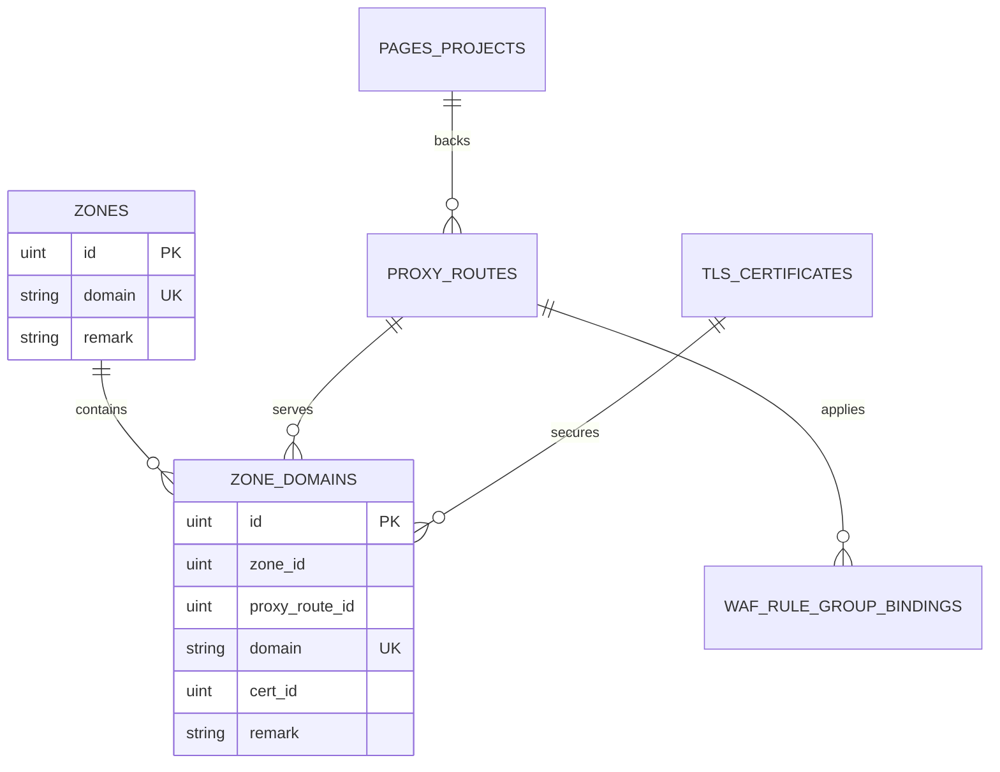

# Zone 与域名资源设计

## 目标

将“网站”重构为以可注册根域为入口的 Zone 管理体验。`arctel.de` 之类的 Zone 是稳定的管理边界；用户通过稳定 ID 路径进入该 Zone，查看并维护其中明确声明的域名、域名所绑定的反代路由和证书，以及路由级 WAF、Pages 等能力。

本设计替代 `managed_domains` 的概念、表与 API。它不引入权威 DNS 解析记录管理。

## 范围与约束

* Zone 根域使用 Public Suffix List 解析，例如 `api.example.co.uk` 归属 `example.co.uk`。
* URL 使用 ID：列表为 `/websites`，详情为 `/websites/:zoneId`；不使用域名作为 URL 参数。
* Zone 域名必须是明确的 FQDN，禁止录入 `*.example.com`。TLS 证书可仍含通配符 SAN，并用于覆盖明确的 Zone 域名。
* 一个 Zone 域名至多关联一条反代路由；一条反代路由可关联多个 Zone 域名，因而可跨 Zone 共享同一套上游、缓存、限流、WAF 与 Pages 配置。
* 不新增 DNS 记录、边缘函数、预览子域或租户隔离能力。

## 核心模型

### `of_zones`

保存根域、备注、创建时间与更新时间。根域全局唯一且创建后不可原地修改；需要变更时新建 Zone 并迁移域名。删除 Zone 前必须先清空其 Zone 域名。

### `of_zone_domains`

保存 `zone_id`、明确 `domain`、可空的 `proxy_route_id`、可空的 `cert_id`、备注及时间戳。`domain` 全局唯一；所有关系字段建立索引但不建立物理外键。`proxy_route_id` 允许为空，以承接已准备证书但尚未配置反代的历史域名。

`of_proxy_routes` 逐步移除 `domain`、`domains`、`cert_id`、`cert_ids` 与 `domain_cert_ids` 等域名/证书冗余列。路由不得再指定任何 TLS 证书；路由名称 `site_name` 成为稳定的人类可读标识，编译器从关联的 Zone 域名读取 `server_name` 与其 `cert_id`。这使每个明确域名的证书只有一个来源。

## 业务与 API

管理端新增 Zone 资源：

* `GET/POST /api/v1/d/zones`
* `GET/POST /api/v1/d/zones/:id/update`
* `POST /api/v1/d/zones/:id/delete`
* `GET/POST /api/v1/d/zones/:id/domains`
* `POST /api/v1/d/zones/:id/domains/:domainID/update`
* `POST /api/v1/d/zones/:id/domains/:domainID/delete`
* `GET /api/v1/d/zones/:id/overview`

反代路由的创建、更新请求改用 `zone_domain_ids`，不再提交 `domains`、`cert_id`、`cert_ids` 或 `domain_cert_ids`。服务端在事务中验证域名归属、全局唯一性和证书 SAN 覆盖；失败通过 `response.Abort*` 统一返回。删除已绑定路由的 Zone 域名必须先解除或删除该路由；删除仍有域名的 Zone 必须拒绝。

WAF、Pages、上游与发布版本仍属于 `proxy_routes`。Zone 概览只聚合展示其域名关联的路由状态，不复制或重新定义这些配置。

## 前端体验

`/websites` 只展示 Zone 根域，显示已配置域名数、路由数与状态，并提供搜索、创建和操作菜单。点击进入 `/websites/:zoneId`。

详情页包含：

* 概览：域名、路由和有效证书统计；域名—路由—证书摘要；路由级 WAF 与 Pages 摘要。
* 域名：明确 FQDN 的列表、证书选择和关联路由；不显示或接受通配符域名。
* 路由：筛选到当前 Zone 的路由并链接到既有路由详情。
* 证书：当前 Zone 域名实际引用的证书。
* 设置：Zone 备注和受保护的删除操作。

新增路由时从 Zone 域名中选择；用户也可以先在 Zone 中登记域名，再绑定路由。全局反代路由入口保留，但改用同一套 Zone 域名选择器。

## 数据迁移

本次改造分两个发布阶段，以免 SQL 用错误的“末两段域名”规则处理多级公共后缀。

1. 使用 PostgreSQL 与 SQLite 同版本 Goose DDL 创建新表、索引；保留旧表和路由冗余列。
2. 通过可显式执行、可重复运行的 Go 数据迁移使用 `publicsuffix.EffectiveTLDPlusOne`：从既有路由域名及 `managed_domains` 创建 Zone 和 Zone 域名，按旧 `domain_cert_ids` 的位置迁移证书到 `zone_domains.cert_id`；旧记录仅在没有路由时生成未绑定 Zone 域名。迁移报告必须列出无法解析或存在冲突的记录并中止，不静默丢弃。
3. 新代码切换到 Zone 模型、完成配置编译与 UI 验证后，再在独立 Goose 迁移中删除 `of_managed_domains` 和旧冗余列。

## 验证

* 单元测试：Public Suffix List 分组、FQDN / 通配符拒绝、跨 Zone 路由、证书 SAN 覆盖、删除保护及迁移幂等性。
* 集成测试：Zone、Zone 域名与路由 API 的成功与失败响应；现有路由迁移后生成相同 OpenResty 域名与证书配置。
* 前端测试：Zone 列表、ID 路由、详情加载 / 错误 / 空状态、域名选择器与 API 负载。
* 手动验证：迁移前后比较激活配置快照中的 `server_name` 和证书路径，发布后使用根域及各子域请求验证路由。
