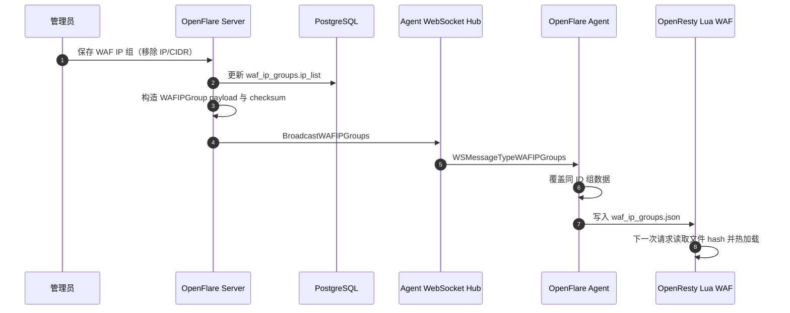
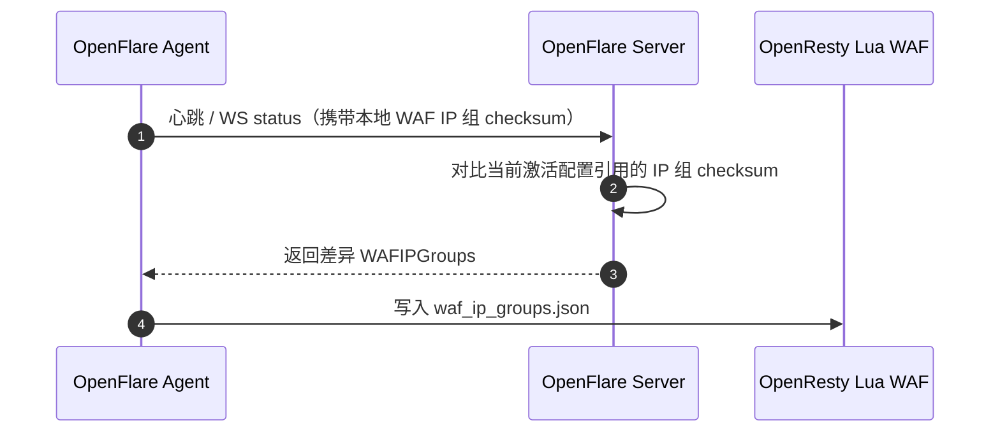

# WAF IP 组保存后节点仍拦截问题修复方案

> **状态**：已实施  
> **分支**：`fix/waf-ip-group-sync`  
> **日期**：2026-06-26  
> **范围**：OpenFlare Server、Agent 同步链路、OpenResty WAF 运行时文件

---

## 1. 目标与背景

### 1.1 问题现象

管理员在 WAF 中创建一条引用黑名单 IP 组的规则后，节点能够按预期拦截黑名单内的 IP 或 CIDR。但当管理员从该黑名单 IP 组中移除部分 IP 段，并发布规则到 CDN / Agent 节点后，被移出的 IP 段仍然可能继续被拦截。

该问题属于安全策略数据面与控制面状态不一致：控制面数据库中的 IP 组成员已经更新，但边缘节点本地 `waf_ip_groups.json` 仍保留旧成员，OpenResty Lua WAF 继续按旧成员判决。

### 1.2 修复目标

本次修复需要满足以下目标：

1. 保存 WAF IP 组后，Server 应立即将更新后的 IP 组成员同步给在线 Agent。
2. IP 组成员变更不应强制触发 OpenResty 主配置 reload，继续保持当前异步热更新设计。
3. 当 WebSocket 推送失败、Agent 重连或本地运行时文件漂移时，心跳与主动同步链路仍能校准 `waf_ip_groups.json`。
4. 新增回归测试覆盖“保存后广播”“节点覆盖旧成员”“no-op 配置路径同步引用 IP 组”等关键路径。

### 1.3 非目标

本方案不做以下变更：

1. 不把 IP 组成员重新内联进 `waf_config.json`。
2. 不让 IP 组成员变化影响主配置 bundle checksum。
3. 不新增数据库字段或迁移。
4. 不新增管理端 API 路由，不改变现有前端保存交互。
5. 不改变 WAF 判决语义、白名单优先级或黑名单匹配规则。

---

## 2. 当前设计与代码证据

### 2.1 WAF 配置采用双文件运行时模型

OpenResty 数据面的 WAF 运行时由两个文件共同决定：

| 文件 | 数据内容 | 更新方式 | 作用 |
| --- | --- | --- | --- |
| `waf_config.json` | WAF 规则组、站点绑定、IP 组引用 ID | 随配置版本发布 | 告诉 WAF 哪些规则引用哪些 IP 组 |
| `waf_ip_groups.json` | IP 组 ID 与具体 IP / CIDR 成员 | 异步差分同步 | 告诉 WAF 每个 IP 组当前有哪些成员 |

代码证据：

| 位置 | 结论 |
| --- | --- |
| `pkg/render/openresty/render.go` | `RenderWAFConfig` 只把 `ip_whitelist_group_ids` / `ip_blacklist_group_ids` 写入 `waf_config.json`，不写入 IP 组成员。 |
| `pkg/render/openresty/render.go` | `ChecksumBundle` 会排除 `openresty_config.json` 源快照，并基于主配置、路由配置、支持文件计算 checksum。由于 `waf_config.json` 不包含 IP 组成员，仅修改 IP 组成员不会改变 OpenResty 主配置 checksum。 |
| `internal/apps/agent/nginx/waf_assets.go` | Lua WAF 会读取 `waf_ip_groups.json`，按文件内容 hash 缓存并热加载 IP 组成员。 |
| `internal/apps/agent/nginx/manager.go` | Agent 收到 IP 组增量后，通过 `SyncWAFIPGroups` 覆盖同 ID 的本地组数据并写回 `waf_ip_groups.json`。 |

该设计本身是合理的：高频变化的黑名单成员不应迫使 Nginx 频繁 reload。但这也意味着“重新发布规则配置”不能替代“同步 IP 组成员”。

### 2.2 保存 IP 组当前没有触发节点广播

管理端保存入口最终调用后端 `CreateIPGroup` / `UpdateIPGroup`：

| 位置 | 当前行为 |
| --- | --- |
| `frontend/app/(main)/ip-groups/page.tsx` | 保存 mutation 只调用 `WafService.createIPGroup` 或 `WafService.updateIPGroup`。 |
| `frontend/lib/services/openflare/waf.service.ts` | `/ip-groups/{id}/sync` 是独立接口，保存接口不会自动调用它。 |
| `internal/apps/openflare/waf/logics.go` | `CreateIPGroup` 只写库后返回 `GetIPGroup`；`UpdateIPGroup` 只更新数据库后返回 `GetIPGroup`。两者均没有调用 Agent 广播。 |

这与 `docs/design/agent-design.md` 中的设计约束不一致。设计文档明确说明：手动更新 IP 组、订阅源自动同步成功、自动规则触发临时封禁时，Server 应通过 WebSocket 广播受影响的 IP 组更新包，Agent 接收后写入本地并即时生效。

### 2.3 自动 / 订阅同步路径已经具备广播能力

现有自动与订阅同步链路已经在更新数据库后主动广播：

| 位置 | 当前行为 |
| --- | --- |
| `internal/apps/openflare/waf/ip_group_sync.go` | `syncIPGroupSubscription` 保存同步结果后调用 `broadcastIPGroupToAgents`。 |
| `internal/apps/openflare/waf/ip_group_sync.go` | `syncIPGroupAutomatic` 保存同步结果后调用 `broadcastIPGroupToAgents`。 |
| `internal/apps/openflare/waf/ip_group_sync.go` | `broadcastIPGroupToAgents` 通过 `agent.WAFIPGroupsForAgent` 构造 Agent 载荷，再调用 `websocket.BroadcastWAFIPGroups`。 |
| `internal/apps/agent/agent/runner.go` | Agent 收到 `WSMessageTypeWAFIPGroups` 后调用 `HeartbeatCycle.ApplyWAFIPGroups`。 |

因此本次修复不需要新增新的协议类型，应该复用现有 `waf_ip_groups` WebSocket 消息和 Agent 写入逻辑。

### 2.4 心跳兜底存在，但不能替代保存后实时同步

Agent 心跳会带上本地 `waf_ip_groups.json` 中各组 checksum，Server 会返回当前激活配置引用且 checksum 不一致的 IP 组：

| 位置 | 当前行为 |
| --- | --- |
| `internal/apps/agent/heartbeat/cycle.go` | Agent 心跳载荷包含 `WAFIPGroupChecksums`，收到心跳响应后优先 `ApplyWAFIPGroups`。 |
| `internal/apps/openflare/agent/logics.go` | `HeartbeatNode` 调用 `ChangedWAFIPGroupsForAgent` 计算差异 IP 组并返回给 Agent。 |
| `internal/apps/openflare/agent/waf_ip_group.go` | checksum 基于 `id`、`enabled`、`ip_list` 计算，成员变更会产生新的 checksum。 |
| `internal/apps/openflare/agent/ws_status.go` | WebSocket status 模式同样复用心跳处理，并在有差异时发送 `WAFIPGroups`。 |

心跳兜底可以最终修正节点状态，但默认心跳周期为 10 秒，并且依赖 Agent 继续正常上报状态。对于“保存 IP 组后应自动同步到节点”的产品语义，心跳只能作为兜底，不能作为唯一同步路径。

---

## 3. 根因分析

### 3.1 直接根因

`CreateIPGroup` 与 `UpdateIPGroup` 保存数据库后没有触发 `broadcastIPGroupToAgents`，导致在线 Agent 不会在保存动作发生时立即收到新的 IP 组成员。

当节点本地 `waf_ip_groups.json` 仍保存旧黑名单成员时，OpenResty Lua WAF 会继续命中旧 CIDR，表现为“已从黑名单移除的 IP 段仍被拦截”。

### 3.2 为什么重新发布规则不能稳定修复

发布配置版本主要刷新 `waf_config.json`、路由配置、证书等主配置文件。当前 `waf_config.json` 只包含 IP 组引用 ID，不包含 IP 组成员。因此仅修改 IP 组成员时：

1. 新发布快照中虽然可能记录了新的 IP 组成员；
2. 但渲染给 OpenResty 的 `waf_config.json` 仍只是同一组 ID；
3. bundle checksum 可能保持不变；
4. Agent 可能走 no-op 路径或重新应用同等配置；
5. 本地 `waf_ip_groups.json` 如果没有通过独立同步链路刷新，旧成员仍会继续生效。

换言之，发布规则和同步 IP 组成员是两个不同的数据面动作。当前 bug 正是保存路径漏掉了第二个动作。

### 3.3 次要薄弱点

Agent 在完整配置应用成功后会调用 `syncReferencedWAFIPGroups` 拉取引用 IP 组。但在部分 no-op 路径中，Agent 已经确认主配置 checksum 一致后只更新状态和 Pages 部署，不一定重新校准引用的 WAF IP 组。

该问题不是本次故障的直接根因，因为心跳响应已经携带 IP 组差异；但为了增强自愈能力，应在已经拿到完整 active config 的 no-op 路径中补一次引用 IP 组同步。

### 3.4 已排除的原因

| 方向 | 结论 |
| --- | --- |
| Agent 写入是否只追加不覆盖 | 已排除。`SyncWAFIPGroups` 按 group ID 覆盖 map entry，理论上同 ID 更新会移除旧成员。 |
| Lua 是否永远缓存旧文件 | 已排除。Lua 会基于 `waf_ip_groups.json` 文件内容 MD5 更新缓存。只要文件被正确改写，运行时可热加载。 |
| checksum 是否无法感知 IP 成员变化 | 已排除。`checksumAgentWAFIPGroup` 包含 `id`、`enabled`、`ip_list`，成员变更会改变 checksum。 |

---

## 4. 修复方案

### 4.1 Server 保存成功后立即广播 IP 组

在 `internal/apps/openflare/waf/logics.go` 中修改：

1. `CreateIPGroup` 在 `model.CreateOpenFlareWAFIPGroup` 成功后触发广播。
2. `UpdateIPGroup` 在 `model.UpdateOpenFlareWAFIPGroup` 成功后触发广播。
3. 广播复用现有 `broadcastIPGroupToAgents(ctx, group.ID)`，保持协议与 Agent 处理逻辑不变。
4. 广播为 best-effort：构造载荷失败或当前无在线 Agent 不应导致保存 API 失败；失败信息应记录日志，后续心跳差分继续兜底。

建议将现有广播函数整理为可测试形态：

```go
var broadcastWAFIPGroups = websocket.BroadcastWAFIPGroups

func broadcastIPGroupToAgents(ctx context.Context, id uint) (int, error) {
    groups, err := agent.WAFIPGroupsForAgent(ctx, []uint{id})
    if err != nil || len(groups) == 0 {
        return 0, err
    }
    return broadcastWAFIPGroups(groups), nil
}
```

调用方保存成功后调用该函数并记录日志，不把广播失败返回给用户：

```go
if sent, notifyErr := broadcastIPGroupToAgents(ctx, group.ID); notifyErr != nil {
    slog.Debug("broadcast waf ip group after save failed", "id", group.ID, "error", notifyErr)
} else {
    slog.Debug("broadcast waf ip group after save finished", "id", group.ID, "sent", sent)
}
```

#### 类型范围

保存接口应对所有 IP 组类型触发广播，而不是只处理 `manual`：

| 类型 | 需要广播的原因 |
| --- | --- |
| `manual` | `ip_list` 直接来自保存载荷，是本次问题的核心场景。 |
| `automatic` | 保存可能修改 `enabled`、基础 IP 列表或自动配置；`enabled` 与 `ip_list` 会影响 Agent checksum。 |
| `subscription` | 保存可能修改 `enabled` 或清空 / 改写当前 `ip_list`；订阅拉取成功路径已经广播，保存路径也应一致。 |

### 4.2 Agent no-op 配置路径补充引用 IP 组校准

在 Agent 已经拿到完整 `ActiveConfigResponse` 的 no-op 路径中，补充调用 `syncReferencedWAFIPGroups`：

1. `internal/apps/agent/sync/service.go`
   * `applyIfNeeded` 中 `snapshot.CurrentVersion == config.Version && snapshot.CurrentChecksum == config.Checksum && !startup` 分支，当前只同步 Pages 并保存状态，应渲染 active config 并调用 `syncReferencedWAFIPGroups(ctx, rendered.supportFiles)`。
2. `internal/apps/agent/sync/sync_helpers.go`
   * `handleUpToDateConfig` 已经持有完整 `config`，在 no-op report 逻辑附近复用一次 `renderActiveConfig(config)`，并调用 `syncReferencedWAFIPGroups`。

不建议在只有 `ActiveConfigMeta` 的 `finishUpToDateSync` 中额外拉取完整 active config。该路径每次心跳都会命中，强制拉取会增加控制面压力；而心跳响应本身已经包含差异 IP 组，足以作为 checksum 一致路径的兜底。

### 4.3 保持主配置发布模型不变

本次修复不改变 `waf_config.json` 与 `waf_ip_groups.json` 的职责边界：

1. `waf_config.json` 继续只保存规则组和 IP 组引用关系。
2. `waf_ip_groups.json` 继续保存 IP 组成员。
3. IP 组成员变更继续通过 WebSocket / 心跳 / Agent 主动 sync 差分落地。
4. OpenResty 无需 reload，仅依赖 Lua 读取文件内容 hash 热加载。

该取舍能保留当前设计优势：黑名单高频变化不会造成 Nginx reload 抖动。

---

## 5. 修复后数据流



离线或推送失败时：



---

## 6. 具体修改文件清单

### 后端 Server

| 文件 | 修改点 |
| --- | --- |
| `internal/apps/openflare/waf/logics.go` | `CreateIPGroup` / `UpdateIPGroup` 保存成功后触发 IP 组广播。 |
| `internal/apps/openflare/waf/ip_group_sync.go` | 将 `broadcastIPGroupToAgents` 调整为返回发送数量 / 错误，并通过可替换变量调用 `websocket.BroadcastWAFIPGroups`，便于单元测试。 |
| `internal/apps/openflare/waf/logics_test.go` | 新增保存 IP 组后触发广播的回归测试，重点覆盖更新后 payload 不再包含被移除的 CIDR。 |

### 边缘 Agent

| 文件 | 修改点 |
| --- | --- |
| `internal/apps/agent/sync/service.go` | 在已拿到完整 active config 的 no-op 分支补充 `syncReferencedWAFIPGroups`。 |
| `internal/apps/agent/sync/sync_helpers.go` | 在 `handleUpToDateConfig` 中补充引用 IP 组同步，复用渲染结果，避免重复渲染。 |
| `internal/apps/agent/sync/service_test.go` | 新增 no-op 配置路径仍会请求 / 应用引用 IP 组差分的测试。 |
| `internal/apps/agent/nginx/manager_test.go` | 新增同 ID IP 组更新后旧 IP / CIDR 被覆盖移除的测试。 |

### 文档

| 文件 | 修改点 |
| --- | --- |
| `docs/changelog/index.md` | 实现修复后，在 `[Unreleased]` 的“修复”区块补充中文变更记录。 |

---

## 7. 验证计划

### 7.1 自动化测试

建议先运行聚焦测试：

```bash
go test ./internal/apps/openflare/waf ./internal/apps/openflare/agent ./internal/apps/agent/sync ./internal/apps/agent/nginx -count=1
```

完成实现后按项目要求运行：

```bash
make code-check
```

### 7.2 手动验证

1. 创建黑名单 IP 组，加入测试 IP 或 CIDR。
2. 创建 WAF 规则引用该黑名单组，并发布配置到 Agent 节点。
3. 从测试 IP 发起请求，确认被拦截。
4. 从 IP 组中移除该 IP 或 CIDR，仅点击保存，不重新发布。
5. 检查 Agent 本地 `waf_ip_groups.json` 中对应组已移除该成员。
6. 从同一测试 IP 再次访问，确认不再被该黑名单组拦截。
7. 断开 WebSocket 或重启 Agent，重复修改 IP 组，确认下一次心跳后仍能通过 checksum 差分校准。

### 7.3 回归关注点

| 场景 | 预期 |
| --- | --- |
| 在线 Agent，保存手工黑名单组 | 秒级收到 `waf_ip_groups` 消息并更新本地文件。 |
| WebSocket 不在线 | 保存 API 成功；下一次心跳返回差异 IP 组并更新本地文件。 |
| IP 组成员减少 | 本地 `waf_ip_groups.json` 同 ID entry 被覆盖，旧 IP 不再存在。 |
| IP 组禁用 | Agent payload 中 `enabled=false` 且 `ip_list=[]`，不会继续匹配旧成员。 |
| 仅成员变化后发布配置 | 不依赖发布动作修复成员；保存动作或心跳兜底负责成员同步。 |

---

## 8. 风险与回滚

### 8.1 风险

1. **广播失败不阻断保存**：保存接口会返回成功，但在线节点可能延迟到心跳后才更新。这是有意设计，避免短暂 WebSocket 故障导致管理端无法保存策略。
2. **所有在线 Agent 都可能收到该组 payload**：当前系统是全局 active config 模型，现有自动 / 订阅同步也是广播到在线 Agent。本次复用既有行为，不新增 per-node 过滤。
3. **并发连续保存**：同一 WebSocket 连接内消息有序，最终本地文件以后到达的更新为准；心跳 checksum 仍可最终校准。

### 8.2 回滚方式

本修复不包含数据库迁移。若上线后发现异常，可回滚代码版本；Agent 已写入的 `waf_ip_groups.json` 仍会在后续心跳或配置同步中被当前 Server 状态覆盖。

---

## 9. 验收标准

本修复完成后应满足：

1. `CreateIPGroup` / `UpdateIPGroup` 保存成功后会触发 WAF IP 组广播。
2. Agent 收到更新后覆盖本地同 ID IP 组，旧成员不会残留。
3. OpenResty 不 reload 也能在后续请求中按新的 `waf_ip_groups.json` 判决。
4. WebSocket 推送失败时，心跳差分仍能最终修正节点状态。
5. 聚焦测试与 `make code-check` 均通过。

---

## 10. 实施记录

2026-06-26 已完成代码修复：

1. `CreateIPGroup` / `UpdateIPGroup` 保存成功后复用现有 `waf_ip_groups` WebSocket 消息 best-effort 广播更新后的 IP 组。
2. Agent 在已拿到完整 active config 的 no-op 配置路径中重新校准引用的 WAF IP 组。
3. 补充保存后广播、no-op 引用同步、同 ID IP 组覆盖旧成员的回归测试。
4. 同步更新 `docs/changelog/index.md` 的 `[Unreleased]` 修复记录。

验证结果：

1. 本次修复相关组合测试已通过。
2. 方案中的完整聚焦测试里 `openflare/waf` 与 `openflare/agent` 通过；`agent/sync` 与 `agent/nginx` 整包测试在当前 Windows 本机环境仍受既有环境依赖影响失败（缺少 `openflare` 系统用户、`pow_static` 测试资产路径解析失败）。
3. `make code-check` 在当前环境因缺少 `golangci-lint` 未能执行到 lint 阶段。
