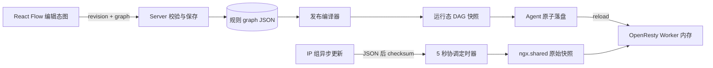

# WAF 可编排规则实现计划

> **For agentic workers:** REQUIRED SUB-SKILL: Use superpowers:subagent-driven-development (recommended) or superpowers:executing-plans to implement this plan task-by-task. Steps use checkbox (`- [ ]`) syntax for tracking.

**Goal:** 将固定顺序的 WAF 规则组重构为可用 React Flow 编辑、发布时编译、OpenResty 内存执行的有序 DAG 规则系统。

**Architecture:** 控制面以带修订号的版本化 JSON 保存整张编辑态图，Server 保存与发布时执行同一套强校验并编译为精简运行态 DAG。规则仅随配置发布和 OpenResty reload 加载一次；动态 IP 组由协调 Worker 每 5 秒检查 checksum，变化时更新共享快照和各 Worker 本地内存对象。

**Tech Stack:** Go 1.25、Gin、GORM、goose、PostgreSQL/SQLite、OpenResty Lua、Next.js 16 App Router、React 19、TypeScript、`@xyflow/react`、TanStack Query、shadcn/ui、Vitest。

## 实现状态（2026-07-13）

Tasks 1–11 已实现，包含三段数据库迁移、图模型与编译器、规则 API、发布快照、OpenResty 内存执行器、IP 组协调刷新、React Flow 编辑器、有序绑定、GeoLite2 City/Country 支持以及中文文档与 Swagger 更新。React Flow 画布使用本地受控节点状态处理拖动，并支持显式或键盘删除普通节点与连线。Country 与 City MMDB 均随 Agent 内嵌，缺失文件在启动时从程序内初始化，网络仅用于后续周期更新。地域属性栏使用完整国家与 ISO 3166-2 一级行政区数据，国家同时展示中文名称与代码，行政区支持按名称或代码搜索。发布器保证空规则绑定编码为 `[]`，Lua 运行时兼容旧快照中的 `null` 数组，避免未启用或空绑定规则导致请求 500。

当前工作区已完成 `go test ./...`、前端全量 Vitest（56 项）、`make swagger`、`make code-check` 与 `git diff --check` 验证。Next.js 生产构建在本机持续停留于 Turbopack 的 `Creating an optimized production build ...`，未返回编译错误或成功状态，故不计为通过。

## Global Constraints

- 每张图恰好一个 `start` 和一个 `allow`；`block` 可多个；图必须无环、无悬空、无不可达节点，所有路径必须抵达 `allow` 或 `block`。
- `ip_match` 与 `geo_match` 只输出 `true`/`false`，分别表示匹配与未匹配；`pow` 只输出 `next`。
- 全局规则固定前置；路由自定义规则按绑定 `sequence` 升序执行；当前规则 `allow` 后继续下一条，`block` 立即终止。
- 规则运行态 JSON 仅在 OpenResty reload 后由 Worker 加载一次；请求路径禁止文件 I/O、checksum 和 JSON 解码。
- IP 组请求路径始终读取 Worker 本地对象；整个实例每 5 秒最多一个 Worker 检查 checksum。
- 迁移只保留规则名称、全局标记、启用状态和绑定关系，旧策略统一重置为 `开始 → 通过`。
- 所有 HTTP 路由仅在 `internal/router/router.go` 的既有分发体系中通过 `internal/router/v1/openflare/register_waf.go` 注册；API 失败使用 `response.Abort*`。
- API Handler 变化后运行 `make swagger`；代码完成后运行 `make code-check`；代码变更写入 `docs/changelog/index.md` 的 `[Unreleased]`。
- 前端不得删除 `frontend/node_modules`；使用 shadcn variant 与全局 CSS 变量，页面根容器保持 `w-full py-6 px-1`。
- 实现前阅读 `.agent/skills/database-migration/SKILL.md`、`.agent/skills/new-api/SKILL.md`、`.agent/skills/shadcn/SKILL.md` 以及 `frontend/node_modules/next/dist/docs/01-app/03-api-reference/03-file-conventions/page.md` 等匹配的 Next.js 本地文档。

---

## 1. 目标与背景

当前 `OpenFlareWAFRuleGroup` 把 IP/地域黑白名单、PoW 与阻止响应平铺为固定字段，Lua 按硬编码顺序判断，无法表达用户自定义分支。本次交付包含图模型、强校验、API、迁移、发布编译、Lua DAG 执行、有序绑定、IP 组五秒内存刷新和 React Flow 编辑器；不包含循环、脚本节点、表达式节点、子图和跨规则跳转。

## 2. 数据与控制流



## 3. 文件结构与职责

- `internal/apps/openflare/waf/graph_types.go`：编辑态图、节点配置、运行态图和默认图类型。
- `internal/apps/openflare/waf/graph_validate.go`：结构、端口、配置、引用、可达性和终止性校验。
- `internal/apps/openflare/waf/graph_compile.go`：删除 UI 字段、编译索引化 DAG、收集 IP 组引用。
- `internal/apps/openflare/waf/rule_logics.go`：规则元数据、修订保存和有序绑定逻辑；从现有过大的 `logics.go` 中抽离规则职责。
- `internal/apps/openflare/waf/rule_routers.go`：规则 API Handler 与 Swagger；IP 组 Handler 留在现有文件或后续独立拆分。
- `internal/apps/agent/nginx/waf_assets.go`：只负责嵌入 Lua 文件；实际 Lua 拆到 `internal/apps/agent/nginx/waf_runtime.lua` 与 `waf_ip_groups.lua` 并使用 `go:embed`，避免继续膨胀 Go 字符串。
- `frontend/app/(main)/waf/page.tsx`：规则/IP 组列表和仅名称创建流程。
- `frontend/app/(main)/waf/rules/editor/page.tsx`：静态可导出的编辑器路由入口，通过查询参数读取规则 ID，避免 Next 静态导出的动态参数限制。
- `frontend/app/(main)/waf/rules/editor/components/`：画布、节点、节点库、属性栏和校验提示，单文件保持低于 600 行。

---

### Task 1: 数据库迁移与持久化模型

**Files:**
- Create: `internal/db/migrator/goose/postgres/202607150001_orchestrate_waf_rules.sql`
- Create: `internal/db/migrator/goose/sqlite/202607150001_orchestrate_waf_rules.sql`
- Create: `internal/db/migrator/goose/postgres/202607150002_reset_waf_rule_graphs.sql`
- Create: `internal/db/migrator/goose/sqlite/202607150002_reset_waf_rule_graphs.sql`
- Modify: `internal/model/openflare_waf.go`
- Create: `internal/model/openflare_waf_graph_test.go`

**Interfaces:**
- Produces: `Graph string`, `Revision uint64`, `Sequence int`；`UpdateOpenFlareWAFRuleGraph(ctx, id, revision, graph) (uint64, error)`；绑定查询按 `sequence, id` 排序。
- Consumes: 现有 `OpenFlareWAFRuleGroup` 与 `OpenFlareWAFRuleGroupBinding`。

- [ ] **Step 1: 阅读数据库迁移 Skill 并写迁移失败测试**

测试建立旧 Schema、插入两个规则和无序绑定、执行迁移后断言图统一为默认图、`revision = 1`、绑定顺序稳定。测试核心断言：

```go
require.JSONEq(t, `{"schema_version":1,"nodes":[{"id":"start","type":"start","position":{"x":0,"y":0},"config":{}},{"id":"allow","type":"allow","position":{"x":320,"y":0},"config":{}}],"edges":[{"id":"start-allow","source":"start","source_handle":"next","target":"allow"}]}`, group.Graph)
assert.Equal(t, uint64(1), group.Revision)
assert.Equal(t, []int{0, 1}, []int{bindings[0].Sequence, bindings[1].Sequence})
```

- [ ] **Step 2: 运行模型测试确认失败**

Run: `go test ./internal/model -run 'TestOpenFlareWAFGraph|TestReplaceOpenFlareWAFRuleGroupBindings' -count=1`

Expected: FAIL，缺少新字段或迁移列。

- [ ] **Step 3: 编写 PostgreSQL 与 SQLite goose 迁移**

`202607150001` 只执行 DDL：两端都增加 `graph TEXT NOT NULL`、`revision BIGINT/INTEGER NOT NULL DEFAULT 1`、`sequence INTEGER NOT NULL DEFAULT 0`。`202607150002` 只执行 DML：用确定性的 `id` 顺序为每个 `proxy_route_id` 回填 sequence，并将所有 graph 重置为同一默认 JSON。Down 分别恢复数据语义与旧列结构；不要创建物理外键，禁止把 DDL 与 DML 放入同一个迁移文件。

- [ ] **Step 4: 实现乐观锁与有序绑定模型方法**

```go
var ErrWAFRuleRevisionConflict = errors.New("waf rule revision conflict")

func UpdateOpenFlareWAFRuleGraph(ctx context.Context, id uint, revision uint64, graph string) (uint64, error) {
    result := db.DB(ctx).Model(&OpenFlareWAFRuleGroup{}).
        Where("id = ? AND revision = ?", id, revision).
        Updates(map[string]any{"graph": graph, "revision": gorm.Expr("revision + 1")})
    if result.Error != nil { return 0, result.Error }
    if result.RowsAffected != 1 { return 0, ErrWAFRuleRevisionConflict }
    return revision + 1, nil
}
```

绑定替换在事务中按输入下标写 `Sequence: index`；查询显式 `Order("sequence asc").Order("id asc")`。

- [ ] **Step 5: 运行测试并提交**

Run: `go test ./internal/model ./internal/db/migrator/... -count=1`

Expected: PASS。

Commit: `feat(waf): add graph persistence and binding order`

---

### Task 2: 图类型、默认图和强校验器

**Files:**
- Create: `internal/apps/openflare/waf/graph_types.go`
- Create: `internal/apps/openflare/waf/graph_validate.go`
- Create: `internal/apps/openflare/waf/graph_validate_test.go`
- Modify: `internal/apps/openflare/waf/errs.go`

**Interfaces:**
- Produces: `RuleGraph`, `RuleNode`, `RuleEdge`, `DefaultRuleGraph() RuleGraph`, `ValidateRuleGraph(ctx context.Context, graph RuleGraph, ipGroupExists func(context.Context, uint) (bool, error)) error`。
- Consumes: Task 1 的 JSON 持久化字段。

- [ ] **Step 1: 写表驱动失败测试**

覆盖合法默认图、重复 start/allow、环、不可达节点、悬空端口、错误 handle、同 handle 多目标、无终止路径、未知类型、无效 IP/CIDR、缺失 IP 组、非法国家/地区、PoW 范围和超限图。

```go
tests := []struct{name string; mutate func(*RuleGraph); want string}{
    {"cycle", addCycle, "规则图不能包含循环"},
    {"missing false edge", removeFalseEdge, "节点 match-1 的 false 出口未连接"},
    {"unreachable", addUnreachableNode, "节点 orphan 无法从开始节点到达"},
}
```

- [ ] **Step 2: 运行测试确认失败**

Run: `go test ./internal/apps/openflare/waf -run TestValidateRuleGraph -count=1`

Expected: FAIL，类型和校验函数不存在。

- [ ] **Step 3: 定义带判别联合的图类型**

```go
type RuleNodeType string
const (
    RuleNodeStart RuleNodeType = "start"
    RuleNodeAllow RuleNodeType = "allow"
    RuleNodeBlock RuleNodeType = "block"
    RuleNodeIPMatch RuleNodeType = "ip_match"
    RuleNodeGeoMatch RuleNodeType = "geo_match"
    RuleNodePoW RuleNodeType = "pow"
)
type RuleGraph struct { SchemaVersion int `json:"schema_version"`; Nodes []RuleNode `json:"nodes"`; Edges []RuleEdge `json:"edges"` }
type RuleEdge struct { ID, Source, SourceHandle, Target string }
```

`RuleNode.Config` 先用 `json.RawMessage` 解码到明确的 `IPMatchConfig`、`GeoMatchConfig`、`PoWNodeConfig`、`BlockNodeConfig`，禁止透传未知字段。

- [ ] **Step 4: 实现结构和 DFS/Kahn 校验**

先检查大小、ID、类型、端口和配置，再用 Kahn 检测环，用从 start 的 DFS 检测可达性，用反向图从所有终止节点遍历检测终止性。错误文案携带节点/边 ID，供前端定位。

- [ ] **Step 5: 运行测试并提交**

Run: `go test ./internal/apps/openflare/waf -run 'Test(DefaultRuleGraph|ValidateRuleGraph)' -count=1`

Expected: PASS。

Commit: `feat(waf): validate composable rule graphs`

---

### Task 3: 运行态图编译器

**Files:**
- Create: `internal/apps/openflare/waf/graph_compile.go`
- Create: `internal/apps/openflare/waf/graph_compile_test.go`

**Interfaces:**
- Produces: `CompileRuleGraph(graph RuleGraph) (RuntimeRuleGraph, error)`、`ReferencedIPGroupIDs(graph RuleGraph) []uint`。
- Consumes: Task 2 的已校验图类型。

- [ ] **Step 1: 写编译快照测试**

断言位置和显示名不进入 JSON、节点通过 ID map O(1) 查找、出口按 handle 编译、IP 组 ID 去重排序。

```go
compiled, err := CompileRuleGraph(graph)
require.NoError(t, err)
assert.Equal(t, "start", compiled.Entry)
assert.Equal(t, "allow", compiled.Nodes["match"].Next["true"])
assert.Equal(t, []uint{2, 7}, ReferencedIPGroupIDs(graph))
```

- [ ] **Step 2: 运行测试确认失败**

Run: `go test ./internal/apps/openflare/waf -run 'TestCompileRuleGraph|TestReferencedIPGroupIDs' -count=1`

Expected: FAIL，编译接口不存在。

- [ ] **Step 3: 实现确定性编译**

输出结构只保留 `entry`、按节点 ID 索引的类型化运行配置和 handle→target 映射；序列化前对可排序切片排序，确保相同图生成相同快照和 checksum。

- [ ] **Step 4: 运行测试并提交**

Run: `go test ./internal/apps/openflare/waf -run 'TestCompileRuleGraph|TestReferencedIPGroupIDs' -count=1`

Expected: PASS。

Commit: `feat(waf): compile rule graphs for runtime`

---

### Task 4: 规则 API、修订冲突与有序绑定

**Files:**
- Create: `internal/apps/openflare/waf/rule_logics.go`
- Create: `internal/apps/openflare/waf/rule_routers.go`
- Create: `internal/apps/openflare/waf/rule_logics_test.go`
- Modify: `internal/apps/openflare/waf/logics.go`
- Modify: `internal/apps/openflare/waf/routers.go`
- Modify: `internal/router/v1/openflare/register_waf.go`

**Interfaces:**
- Produces: `CreateRuleInput{Name string}`、`SaveRuleGraphInput{Revision uint64; Graph RuleGraph}`、`UpdateRuleMetaInput{Name string; Enabled bool}`；创建、详情、元数据、图保存、删除和有序绑定 API。
- Consumes: Tasks 1–3 的模型、默认图和校验器。

- [ ] **Step 1: 阅读 new-api Skill，写逻辑与 Handler 失败测试**

覆盖只传名称创建默认图、空名 400、图非法 400、revision 冲突 409、绑定顺序往返不变、全局规则不能被路由绑定排序覆盖。

- [ ] **Step 2: 运行测试确认失败**

Run: `go test ./internal/apps/openflare/waf ./internal/router/v1/openflare -run 'Test(CreateRule|SaveRuleGraph|ReplaceSiteRuleGroups)' -count=1`

Expected: FAIL，API 输入与路由尚未实现。

- [ ] **Step 3: 实现 logic 与安全错误映射**

```go
func SaveRuleGraph(ctx context.Context, id uint, input SaveRuleGraphInput) (*RuleView, error) {
    if err := ValidateRuleGraph(ctx, input.Graph, ipGroupExists); err != nil { return nil, err }
    raw, err := json.Marshal(input.Graph)
    if err != nil { return nil, err }
    if _, err = model.UpdateOpenFlareWAFRuleGraph(ctx, id, input.Revision, string(raw)); err != nil { return nil, err }
    return GetRule(ctx, id)
}
```

数据库/编码错误用 `pkg/logger` 记录后映射 `AbortInternal`；校验错误用 `AbortBadRequest`；revision 冲突用 `AbortConflict`。

- [ ] **Step 4: 注册路由并补全 Swagger**

保留 `/rule-groups` 路径以减少前端与兼容面变化，但将创建 payload 改为仅名称，新增 `POST /rule-groups/:id/graph` 与 `POST /rule-groups/:id/meta`。所有 `@Failure 400/404/409/500` 与统一 response envelope 完整声明。

- [ ] **Step 5: 运行测试并提交**

Run: `go test ./internal/apps/openflare/waf ./internal/router/v1/openflare -count=1`

Expected: PASS。

Commit: `feat(api): expose orchestrated waf rules`

---

### Task 5: 发布快照与规则顺序

**Files:**
- Modify: `internal/apps/openflare/config_version/snapshot.go`
- Modify: `internal/apps/openflare/config_version/logics_test.go`
- Create: `internal/apps/openflare/config_version/waf_graph_snapshot_test.go`

**Interfaces:**
- Produces: 发布快照中的 `rule_groups[].graph` 运行态 DAG、按 sequence 排序的 `bindings[].rule_group_ids`、图引用 IP 组集合。
- Consumes: Task 3 编译器与 Task 1 有序绑定。

- [ ] **Step 1: 写失败测试**

建立全局规则和两个自定义图，绑定顺序 `[customB, customA]`，断言快照保持该顺序、运行图无 position、只包含图引用的 IP 组；非法启用图阻止预览/发布。

- [ ] **Step 2: 运行测试确认失败**

Run: `go test ./internal/apps/openflare/config_version -run 'TestWAFGraphSnapshot|TestBuildSnapshotRejectsInvalidWAFGraph' -count=1`

Expected: FAIL，快照仍输出旧固定字段并按 ID 排序。

- [ ] **Step 3: 替换固定字段快照编译**

删除 `snapshotWAFRuleGroup` 的旧黑白名单/PoW 字段，加入 `Graph waf.RuntimeRuleGraph`；`buildSnapshotWAFIPGroups` 从所有编辑图的 `ReferencedIPGroupIDs` 聚合；绑定不再按 group ID 排序。

- [ ] **Step 4: 运行测试并提交**

Run: `go test ./internal/apps/openflare/config_version ./internal/apps/openflare/integration -count=1`

Expected: PASS。

Commit: `feat(waf): publish ordered runtime graphs`

---

### Task 6: OpenResty 内存 DAG 执行器

**Files:**
- Create: `internal/apps/agent/nginx/waf_runtime.lua`
- Create: `internal/apps/agent/nginx/waf_runtime_spec.lua`
- Modify: `internal/apps/agent/nginx/waf_assets.go`
- Modify: `internal/apps/agent/nginx/waf_assets_test.go`
- Modify: `internal/apps/agent/nginx/manager.go`
- Modify: `internal/apps/agent/nginx/manager_test.go`
- Modify: `internal/apps/agent/nginx/pow_assets.go`

**Interfaces:**
- Produces: `require("waf.runtime").check()`，模块加载时读取一次规则配置，请求时执行内存 DAG。
- Consumes: Task 5 的运行态快照；现有 PoW challenge/session 代码。

- [ ] **Step 1: 写 Lua 执行器失败测试**

用 stub `ngx` 覆盖 IP true/false、地域 true/false、PoW 接管/完成、多个 block 响应、全局前置、自定义顺序、未知节点 fail-closed、请求期间 `io.open` 调用次数为 0。

- [ ] **Step 2: 运行测试确认失败**

Run: `go test ./internal/apps/agent/nginx -run 'TestWAFRuntime' -count=1`

Expected: FAIL，运行时仍为固定链且每次请求读取配置。

- [ ] **Step 3: 将规则加载移到 Lua 模块初始化**

```lua
local rules_config = assert(load_json_once(runtime_dir .. "/waf_config.json"))

function _M.check()
  local rules = active_rules_for_site(rules_config, ngx.var.openflare_waf_site or "")
  for _, rule in ipairs(rules) do
    local decision = execute_graph(rule.graph)
    if decision.kind == "block" then return render_block(decision.config) end
  end
end
```

在 `manager.go` 生成的 `http` 块中显式加入 `init_worker_by_lua_block { require("waf.runtime").init() }`，使新 Worker 在 reload 启动阶段完成读取与解析，而不是推迟到首个请求。模块缓存使每个 Worker 只解析一次；执行器设置最大步数为节点数，任何损坏图都记录限频错误并返回阻止响应。

- [ ] **Step 4: 将 PoW 变为节点执行接口**

抽取现有 PoW runtime 为 `pow.evaluate(config)`：完成返回 `true`，未完成直接输出/重定向挑战并返回接管标记。移除“按站点选择第一个 pow_enabled 规则”的旧扫描逻辑。

- [ ] **Step 5: 运行测试并提交**

Run: `go test ./internal/apps/agent/nginx ./internal/apps/agent/sync -count=1`

Expected: PASS。

Commit: `feat(agent): execute waf graphs from worker memory`

---

### Task 7: IP 组 checksum 与五秒内存刷新

**Files:**
- Create: `internal/apps/agent/nginx/waf_ip_groups.lua`
- Create: `internal/apps/agent/nginx/waf_ip_groups_spec.lua`
- Modify: `internal/apps/agent/sync/service.go`
- Modify: `internal/apps/agent/sync/service_test.go`
- Modify: `internal/apps/agent/nginx/waf_assets.go`

**Interfaces:**
- Produces: `waf_ip_groups.json.checksum`；Lua `ip_groups.current()` 返回 Worker 本地对象；协调刷新间隔固定 5 秒。
- Consumes: 现有 Agent IP 组同步 payload 与独立的 `ngx.shared.openflare_waf_ip_groups`（64 MiB）；完整运行时快照上限为 20 MiB。

- [ ] **Step 1: 写失败测试**

断言 Agent 先原子替换 JSON、最后原子替换 checksum；Lua 稳定状态 15 秒只读取 checksum 3 次且不读 JSON；变化时全实例只读一次 JSON；非法新 JSON 保留旧对象。

- [ ] **Step 2: 运行测试确认失败**

Run: `go test ./internal/apps/agent/sync ./internal/apps/agent/nginx -run 'TestWAFIPGroup(Checksum|Refresh)' -count=1`

Expected: FAIL，checksum sidecar 和定时器不存在。

- [ ] **Step 3: Agent 写 checksum sidecar**

checksum 使用 Agent 已有快照 checksum；写入采用同目录临时文件、fsync/close、rename 的现有原子文件工具。严格顺序为 JSON rename 成功后 checksum rename。

- [ ] **Step 4: 实现协调 Worker 刷新**

```lua
local function tick(premature)
  if premature then return end
  local ok = shared:add("ip_refresh_lock", true, 4)
  if ok then refresh_from_checksum() end
  adopt_shared_snapshot_if_changed()
end
ngx.timer.every(5, tick)
```

协调 Worker 变化时把 raw JSON 和 checksum 写共享字典；每个 Worker 只在 shared version 变化时 decode 到模块局部 `current_groups`。请求只调用 `ip_groups.current()`。

- [ ] **Step 5: 运行测试并提交**

Run: `go test ./internal/apps/agent/nginx ./internal/apps/agent/sync -count=1`

Expected: PASS。

Commit: `perf(waf): refresh ip groups by checksum timer`

---

### Task 8: 前端类型、Service 与创建流程

**Files:**
- Modify: `frontend/package.json`
- Modify: `frontend/pnpm-lock.yaml`
- Modify: `frontend/lib/services/openflare/types.ts`
- Modify: `frontend/lib/services/openflare/waf.service.ts`
- Modify: `frontend/app/(main)/waf/page.tsx`
- Create: `frontend/app/(main)/waf/components/create-rule-dialog.tsx`
- Modify: `frontend/app/(main)/waf/components/rule-groups-table.tsx`
- Delete after replacement: `frontend/app/(main)/waf/components/rule-group-sheet.tsx`
- Test: `frontend/tests/unit/waf-rule-service.test.ts`

**Interfaces:**
- Produces: TypeScript 判别联合 `WAFRuleNode`、`WAFRuleGraph`、`WAFRule`；`WafService.createRule({name})`、`saveRuleGraph(id, {revision, graph})`。
- Consumes: Task 4 API。

- [ ] **Step 1: 阅读 shadcn 与 Next 本地文档，安装 React Flow**

Run: `cd frontend && pnpm add @xyflow/react`

Expected: `package.json` 与 lockfile 增加同一版本的 `@xyflow/react`。

- [ ] **Step 2: 写 Service 与创建流程失败测试**

断言创建 payload 只有 `{name}`，保存包含 revision，创建成功导航到 `/waf/rules/editor?id=<id>`，不再打开旧规则大表单。

- [ ] **Step 3: 运行测试确认失败**

Run: `cd frontend && pnpm vitest run tests/unit/waf-rule-service.test.ts`

Expected: FAIL，旧 payload 仍要求固定字段。

- [ ] **Step 4: 实现类型、Service 和名称对话框**

```ts
export type WAFRuleNode =
  | {id: string; type: 'start'; position: XYPosition; config: Record<string, never>}
  | {id: string; type: 'ip_match'; position: XYPosition; config: IPMatchConfig}
  | {id: string; type: 'geo_match'; position: XYPosition; config: GeoMatchConfig}
  | {id: string; type: 'pow'; position: XYPosition; config: PoWNodeConfig}
  | {id: string; type: 'allow'; position: XYPosition; config: Record<string, never>}
  | {id: string; type: 'block'; position: XYPosition; config: BlockNodeConfig};
```

静态方法作为 React Query 回调时继续用箭头函数包裹。列表创建成功后 `router.push('/waf/rules/editor?id=' + rule.id)`。

- [ ] **Step 5: 运行测试并提交**

Run: `cd frontend && pnpm vitest run tests/unit/waf-rule-service.test.ts && pnpm lint`

Expected: PASS。

Commit: `feat(frontend): create orchestrated waf rules`

---

### Task 9: React Flow 编排器与固定属性栏

**Files:**
- Create: `frontend/app/(main)/waf/rules/editor/page.tsx`
- Create: `frontend/app/(main)/waf/rules/editor/components/rule-flow-canvas.tsx`
- Create: `frontend/app/(main)/waf/rules/editor/components/rule-node.tsx`
- Create: `frontend/app/(main)/waf/rules/editor/components/node-library.tsx`
- Create: `frontend/app/(main)/waf/rules/editor/components/node-properties.tsx`
- Create: `frontend/app/(main)/waf/rules/editor/components/graph-validation.ts`
- Create: `frontend/app/(main)/waf/rules/editor/components/graph-validation.test.ts`
- Create: `frontend/app/(main)/waf/rules/editor/components/unsaved-changes.tsx`

**Interfaces:**
- Produces: 全宽 React Flow 编辑器；前端 `validateGraph(graph): GraphIssue[]`；Server 错误节点定位。
- Consumes: Task 8 类型与 Service。

- [ ] **Step 1: 写前端图校验失败测试**

覆盖唯一 start/allow、必需 handle、禁止环、不可达、终止性以及删除节点同步删边。

- [ ] **Step 2: 运行测试确认失败**

Run: `cd frontend && pnpm vitest run 'app/(main)/waf/rules/editor/components/graph-validation.test.ts'`

Expected: FAIL，校验器不存在。

- [ ] **Step 3: 实现页面骨架和数据状态**

`page.tsx` 直接维护 query、mutation、React Flow nodes/edges、dirty、selection 和右侧栏状态，不创建同名中转容器。根节点使用 `w-full py-6 px-1`，标题严格使用既定图标和 `h1` 规范。

- [ ] **Step 4: 实现节点、handle 和连线约束**

`start/pow` 只显示 `next` source handle，`ip_match/geo_match` 显示 `true`、`false`，`allow/block` 只显示 target handle。`isValidConnection` 阻止错误端口、同端口重复连接和形成环；start/allow 禁止删除。

- [ ] **Step 5: 实现固定右侧属性栏**

属性栏按节点判别联合渲染 IP/CIDR 与 IP 组多选、国家/地区多选、PoW 配置、阻止状态码与 HTML。颜色和阴影通过节点组件 variant/CSS 变量集中定义，不在业务调用点硬编码。

- [ ] **Step 6: 实现保存、冲突和未保存提示**

仅图合法时启用保存；409 显示“规则已在其他页面更新，请重新加载”；Server 返回节点/边 ID 时选中并聚焦；浏览器离开和应用内返回均提示未保存变更。

- [ ] **Step 7: 运行测试、构建并提交**

Run: `cd frontend && pnpm vitest run && pnpm lint && pnpm build`

Expected: PASS；静态导出包含 `/waf/rules/editor`。

Commit: `feat(frontend): add visual waf rule composer`

---

### Task 10: 路由绑定排序 UI 与旧界面清理

**Files:**
- Modify: `frontend/app/(main)/waf/components/site-binding-sheet.tsx`
- Modify: `frontend/app/(main)/proxy-routes/detail/components/waf-section.tsx`
- Modify: `frontend/app/(main)/waf/components/helpers.ts`（删除仅旧规则表单使用的导出；若清空则删除文件）
- Delete: `frontend/app/(main)/waf/components/pow-config-panel.tsx`
- Delete: `frontend/app/(main)/waf/components/rule-entry-dialog.tsx`
- Delete: `frontend/app/(main)/waf/components/rule-list-section.tsx`
- Test: `frontend/tests/unit/waf-binding-order.test.tsx`

**Interfaces:**
- Produces: 拖拽或上下移动的有序绑定列表，提交 ID 顺序不被排序。
- Consumes: Task 4 有序绑定 API 和 Task 8 Service。

- [ ] **Step 1: 写绑定顺序失败测试**

选择规则 A/B/C，移动为 C/A/B，断言 API payload 为 `{ids:[C,A,B]}`；全局规则单独展示为固定前置且不可拖动。

- [ ] **Step 2: 运行测试确认失败**

Run: `cd frontend && pnpm vitest run tests/unit/waf-binding-order.test.tsx`

Expected: FAIL，当前 UI 只表达集合。

- [ ] **Step 3: 实现排序并删除旧固定表单组件**

复用项目现有 `@dnd-kit/sortable`；为键盘用户提供上移/下移操作。清理旧字段、旧 PoW 面板和不再引用的 helper，保留 IP 组管理组件。

- [ ] **Step 4: 运行测试并提交**

Run: `cd frontend && pnpm vitest run && pnpm lint && pnpm build`

Expected: PASS。

Commit: `refactor(frontend): order waf bindings and remove legacy editor`

---

### Task 11: 旧后端字段清理、Swagger、中文文档与端到端验证

**Files:**
- Create: `internal/db/migrator/goose/postgres/202607150003_drop_legacy_waf_rule_fields.sql`
- Create: `internal/db/migrator/goose/sqlite/202607150003_drop_legacy_waf_rule_fields.sql`
- Modify: `internal/model/openflare_waf.go`
- Modify: `internal/apps/openflare/waf/logics_test.go`
- Modify: `docs/design/waf-design.md`
- Modify: `docs/guide/waf-usage.md`
- Modify: `docs/changelog/index.md`
- Generated: `docs/docs.go`, `docs/swagger.json`, `docs/swagger.yaml`

**Interfaces:**
- Produces: 无旧固定策略字段的最终 Schema 与中文使用文档。
- Consumes: Tasks 1–10 的完整替代实现。

- [ ] **Step 1: 写迁移与集成失败测试**

断言最终表不再包含 `block_status_code`、`ip_whitelist`、`ip_blacklist`、地域名单、`pow_enabled`、`pow_config`；端到端图分别产生 allow、block、PoW 接管，IP 组变化在 5–10 秒内生效。

- [ ] **Step 2: 运行测试确认失败**

Run: `go test ./internal/apps/openflare/integration ./internal/model -run 'TestOrchestratedWAF|TestLegacyWAFColumnsRemoved' -count=1`

Expected: FAIL，旧列仍存在。

- [ ] **Step 3: 删除旧列和旧代码路径**

PostgreSQL 直接 `DROP COLUMN`；SQLite 使用项目支持版本的 `DROP COLUMN` 或重建表迁移并复制 `id/name/enabled/is_global/graph/revision/timestamps`。删除 Go model/view/input 中的旧字段和固定链 helper，确保仓库中业务代码不再引用它们。

- [ ] **Step 4: 更新中文文档与 changelog**

`waf-design.md` 删除固定链作为现行设计的表述，链接可编排设计；`waf-usage.md` 写创建、节点语义、绑定顺序、发布生效和迁移警告；`[Unreleased]` 增加 WAF 可视编排、发布加载和 IP 组刷新条目。

- [ ] **Step 5: 生成 Swagger 并运行全量验证**

Run: `make swagger`

Expected: PASS，生成文件包含新 graph/meta API 与 409 response。

Run: `go test ./... -count=1`

Expected: PASS。

Run: `cd frontend && pnpm vitest run && pnpm lint && pnpm build`

Expected: PASS。

Run: `make code-check`

Expected: PASS，无格式、lint、测试或生成文件差异。

- [ ] **Step 6: 最终人工数据面验收**

创建规则并编排 `开始 → IP 匹配 → true:通过 / false:地域匹配 → true:阻止A / false:PoW → 通过`，绑定到测试路由并发布。用命中/未命中 IP、不同 GeoIP 和无 PoW cookie 请求验证三个分支；更新引用 IP 组后不发布，确认 5–10 秒内结果变化且 OpenResty 未 reload。

- [ ] **Step 7: 提交**

Commit: `feat(waf): complete composable rule orchestration`

## 4. 最终验收标准

- 用户新增规则时只输入名称并立即进入 React Flow 编排器。
- 默认规则为 `开始 → 通过`；特殊节点与处理节点满足设计约束。
- Server 和前端均拒绝非法图，发布再次校验，revision 冲突返回 409。
- 全局规则固定前置，自定义规则严格按绑定顺序执行。
- OpenResty 请求路径对规则与 IP 组均为纯内存读取。
- 规则只在发布 reload 时加载；IP 组每 5 秒 checksum 检查且仅变化时读取完整 JSON。
- PostgreSQL、SQLite、Go、Lua、前端、Swagger、构建与 `make code-check` 全部通过。
