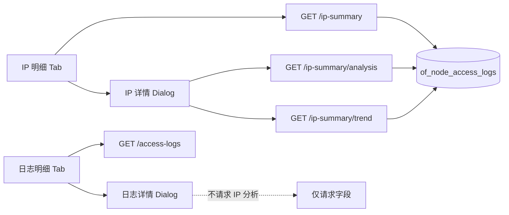

# 访问日志 IP 明细 Tab — 实现计划

## 1. 目标与背景 (Goal & Context)

* **需求背景**：运维需要按 IP 维度快速查看时间窗内的访问量与流量，并下钻单 IP 情报；原先 IP 分析嵌在「单条访问日志详情」中，入口弱、列表能力缺失。
* **开发范围 (Scope) V1**：
  * 访问日志页新增第三 Tab **「IP 明细」**（`?tab=ips`）。
  * IP 列表：时间筛选（快捷 24h/7d/15d/30d + 自定义 since/until）、分页、按请求数 / 入站 / 出站 / 最后访问 / 2xx 比例排序。
  * 列表列：IP、地区、请求数、2xx 比例（2xx 数 / 总请求）、入站流量、出站流量、最后访问。
  * 行详情：弹窗展示完整 **IP 情报**（分析 + 趋势 + Top 分布 + 加入 WAF IP 组）。
  * **日志明细详情弹窗仅展示单条请求字段**，不再内嵌 IP 情报；如需分析请到 IP 明细。
* **Out of Scope（V1 不做）**：
  * 独立 `/access-logs/ip` 子路由全页。
  * IP 列表 UI 暴露节点 / host 筛选（后端可保留兼容参数，前端首版不放）。
  * 入/出站带宽时间序列（趋势图仍为请求数）。
  * 实时 GeoIP 二次查询（沿用入库 `region`）。

## 2. 设计与决策 (Design & Decisions)

### 2.1 页面与交互

| Tab | URL | 内容 |
| --- | --- | --- |
| 概览 | `/access-logs` | 不变 |
| IP 明细 | `/access-logs?tab=ips` | 新 |
| 日志明细 | `/access-logs?tab=list` | 不变；详情弹窗瘦身 |

* **时间筛选（IP 明细）**：
  * 快捷：`hours` ∈ {24, 168, 360, 720}，默认 168（7d）。
  * 自定义：`since` + `until`（RFC3339）；**同时提供时覆盖 hours**。
* **详情形态**：留在列表页的 Dialog（非独立子页）。
* **日志详情瘦身**：`access-log-detail-dialog` 只渲染请求字段（时间、节点、IP、地区、host、path、UA、cache、status 等）及必要操作；删除 analysis/trend/WAF 组内嵌区块。WAF「按 IP 加入组」仅保留在 IP 详情弹窗。

### 2.2 API 设计（扩展现有端点，不新建）

**`GET /api/v1/d/access-logs/ip-summary`**

| 参数 | 说明 |
| --- | --- |
| `hours` | 1–720；默认 168；在无 since/until 时生效 |
| `since` / `until` | 可选 RFC3339；同时有效时优先于 hours |
| `sort_by` | `total_requests`（默认）\| `request_length`（入站）\| `bytes_sent`（出站）\| `last_seen_at` \| `success_ratio` |
| `sort_order` | `asc` \| `desc` |
| `p` / `page_size` | 分页，page_size 上限 200 |
| `remote_addr` / `node_id` / `host` | 兼容保留；V1 UI 可不暴露 |

**响应行字段（扩展）**

```text
remote_addr          string
region               string   // 窗内 argMax(region, logged_at) 或等价
total_requests       uint64
success_2xx_count    uint64   // status_code 200–299
success_ratio        float64  // success_2xx_count / total_requests；total=0 时为 0
bytes_received       uint64   // sum(request_length) 入站
bytes_sent           uint64   // sum(bytes_sent) 出站
last_seen_at         time
```

* `recent_requests`：可停止计算或固定返回 0；**UI 不展示**。避免与可配置时间窗语义冲突。
* 详情下钻仍用现有：
  * `GET .../ip-summary/analysis?remote_addr=&hours=`（或 since/until，若后续扩展；V1 将列表当前窗映射为 hours 或 since/until 与后端约定一致）
  * `GET .../ip-summary/trend?remote_addr=&hours=&bucket_minutes=`

**分析/趋势时间窗对齐**：打开 IP 详情时，将列表当前时间窗传入 analysis/trend（优先 since/until；仅有 hours 则传 hours）。

### 2.3 数据层（ClickHouse）

* 表：`of_node_access_logs`（已有 `bytes_sent`、`request_length`、`status_code`、`region`）。
* 聚合：`GROUP BY remote_addr`，在 `NodeAccessLogFilter.Since/Until` 上过滤。
* 2xx：`countIf(status_code >= 200 AND status_code < 300)`。
* region：`argMax(region, logged_at)`。
* 排序：服务端 ORDER BY 对应表达式；`success_ratio` 注意除零（`if(total=0,0,ratio)`）。

### 2.4 设计决策权衡

| 选项 | 结论 |
| --- | --- |
| 扩展 `/ip-summary` vs 新 `/ip-list` | **扩展现有**，前端 service 已有 `listIPSummaries` |
| 详情弹窗 vs 子页 | **弹窗**，与现有明细交互一致 |
| IP 情报放日志详情 vs 独立 IP 详情 | **仅 IP 明细详情**；日志详情只展示请求信息 |
| 时间：仅快捷 vs 仅自定义 | **两者都要**，自定义优先 |

### 2.5 数据流（示意）



## 3. 具体修改文件清单 (Proposed Changes)

### 后端 Server

* #### [MODIFY] `internal/repository/analytics/node_access_log_stats.go`（及 filter 如有）
  * `IPSummariesNodeAccessLogs`：时间窗、sum 入/出、2xx count、ratio、region、扩展 sort。
* #### [MODIFY] `internal/apps/openflare/observability/access_log_logics.go`
  * Query/View 类型扩展；解析 hours/since/until；去掉或忽略 recent 3h 硬编码。
* #### [MODIFY] `internal/apps/openflare/observability/routers.go` / handler
  * 绑定新 query；Swagger 注释。
* #### [MODIFY] 相关单元测试（logics / repository 若有）

### 前端 Web

* #### [MODIFY] `frontend/app/(main)/access-logs/page.tsx`
  * 第三 Tab `ips`；`resolveTab` / `handleTabChange`。
* #### [NEW] `frontend/app/(main)/access-logs/components/ip-tab.tsx`
  * 列表、时间筛选、排序、分页、打开详情。
* #### [NEW] `frontend/app/(main)/access-logs/components/ip-detail-dialog.tsx`
  * IP 入口详情壳。
* #### [NEW] `frontend/app/(main)/access-logs/components/ip-analysis-panel.tsx`
  * 从现有 `access-log-detail-dialog` **迁出** 分析/趋势/排行/WAF IP 组逻辑。
* #### [MODIFY] `frontend/app/(main)/access-logs/components/access-log-detail-dialog.tsx`
  * **删除** IP 情报相关 UI 与 `getIPAnalysis` / `getIPTrend` 请求；仅请求日志字段展示。
* #### [MODIFY] `frontend/app/(main)/access-logs/components/access-log-utils.ts`
  * tab 类型、IP 排序选项、时间筛选辅助。
* #### [MODIFY] `frontend/lib/services/openflare/access-log.service.ts` + `types.ts`
  * `listIPSummaries` 参数与 `AccessLogIPSummaryItem` 字段同步。

### 文档

* #### [MODIFY] `docs/changelog/index.md` — `[Unreleased]` 用户可见说明
* #### [MODIFY] `docs/design/observability-design.md` 或 data-model（如有访问日志 UI 约定）— 补充 IP 明细 Tab 与 API 字段（中文）
* #### [MODIFY] `docs/plan/index.md` — 挂上本计划链接

## 4. 验证计划 (Verification Plan)

### 自动化

```bash
go test ./internal/apps/openflare/observability/ ./internal/repository/analytics/
# 前端：相关 tsc / 页面无类型错误
make code-check   # 完成后按项目门禁
make prettier
make swagger      # API 注释变更后
```

### 手动

1. `/access-logs?tab=ips` 默认 7d 列表有数据；切换 24h/自定义区间结果变化。
2. 分别按请求数、入站、出站、2xx 比例、最后访问排序正确。
3. 2xx 比例 = 2xx/总数；0 请求不出现 NaN/Infinity。
4. 点 IP 打开详情：指标/趋势/Top/WAF 组可用；时间窗与列表一致。
5. 日志明细 → 详情：仅请求信息，**无** IP 分析/趋势区块。
6. 概览 Tab 行为无回归。

## 5. 状态

- [x] 需求澄清与方案确认
- [x] 实现（后端 ip-summary 扩展 + 前端 IP 明细 Tab + 日志详情瘦身）
- [x] 测试与 changelog（`go test` 相关包通过；changelog 已更新）
- [ ] 提交合并
