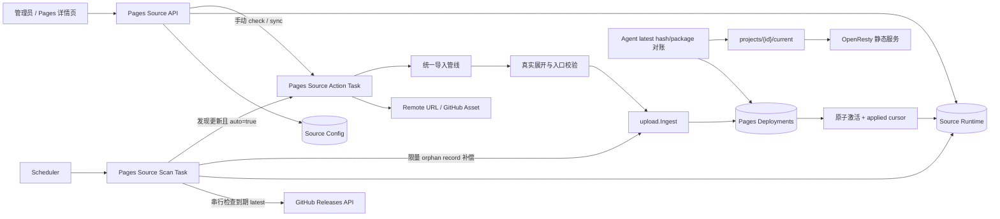
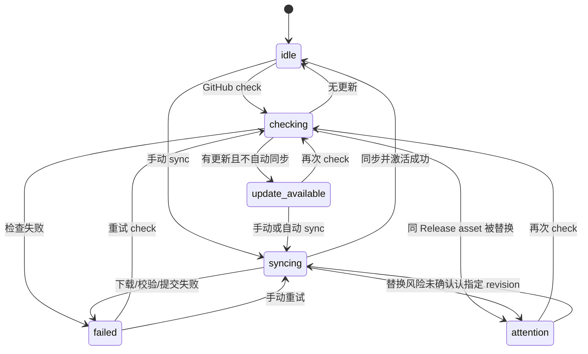

# Pages 项目部署源与 GitHub Releases 自动更新 V2 实现方案

日期：2026-07-19
状态：代码实施完成（范围内自动化验证完成；生产环境验收见 §7）
方案版本：V2（设计修订版，不代表新增 `/api/v2`）

关联材料：

* 原方案：[`20260718-pages-source-sync.md`](./20260718-pages-source-sync.md)
* 设计审核：[`20260719-pages-source-sync-design-review.md`](./20260719-pages-source-sync-design-review.md)
* 表结构审核：[`20260719-pages-source-sync-schema-revision.md`](./20260719-pages-source-sync-schema-revision.md)

> 本文是完整、独立且可直接实施的技术方案，取代原方案成为该功能唯一实现基线。原方案与两份审核文档仅用于追溯设计演进；开发时不需要再将它们与本文拼接，也不得沿用其中与本文冲突的宽表、11 态状态机、`activate=false` 或四重 fence 设计。

---

## 0. 结论摘要

V2 保留原方案正确的主链路：外部来源只由 Server 控制面访问，所有包都进入统一的不可变 deployment 管线，Agent 仍只从 Server 拉取当前 active package。审核意见中的高优先级问题按以下规则一次性收敛：

1. source 配置与运行态拆为 `of_pages_project_sources`、`of_pages_project_source_runtime` 两张表；runtime 不再冗余 `project_id`。
2. 来源同步固定为“解析/下载 → 校验 → 创建或复用 deployment → 原子激活”，API 不提供 `activate` 开关。
3. `sync_status` 只保留 `idle | checking | update_available | syncing | failed | attention` 六态；排队状态使用现有 `TaskExecution`，不在 source runtime 重复保存。
4. 互斥只由 runtime lease 负责；过期结果只在最终事务校验 source `config_version`、project `content_config_version`、`lease_token` 与 lease 未过期时间，不再传递通用 `expected_revision`。
5. 人工激活不同 deployment 时，只要项目存在 source，就在同一事务中 fence 在途任务；若自动更新已开启，同时强制关闭，避免人工回滚被下一轮 latest 静默覆盖。
6. `history_count=1` 时，手动上传允许临时保留 active 与最新 candidate 两条；激活后恢复严格上限。source sync 因创建与激活同事务完成，不产生未激活候选。
7. Remote URL 只支持手动“同步并发布”；只有 GitHub `latest` 支持定时检查和可选自动更新，GitHub `tag` 只支持手动检查/同步。
8. Remote URL 使用显式 `remote_url_set` 控制“保留或替换”密文 URL；API、日志、任务 payload 和 deployment provenance 均不得泄漏 query token。
9. 阶段 0 先修复 `RootDir`、归档真实展开限制、Agent 全量内存下载和历史裁剪问题，再接入远端来源。

---

## 1. 目标与背景 (Goal & Context)

### 1.1 方案制定时的实现与问题

方案制定时，Pages 已支持：

* 管理员本地上传压缩包；
* 同步调用 `POST /api/v1/d/pages/:id/deployments/upload-from-url` 完成一次性 URL 导入；
* 使用 `RootDir + EntryFile` 检查归档并通过 `upload.Ingest` 保存；
* 创建不可变 deployment、手动激活、保留历史版本；
* Agent 通过 latest hash/package 接口拉取 active deployment，并原子切换本地 `current`。

现状的主要问题不是缺少下载函数，而是缺少项目级、可持续管理的来源模型：URL 每次都要重新输入，GitHub Release 无版本游标和自动检查，任务与 deployment 也没有可审计的来源快照。同时，现有代码还存在必须在自动化前修复的边界：

* `RootDir` 已用于 Server 校验，但 OpenResty `LocalRoot` 未稳定追加该目录；
* Agent 将整个 package 读入 `[]byte`，解压时关闭实际限制；
* tar family 的部分检查/解压路径会按声明大小物化成员内容；
* `history_count=1` 时，刚上传的未激活 candidate 会被旧 active 挤掉；
* `PolicyDedupNewRecord` 当前复制既有 record metadata，且新 record 持久化失败时可能误删复用的共享 object；
* 一次性 URL client 允许私网与不安全 TLS，不能作为新持久来源的默认网络策略；
* 前端上传 payload、deployment 类型、固定入口文件提示和请求超时与后端契约存在漂移。

### 1.2 功能目标

本方案交付以下能力：

* Pages 项目可保持手动模式，或配置一个持久 Remote URL / GitHub Release 来源；
* Remote URL 可重复手动同步，每次按下载内容 SHA-256 幂等创建或复用 deployment 并激活；
* GitHub 支持 `latest`（默认）与固定 `tag`，asset 名称默认精确匹配 `dist.zip`；
* GitHub `latest` 可按 5～1440 分钟间隔定时检查，默认 60 分钟；自动更新默认关闭；
* 检查发现新版本但自动更新关闭时，只展示更新，不下载；
* 同一 Release 下 asset 被替换时进入 `attention`，必须由管理员确认指定 revision 后才允许同步；
* `RootDir` / `EntryFile` 继续作为项目级内容配置统一作用于本地、Remote 与 GitHub 包，不在 source 中复制一套入口字段；
* 所有来源统一使用现有 Pages 归档检查、上传、deployment、激活、历史裁剪和 Agent 分发链路；
* 自动化执行可互斥、可 fence、可恢复，且失败不会改变旧 active deployment。

### 1.3 来源能力矩阵

| 模式 | source 行 | 触发方式 | 检查更新 | 自动更新 | revision | 成功结果 |
| --- | --- | --- | --- | --- | --- | --- |
| 手动本地上传 | 无 | 管理员上传 | 无 | 无 | 不用于幂等 | 创建 candidate，管理员再激活 |
| 一次性 URL（兼容） | 无 | 旧同步 API | 无 | 无 | 不用于幂等 | 每次创建 candidate，管理员再激活 |
| 持久 Remote URL | 有 | 管理员“同步并发布” | 不提供 | 不提供 | 下载内容 SHA-256 | 创建或复用并强制激活 |
| GitHub Release tag | 有 | 管理员检查/同步 | 仅手动 | 不提供 | Release/asset 元数据哈希 | 创建或复用并强制激活 |
| GitHub Release latest | 有 | 手动或 scanner | 定时 | 可选，默认关闭 | Release/asset 元数据哈希 | 创建或复用并强制激活 |

无 source 行即手动模式。切换或删除 source 不删除 deployment，也不改变当前 active deployment。

### 1.4 默认值

| 配置 | 默认值 | 边界 |
| --- | --- | --- |
| GitHub selector | `latest` | `latest` / `tag` |
| Release asset | `dist.zip` | basename，精确且区分大小写 |
| 自动更新 | `false` | 仅 GitHub latest 可开启 |
| 检查间隔 | 60 分钟 | 5～1440 分钟 |
| scanner cron | `*/5 * * * *` | 固定，无新增系统设置 |
| scanner 单批 | 20 个 source | 按 `next_check_at, source_id` 排序 |
| check lease | 2 分钟 | 到期可恢复 |
| sync lease | 15 分钟 | 长下载期间按需续租 |
| Remote 网络策略 | `public` | `public` / `trusted_internal` |

### 1.5 非目标

本次不实现：

* GitHub 私有仓库、GitHub Token、GitHub App 或其它代码托管平台；
* source archive、`zipball_url` / `tarball_url` 回退；
* asset glob、正则、优先级列表或 semver 自行排序；
* Remote URL 的定时轮询或自动更新；
* 多 source、分支构建、Webhook、CI 构建、预览环境；
* `remote_url` 数据库加密列；V2 先保证最小暴露和全链路脱敏；
* 额外同步历史表、租约表、Provider 分表或全局 GitHub 响应缓存；
* Agent 直接访问 GitHub 或 Remote URL。

上述“仓库构建”属于明确的后续能力，不在 V2 偷跑实现；但 V2 的 Provider、部署来源视图和导入管线必须保留可扩展边界，避免未来只能把 Git clone/build 逻辑塞入 `github_release` 分支或重写 deployment 主链路。

---

## 2. 设计与决策 (Design & Decisions)

### 2.1 核心原则

1. **Server 单一信任边界**：第三方网络访问、digest 校验与归档检查都在 Server 完成。
2. **source 可变，deployment 不可变**：source 表示当前配置；deployment 保存创建时的最小来源快照，不随 source 编辑。
3. **检查不等于部署**：GitHub check 只更新远端游标；只有 sync 才下载、创建并激活。
4. **成功才切换**：网络和归档工作在事务外；active pointer、deployment 与 applied cursor 在最终事务原子提交。
5. **状态面最小化**：source runtime 只保存控制面稳定状态，队列细节和阶段日志复用现有 TaskExecution。
6. **人工操作优先**：人工激活或回滚必须 fence 自动任务，且不能被自动更新静默覆盖。
7. **平台能力复用**：文件摄取继续通过 `upload.Ingest`；普通文件删除使用 `upload.Remove` / `RemoveOwned`，Pages 保留类型在复检业务引用后使用同包的 `RemoveLockedTx`；任务继续使用现有 task/Asynq 框架。

### 2.2 总体架构



scanner 本身是一个正式 TaskHandler，并非绕过任务框架。它在单次执行中先扫描并精确 CAS 恢复全部过期 lease，再限量补偿最多 100 条 orphan record，最后串行检查最多 20 个到期的 GitHub latest source，避免一次 cron 批量投递并行 GitHub 请求。手动操作和自动下载使用统一 action task；scanner 不执行长时间 package 下载。

### 2.3 领域对象与不变量

| 对象 | 生命周期 | 不变量 |
| --- | --- | --- |
| PagesProject | 可变 | `RootDir` / `EntryFile` 的实质变化递增 `content_config_version` |
| PagesProjectSource | 可变配置 | 每项目最多一条；不保存状态、游标或 lease |
| PagesProjectSourceRuntime | 可变运行态 | 与 source 1:1；状态、游标、lease 只写本表 |
| PagesDeployment | 不可变事实 | 持久来源 revision 幂等；provenance 创建后不回写 |
| PagesDeploymentFile | 不可变清单 | 只属于一个 deployment |

核心不变量：

* source 与 runtime 必须同事务创建、同事务删除；无 source 就无 runtime。
* deployment 的 `source_identity` 与 `source_revision` 必须同时为非空值或同时为 SQL `NULL`。
* 持久来源 sync 成功时，deployment、files、active pointer 和 runtime applied cursor 在同一事务提交。
* source/project 配置变化或人工激活可以使任务过期；过期任务不得改变 active、runtime 或其它 deployment。
* source API 永不返回完整 Remote URL，任务 payload 永不携带 URL。

### 2.4 数据模型

#### 2.4.1 关系总览

```text
of_pages_projects
  └── 0..1 of_pages_project_sources
        └── 1..1 of_pages_project_source_runtime

of_pages_projects
  └── 0..N of_pages_deployments
        └── 0..N of_pages_deployment_files
```

不建立物理外键；删除顺序由 Pages service 事务显式保证。

#### 2.4.2 `of_pages_project_sources`：纯配置

| 字段 | 类型 / DB 默认 | 说明 |
| --- | --- | --- |
| `id` | PK | source ID |
| `project_id` | bigint/integer | 项目 ID，唯一索引 |
| `source_type` | varchar(32), `''` | 服务层写 `remote_url` / `github_release` |
| `remote_url` | text, `''` | 仅 Remote；可含 query secret，禁止回显 |
| `remote_network_policy` | varchar(32), `''` | 服务层写 `public` / `trusted_internal` |
| `github_repository` | varchar(255), `''` | 规范化为 `{owner}/{repo}` |
| `release_selector` | varchar(16), `''` | `latest` / `tag` |
| `release_tag` | varchar(255), `''` | tag 模式必填，latest 必须空 |
| `asset_name` | varchar(255), `''` | 服务层默认写 `dist.zip` |
| `auto_update_enabled` | bool, `false` | 仅 GitHub latest 可为 true |
| `check_interval_minutes` | int, `0` | GitHub latest 服务层默认写 60 |
| `config_version` | int, `0` | 创建显式写 1；实质配置变化或人工 fence 时递增 |
| `source_identity` | char(64), `''` | 无凭据的稳定身份 SHA-256 |
| `created_at` / `updated_at` | datetime | 审计时间 |

配置表禁止加入 `sync_status`、`etag`、`last_seen_*`、`last_applied_*` 或 `lease_*`。

#### 2.4.3 `source_identity`

GitHub：

```text
LP(value) = uint64be(byte_length(UTF8(value))) || UTF8(value)

SHA-256(
  "openflare:pages:github-release:v2" ||
  LP(owner_repo) || LP(selector) || LP(tag) || LP(asset_name)
)
```

GitHub identity 对每个 UTF-8 字段使用无歧义的长度前缀编码，不能使用分隔符直接拼接；自动更新开关和检查间隔不参与 identity。

Remote：

```text
SHA-256("remote_url|" + canonical_scheme_host_port_path)
```

Remote canonical identity 使用小写 scheme/host、移除默认端口并保留规范化 path；明确排除 query、fragment 和 userinfo。下载 URL 仍保存管理员输入的完整值，但 URL userinfo 和 fragment 本身不允许保存。

identity 变化时，同事务重置 runtime 的 ETag、seen/applied cursor、detail、错误、检查时间和 lease；当前 active deployment 不变。仅 query token、自动更新、检查间隔或网络策略变化时 identity 不变，保留 cursor，但仍递增 `config_version`、清 lease 并按现有 cursor 重算稳定状态。

#### 2.4.4 `of_pages_project_source_runtime`：纯运行态

| 字段 | 类型 / DB 默认 | 说明 |
| --- | --- | --- |
| `source_id` | PK | 与 source 1:1 的逻辑关联 |
| `etag` | varchar(512), `''` | GitHub 条件请求 |
| `last_seen_revision` | char(64), `''` | 最近解析到的 revision |
| `last_seen_detail` | text, `''` | 已校验的安全 JSON 对象字符串 |
| `last_applied_revision` | char(64), `''` | 当前 source 视角下已激活 revision |
| `last_applied_detail` | text, `''` | 与 applied revision 配套的安全 JSON |
| `sync_status` | varchar(32), `''` | 创建时服务层显式写 `idle` |
| `last_error` | text, `''` | 脱敏后的最近错误 |
| `last_checked_at` | nullable datetime | GitHub 最近完成检查时间 |
| `last_synced_at` | nullable datetime | 最近成功同步并激活时间 |
| `next_check_at` | nullable datetime | 仅 GitHub latest 非空；普通索引 |
| `lease_expires_at` | nullable datetime | 当前租约截止时间 |
| `lease_token` | varchar(64), `''` | 每次获取租约生成的新 token |
| `updated_at` | datetime | 运行态更新时间 |

runtime 刻意不保存 `project_id`：scanner 本来就必须 join source 读取 `source_type`、selector 和 config version；重复保存 project ID 只会引入漂移和额外索引。scanner 查询以 `next_check_at` 索引定位 runtime，再 join source。

detail 使用跨 PostgreSQL/SQLite 一致的 text，并由 Go typed struct 统一 marshal/unmarshal；比较和幂等只读取 revision 列，禁止解析 JSON 做 CAS。GitHub detail 最小形状为：

```json
{
  "provider": "github",
  "release_id": "123456",
  "asset_id": "789",
  "tag": "v1.2.3",
  "asset_name": "dist.zip",
  "asset_updated_at": "2026-07-18T12:00:00Z",
  "digest": "sha256:..."
}
```

Remote detail 只保存无密钥显示信息，例如：

```json
{
  "provider": "remote_url",
  "display_name": "dist.zip"
}
```

#### 2.4.5 状态机

状态固定为：

```text
idle | checking | update_available | syncing | failed | attention
```



约定：

* `syncing` 覆盖下载、校验、Ingest、创建和激活；详细阶段只写 task 日志。
* `failed` 可以与“已有待更新 revision”同时存在；API 的 `update_available` 始终由 revision 派生，而非由状态字符串判断。
* `attention` 是 GitHub 供应链确认状态，不等同于普通失败。
* `queued` / `succeeded` 属于 `w_task_executions`，不进入 runtime。

派生规则：

```text
update_available =
  last_seen_revision != '' AND
  last_seen_revision != last_applied_revision
```

#### 2.4.6 `of_pages_projects` 增量

新增：

| 字段 | 类型 / 默认 | 说明 |
| --- | --- | --- |
| `content_config_version` | int, `0` | 仅 `RootDir` / `EntryFile` 实质变化时 +1 |

SPA Fallback、API Proxy、名称、描述、启停等变化不影响归档内容校验，不递增该版本。

#### 2.4.7 `of_pages_deployments` 精简 provenance

| 字段 | 类型 / DB 默认 | 说明 |
| --- | --- | --- |
| `source_type` | varchar(32), `''` | `manual_upload` / `manual_url` / `remote_url` / `github_release` |
| `source_identity` | nullable char(64) | 持久 source 快照；手动/一次性 URL 必须为 SQL `NULL` |
| `source_revision` | nullable char(64) | 持久 source 幂等键；手动/一次性 URL 必须为 SQL `NULL` |
| `source_label` | varchar(255), `''` | tag 或安全文件名，不含 query |
| `source_meta` | text, `''` | 安全 JSON 审计快照，不含 URL/token |
| `trigger_type` | varchar(32), `''` | `manual_upload` / `manual_url` / `manual_sync` / `scheduled_auto_update` |

不再增加独立的 release/asset/digest 宽列；这些只在 `source_meta` 保留审计快照。deployment 列表 API 只返回安全的 `source_type`、`source_label`、`trigger_type`，不直接输出原始 meta JSON。

revision 生成：

```text
github_raw = github:<release_id>:<asset_id>:<asset_updated_at>:<declared_digest>
github_revision = SHA-256(github_raw)

remote_revision = SHA-256(downloaded_package_bytes)
```

GitHub 未提供 digest 时，`declared_digest` 为空；同步仍必须计算 package SHA-256 作为 deployment checksum。若 GitHub 提供 `sha256:` digest，则下载后必须严格校验。

#### 2.4.8 索引与迁移

索引：

```text
UNIQUE of_pages_project_sources(project_id)
INDEX  of_pages_project_source_runtime(next_check_at)
UNIQUE of_pages_deployments(project_id, deployment_number)
UNIQUE of_pages_deployments(project_id, source_identity, source_revision)
  WHERE source_identity IS NOT NULL AND source_revision IS NOT NULL
```

PostgreSQL 与 SQLite 均创建同语义的部分唯一索引。禁止用空字符串代替 deployment 的 NULL provenance，否则手动重复上传会被误判为同一来源版本。

新增双方言 migration：

1. `202607190001_add_pages_source_runtime.sql`：两张 source 表、project content version、deployment provenance、索引和存量回填。
2. `202607190002_seed_pages_source_scan.sql`：幂等插入 `of_pages_source_scan` 的 5 分钟 schedule。

存量 deployment 只能可靠回填为 `source_type=manual_upload`、`trigger_type=manual_upload`，identity/revision 保持 NULL；现有记录无法反推出是否来自旧一次性 URL。schedule seed 不写死 ID，使用 `WHERE NOT EXISTS (task_type = 'of_pages_source_scan')`，Down 仅按该 task type 删除。

#### 2.4.9 写入矩阵

| 操作 | source config | runtime | deployment |
| --- | --- | --- | --- |
| 创建 source | 新建 | 同事务新建 idle | 不变 |
| 编辑 source | 实质变化时 version +1 | identity 变则 reset，否则保留 cursor、清 lease | 不变 |
| 删除 source | 删除 | 同事务删除 | 全部保留 |
| GitHub check / 304 | 不变 | seen、时间、状态、下次检查 | 不变 |
| source sync | 不变 | syncing → applied/idle | 创建或复用并激活 |
| 人工激活/回滚 | 必要时关闭 auto、version +1 | 清 lease，按目标 provenance 更新 applied | 切 active |
| project 删除 | 删除 | 先删除 | 按现有流程删除 |

### 2.5 任务、租约与并发

#### 2.5.1 任务类型

只新增两个任务：

| Meta Type | Asynq Type | 职责 |
| --- | --- | --- |
| `of_pages_source_scan` | `openflare:pages_source_scan` | 恢复过期 lease/orphan record；串行检查一批到期 GitHub latest source；必要时投递 sync action |
| `of_pages_source_action` | `openflare:pages_source_action` | 执行管理员 check/sync 或 scanner 触发的 sync |

两者都在 `internal/task/handlers/register.go` 显式注册 Handler 与 TaskMeta。现有 `bootstrap.RegisterTasks()` 已覆盖 API、worker、scheduler 和 all 入口，不新增 `init()`，也不修改 `internal/router/router.go`、`internal/bootstrap/bootstrap.go` 或 `internal/cmd` 的装配职责。

两类任务都标记为 `TaskMeta.InternalOnly=true`。通用 Admin Task 类型列表、手工 dispatch 与 schedule 创建/更新必须隐藏或拒绝 internal-only meta；scheduler 与 Pages 内部 dispatch 仍使用完整 registry。这样客户端不能绕过 Pages Handler 自行伪造 `source_id`、`config_version` 或 `actor`。

action payload 只包含：

```json
{
  "source_id": 42,
  "config_version": 3,
  "action": "check",
  "actor": "user:1234567890",
  "target_revision": "",
  "confirmed_revision": ""
}
```

规则：

* `action` 仅为 `check` / `sync`；
* `target_revision` 只由 scanner 在自动 sync 时写入，用于锁定本次 check 发现的 revision；手动 sync 为空；
* `confirmed_revision` 只在确认 `attention` 时携带 UI 当前看到的精确 revision；不用单纯 boolean 确认未知的未来版本；
* payload 不携带 Remote URL、GitHub 下载 URL、ETag、`content_config_version` 或通用 `expected_revision`；`target_revision` 是自动检查结果约束，不参与配置 fencing；
* `actor` 手动操作为 `user:<id>`，自动任务为 `system:pages-source-sync`，禁止空字符串表示系统。

调用 `task.DispatchTask` 时，框架级 `triggeredBy` 继续使用 `manual` / `system`；具体操作者只放在已校验且无密钥的 action payload 中，供 deployment `created_by` 与审计日志使用。

该 payload 是 Server 内部契约：HTTP Handler 只接受 action 所需业务字段，再从路由项目、当前 source 和 OAuth context 组装 `source_id/config_version/actor`，禁止客户端直接指定或冒充这些值。

`content_config_version` 在 sync Worker 获取 lease 后读取并形成执行快照，最终事务再次检查。这样既能阻止旧入口配置被激活，又不把每次项目变更传播进队列 payload。

#### 2.5.2 lease 规则

lease 只解决“同一 source 同时只能有一个执行者”：

* check 获取 2 分钟短 lease，并将状态切为 `checking`；
* sync 获取 15 分钟长 lease，并将状态切为 `syncing`；
* 获取使用 `source_id + config_version + lease 已过期` 的 CAS；
* 续租、状态写入、终态和释放必须同时满足 `lease_token` 匹配且 `lease_expires_at > now`；续租不再 join project/source 版本；
* 最终事务前强制续租一次；最终提交仍必须再次检查 token 与未过期时间，不能让“尚未被新 Worker 改写 token 的过期 lease”通过；
* source 配置变化、RootDir/EntryFile 变化或人工激活统一调用 `fenceAndNormalizeRuntime`：清 token/expiry；若当前 seen/applied 仍构成同 Release 替换则为 `attention`，否则 seen≠applied 为 `update_available`，其余为 `idle`；source 删除则同事务直接删除 runtime/source，行不存在即 fence；
* 未拿到 lease 的重复任务写一条 no-op task 日志并成功结束，不制造 runtime 错误。

最终提交的锁顺序固定为：

```text
project -> source（存在时） -> runtime（存在时） -> upload（所有相关 ID 升序）
```

提交前只校验：

```text
source.config_version == captured_source_version
project.content_config_version == captured_content_version
runtime.lease_token == worker_token
runtime.lease_expires_at > transaction_now
target_upload.status == used
```

source/runtime 条件只适用于持久 source；本地上传和一次性 URL 仍必须先锁 project、最后锁目标 upload。create-or-load 选中的既有 deployment 与本次新建但最终未使用的 upload 不同时，两个 upload ID 在最后一层按升序加锁，避免多行反序。上述任一条件不满足，任务按“配置、执行权或上传记录已变化”结束，不覆盖新 runtime 状态；若本次创建了 upload record，则进入补偿。revision 幂等由 deployment 部分唯一索引负责，不再增加第四套通用 revision fence。

#### 2.5.3 scanner 流程

每 5 分钟执行：

1. 扫描所有 runtime 中 lease 已过期且状态为 `checking/syncing` 的行；恢复 UPDATE 必须再次 CAS 原 token 且 `lease_expires_at <= now`，避免覆盖刚续租的 Worker。成功后清 lease、状态设为 `failed`，记录“上次任务租约已过期”，GitHub latest 的 `next_check_at` 调整为近期重试。
2. 执行 2.7.2 的限量 orphan record reconciliation；单条失败只告警并保留候选，不中断 source 检查。
3. join source 查询 `github_release + latest + next_check_at <= now`，按 `next_check_at, source_id` 排序，最多取 20 条。
4. 对每条 source 尝试获取短 lease；失败说明另一个 scanner/action 已处理，直接跳过。
5. 在当前 scanner TaskHandler 内串行调用 GitHub check，共享同一 check service；单个 source 失败只落该 runtime，不中断其它 source。
6. `304` 仍更新 `last_checked_at/next_check_at`，并根据已保存的 seen/applied revision 重新判断是否待同步。
7. 发现更新后无论 auto 开关，都先原子写 seen cursor、将状态落为 `update_available` 并释放短 lease；auto 开启时再投递带本次 `target_revision` 的 `action=sync`，sync Worker 获取长 lease 后才切为 `syncing`。
8. sync 入队失败：保持 `update_available`，记录安全错误，并把 `next_check_at` 调整为短退避，后续 scanner 可再次尝试。
9. 下次检查时间使用 interval 加 source-ID 派生的小幅 jitter，避免整点集中请求。

scanner 直接串行 check 而不是先批量投递 check action，目的是减少 GitHub 并发和一层“派发预占”状态。重叠的 scanner 实例仍通过每个 source 的 lease 互斥；不增加全局 scanner 锁。

#### 2.5.4 action 流程

手动 check：

1. Handler 校验 source 为 GitHub；Remote 直接返回稳定 400，不入队。
2. action Worker 校验 payload `config_version`，获取短 lease。
3. 解析 Release/asset，更新 seen、ETag、检查时间与状态后释放 lease。
4. 手动 check 永远不隐式下载；即使 auto 已开启，也只由 scanner 检查路径触发自动 sync，避免“点击检查”产生意外发布。

手动或自动 sync：

1. 校验 source/config version，获取长 lease并读取 project content version。
2. GitHub 在 lease 内重新解析目标 Release/asset；Remote 直接下载。这样刚保存 source 时无需等待一次 check 才能同步。
3. scanner 自动 sync 若携带 `target_revision`，本次新解析 target 必须与其相等；不相等说明 latest 在 check 与执行间变化，任务将新 target 安全写为 seen，按本次 target 归一为 `attention/update_available`，释放 lease 并把 `next_check_at` 提前，禁止直接部署未经原 check 锁定的新 revision。
4. 非空 `confirmed_revision` 必须先与本次 target 完全相等，否则要求刷新后重试；再以本次 target 与 applied detail 判断同 Release 替换，构成替换且未确认当前 target 时写 `attention` 并停止。
5. 流式下载、digest/checksum 校验、归档检查与 Ingest。
6. 进入最终事务完成 create-or-load、激活与 applied cursor；提交后严格裁剪历史。

永久业务错误（非法配置、asset 不存在、未确认 attention）通过 task 框架的 `PermanentError` 包装为 `asynq.SkipRetry`，不进行 Asynq 快速重试；瞬时网络/存储错误按 TaskMeta 的有限次数退避重试。包装后的 `Error()` 只暴露脱敏 domain message。重复任务、旧 config version 和丢失 lease 作为成功 no-op 结束，避免无意义重试。Provider/Action Handler 在把 error 返回 task executor 前必须转换为不含 URL/query/header/body 的安全 domain error；原始错误也只能经统一 URL 脱敏后写内部日志，防止 TaskExecution `error_message/log/result` 持久化密钥。

### 2.6 Provider 设计

#### 2.6.0 Provider 扩展边界与未来仓库构建

V2 Provider 只负责把某个外部来源解析为一个经过约束的不可变归档候选，不负责直接写 deployment、切 active 或操作 Agent。Pages service 继续统一承担归档检查、`upload.Ingest`、deployment create-or-load、激活、历史裁剪与补偿。当前 Remote URL 与 GitHub Release 都实现这一窄边界。

为后续“从仓库拉代码自动构建”预留以下设计约束，但本期不增加数据库列、API 或空实现：

* 后续新增独立 `git_repository` source/provider，禁止复用或扩展 `github_release` 语义；Release asset 是预构建产物来源，repository source 是源码与构建来源，两者凭据、revision、失败阶段和 UI 配置完全不同。
* repository provider 的输出仍必须是临时目录中的受限归档/构建产物描述，再进入现有统一导入管线；build checkout、依赖安装、命令执行和日志隔离属于未来独立 build executor，不进入 Agent，也不绕过 `upload.Ingest`。
* source view 与前端表单继续使用 discriminated union；未来可以新增 repository variant，而无需给 Remote/GitHub Release 视图加入无关的 branch、build command、output directory 或 environment 字段。
* deployment provenance 保留 `source_type/source_identity/source_revision/source_label/source_meta/trigger_type` 的通用事实边界；未来 repository revision 可使用 commit SHA，安全 `source_meta` 可保存 branch/build 输出摘要，但不得保存凭据或完整环境变量。
* TaskExecution 继续承载阶段日志。未来构建可增加 resolve/checkout/build/package 阶段，但 source runtime 不因此扩展为构建步骤状态机。

该边界参考 Cloudflare Pages 当前将 [Git integration](https://developers.cloudflare.com/pages/configuration/git-integration/) 与 [Direct Upload](https://developers.cloudflare.com/pages/get-started/direct-upload/) 分成不同来源体验、同时把生产部署与历史部署统一呈现的产品结构；OpenFlare 保留自己的“来源可切换且历史部署不删除”决策，不照搬 Cloudflare 创建后不可切换来源的限制。

#### 2.6.1 持久 Remote URL

Remote 来源只提供“同步并发布”，不提供 check、定时检查或自动更新。每次同步：

1. 按 source 保存的 network policy 构建下载 client；
2. 流式写入 Server 临时文件，同时计算 SHA-256 和实际压缩包大小；
3. 以内容 SHA-256 生成 revision；若同 identity/revision deployment 已存在，跳过 Ingest，直接进入安全激活；
4. 新 revision 使用统一归档/上传/激活管线；
5. 成功后 seen 与 applied 同时更新为该 revision，状态回到 `idle`。

归档格式优先使用配置 URL path 的安全 basename；名称缺失或无可识别扩展名时，使用 `pagesarchive.DetectFormat` 对临时文件至少前 512 字节做 magic sniff，覆盖 tar 在偏移位置的签名，不能沿用当前仅 16 字节的探测。redirect 最终 URL 和 `Content-Disposition` 不进入 provenance，避免签名地址或不可信文件名泄漏。

Remote URL 的 query 可用于签名 token。API 返回：

* `has_remote_url=true`；
* `display_url=https://example.com/dist.zip?***`；
* 永不返回原始 URL。

编辑时使用显式 `remote_url_set`：

* 新建 Remote、从 GitHub 切换到 Remote：必须为 `true` 且 URL 非空；
* 编辑现有 Remote 但只改 network policy：必须为 `false`，同时省略 `remote_url`；
* 替换地址：为 `true` 并提交新 URL；
* `false` 却携带 URL，或 `true` 但 URL 为空，均返回 400；
* 前端绝不能把 `display_url` 当作可保存值。

#### 2.6.2 GitHub Releases

仓库地址只接受：

```text
https://github.com/{owner}/{repo}
https://github.com/{owner}/{repo}.git
```

保存时规范化为 `{owner}/{repo}`；拒绝非 `https`、非 `github.com`、userinfo、query、fragment、额外 path 及空 owner/repo。V2 只访问公开仓库。

Release 解析：

* latest：`GET /repos/{owner}/{repo}/releases/latest`；采用 GitHub 的 latest 语义，不拉列表、不自行比较 semver；
* tag：`GET /repos/{owner}/{repo}/releases/tags/{url.PathEscape(tag)}`；固定 tag 不进入 scanner；
* asset：只接受 `state=uploaded` 且 `name == asset_name` 的精确、区分大小写匹配；
* asset 不存在时，安全错误最多列出该 Release 前 10 个 asset 名，单项与总错误长度均截断；
* 不回退到源码 archive。

API client 使用新的窄包 `internal/integration/githubrelease`，集中 Release/asset HTTP 契约、redirect、ETag 与限流解析；Pages 模块只负责 source 规则、revision 和状态映射。当前 node/edge/admin updater 的旧实现不在本功能中强制迁移，但后续新增调用方必须复用该包，避免继续增加 feature-local GitHub client。

* 发送 `Accept: application/vnd.github+json`、固定 `User-Agent`；实现基线固定 `X-GitHub-Api-Version: 2026-03-10`，收敛为一个常量；
* 保存 ETag 并发送 `If-None-Match`；
* 处理 `Retry-After`、`X-RateLimit-Remaining`、`X-RateLimit-Reset`，按服务端指示设置 `next_check_at`，禁止紧循环；
* asset 下载使用 `/repos/{owner}/{repo}/releases/assets/{asset_id}` 与 `Accept: application/octet-stream`，兼容 `200` 内容和 `302` 跳转；
* GitHub 始终使用严格 TLS；asset redirect 仅允许 HTTPS、最多 5 次，每跳解析并校验公网 IP；跨 host 删除 `Authorization`、`Cookie`、`Referer` 和条件请求 header；
* 元数据与下载错误只保留 status、request id、repo、tag、asset 等安全上下文。

参考官方文档：

* [GitHub Releases REST API](https://docs.github.com/en/rest/releases/releases)
* [GitHub Release Assets REST API](https://docs.github.com/en/rest/releases/assets)
* [GitHub REST API 最佳实践](https://docs.github.com/en/rest/using-the-rest-api/best-practices-for-using-the-rest-api)
* [GitHub REST API Rate Limits](https://docs.github.com/en/rest/using-the-rest-api/rate-limits-for-the-rest-api)

未认证公共请求存在严格额度，V2 通过 ETag、串行 scanner、jitter 与服务端退避降低消耗，不承诺大规模仓库轮询。多项目共享仓库缓存留到出现真实规模瓶颈后再设计。

#### 2.6.3 `attention` 与 digest 失败边界

* 每次 check/sync 都以本次新解析的 target 判断：`target.release_id == applied.release_id` 且 revision 变化时进入 `attention`；禁止用过期的 runtime seen 代替本次 target；
* 管理员同步时必须提交与当前 seen 完全相等的 `confirmed_revision`；状态变化后旧确认自动失效；
* declared digest 与实际 package checksum 不一致：`failed`，不能用 attention 确认绕过；
* 同一 revision 重复点击由部分唯一索引和 lease 双重保证只产生一条 deployment；
* 后续 latest 已推进到不同 release ID 时，不再满足同 Release 替换条件，应转为普通 `update_available` 并按 auto 策略继续；attention 不设计成永久 hold。

### 2.7 统一导入、激活与回滚

#### 2.7.1 source sync 原子提交

source sync 不创建长期 candidate，固定执行以下顺序：

1. 获取 source lease，快照 source config version、project content version、`RootDir`、`EntryFile`。
2. 事务外解析并流式下载到临时文件，计算 checksum；临时文件在所有退出路径删除。
3. 使用快照的 `RootDir + EntryFile` 做真实展开限制、路径与入口校验，得到 manifest。
4. 先查询相同 project/source identity/revision 的 deployment；存在则不调用 Ingest。
5. 不存在时调用 `upload.Ingest`，使用现有 Pages upload type 与 `PolicyDedupNewRecord`；upload metadata 的 `Extra` 写入固定 marker 版本、十进制字符串形式的 `pages_project_id` 及可选 `pages_source_id`，供孤儿补偿判断，绝不写 URL 或 token。平台需先修正 dedup 新记录语义：新 record 采用本次请求的业务 metadata，仅从既有 object 继承存储归属 `Bucket`，不能继续复制既有 record 的业务 `Extra`；dedup record 写库失败时也绝不能删除并非本次 Ingest 创建的共享 object。
6. 最终事务先按 `project -> source -> runtime` 加锁并校验双 version、lease token/expiry；project 锁同时串行化本项目所有 V2 deployment 创建、激活、裁剪与 orphan 判定。
7. create-or-load 必须使用 GORM `clause.OnConflict{DoNothing: true}`（或等价 `INSERT ... ON CONFLICT DO NOTHING`），再按 `(project_id, source_identity, source_revision)` 查询 winner，禁止依赖普通唯一冲突后继续查询已 aborted 的 PostgreSQL 事务。若冲突仅来自 deployment number 且 revision winner 不存在，则在 project 锁内重新分配编号并有限重试。
8. 确定目标 deployment 后，将目标 upload 与本次 Ingest upload（若不同）按 ID 升序锁定；目标 upload 必须仍为 `used`。唯一竞争产生的多余 upload 只记录为事务后的补偿目标，禁止在 Pages 事务内调用另起事务的 `upload.Remove`。
9. 取消旧 active、激活目标 deployment、更新 project active pointer，并更新 runtime applied/seen/status/时间。
10. 提交后立即补偿未被采用的 upload，再执行严格历史裁剪；事务回滚则补偿本次 Ingest upload。裁剪失败不回滚已成功激活，但必须告警并由下一次裁剪自愈。

任何最终事务前的失败都保持旧 active。`created_by` / `trigger_type` 约定：

| 触发 | `created_by` | `trigger_type` |
| --- | --- | --- |
| 本地上传 | `user:<id>` | `manual_upload` |
| 一次性 URL | `user:<id>` | `manual_url` |
| 持久来源手动 sync | `user:<id>` | `manual_sync` |
| scanner 自动更新 | `system:pages-source-sync` | `scheduled_auto_update` |

#### 2.7.2 Ingest 补偿与延迟记录恢复

`upload.Remove` 当前只会软删除 upload record、调整统计并失效缓存，不会删除底层 object；因此实现与验收不得宣称 defer 调用后物理文件已回收。

新创建的 Pages upload record 统一使用以下无密钥 marker；`pages_source_id` 只在持久 source sync 时存在，手动上传与一次性 URL 省略该键：

```json
{
  "pages_ingest_marker": "pages_deployment_v2",
  "pages_project_id": "123",
  "pages_source_id": "456"
}
```

ID 使用十进制字符串，cleanup 必须严格解析并校验关联归属；marker 不作为权限凭证，只作为“允许进入 Pages 孤儿判定”的一个条件。`project_slug`、归档格式等可由正式模型/Upload 列获得且当前无读取方，不再复制进新 record 的 `Extra`。

`openflare_pages_deployment` 由 upload 平台集中定义并导出为保留 type，Pages 与通用 Handler 复用同一常量：通用 `POST /api/v1/upload` 必须拒绝客户端提交该值，通用管理员/用户删除入口及 `upload.Remove` / `RemoveOwned` 也必须拒绝删除该类型；cleanup 候选还必须满足 `user_id == repository.GetSystemUser(ctx).ID`。marker、保留 type、system owner 三项缺一不可，避免普通用户伪造 metadata 后被后台任务误删。

V2 采用两层处理：

1. 立即补偿：只要 Ingest 创建了新 upload record 而最终事务未引用它，就调用 Pages 内部 `removePagesUploadIfUnreferenced`；该函数锁 project（存在时）与 upload、再次确认没有任何 deployment 引用，再调用 `upload.RemoveLockedTx`。补偿错误必须写可告警日志，不能 `_ =` 静默忽略。
2. 延迟记录补偿：Pages scanner 每轮最多选择 100 条超过 2 小时、状态仍为 `used`、system owner、type 为 `openflare_pages_deployment`、无 deployment 引用且带 V2 Pages marker 的 upload。这覆盖“立即补偿调用本身失败”的恢复路径；PostgreSQL 使用 JSONB 路径、SQLite 使用 `json_extract` 将 marker 纳入 SQL 候选条件，避免存量合法记录长期占满批次。任一条件不满足的记录一律跳过，禁止仅凭 type/时间推断孤儿。

`upload.Remove`、`RemoveOwned` 与 Pages 内部删除路径必须共用同一幂等删除原语：事务内锁定包含 deleted 状态的 record，再由 `RemoveLockedTx` 以 `id + status IN (pending, used)` 做 CAS；只有 `RowsAffected == 1` 才递减统计，已 deleted 视为成功 no-op。事务成功后无论本次是否发生状态迁移都失效该 record 的 metadata cache，以便顺带修复前次提交后 cache invalidation 中断；这样立即补偿、延迟补偿、历史裁剪和管理员删除并发时不会重复扣减统计。`Remove` / `RemoveOwned` 在锁内发现保留 type 时返回稳定 domain error，不得调用 `RemoveLockedTx`。

cleanup 最终 recheck 与软删除必须在同一数据库临界区完成：

1. 事务外读取 candidate 快照，严格解析 system owner、marker、`pages_project_id/pages_source_id`；格式错误直接跳过并告警；
2. 事务内统一按 `project -> source（存在时） -> runtime（存在时） -> upload` 加锁；项目或 marker 指向的 source 已不存在属于合法 orphan 场景，应继续检查；只有 source ID 仍存在但其 `project_id` 与 marker 不同才跳过并告警。禁止先锁 upload 再反向读取 runtime；
3. source 存在时若 runtime 有未过期 lease，回滚并跳过；随后锁 upload，再次确认 ID、marker、归属、`used` 状态和 2 小时阈值；
4. 在持有 project/upload 锁的情况下确认不存在任何 deployment 引用该 upload；所有 V2 deployment 创建路径也必须遵循同一锁顺序，避免检查后又插入引用；
5. 通过 upload 平台提供的事务内幂等 `RemoveLockedTx` 完成软删除与统计更新，提交后统一失效 upload metadata cache；业务模块不得直接调用 repository 或改 `w_uploads`；
6. Pages 最终提交若后获得 upload 行锁，必须因 status 已 deleted 而终止；若 deployment 提交先完成，cleanup 在引用检查时跳过。两者竞争时只能有一方成功，绝不允许 deployment 指向 deleted upload。

V2 不物理删除 object，也不硬删除 upload record：`PolicyDedupNewRecord` 可能共享 `file_path`，当前平台没有能与并发 dedup 创建原子协调的引用锁/引用计数，先检查再删除仍有竞态。软删除后的 object 和记录保持可识别，待 upload 平台提供安全的统一 blob GC 后回收；Pages 业务包不得直接调用 storage backend。清理失败保留 active 候选供下次重试，并输出数量与错误上下文。

同一安全边界也适用于现有 `system:cleanup`：阶段 0 将 pending upload 清理收敛为 `RemoveLockedTx` 的记录级软删除、统计与 cache 失效，停止直接 `backend.Delete(file_path)`。仅增加“是否还有 active record”检查仍无法闭合“检查后并发 dedup 新 record”的竞态，不能作为物理删除依据；所有 upload blob 的物理回收统一留给未来具备引用协调能力的平台 GC。

#### 2.7.3 人工激活/回滚硬约束

通过现有 activation API 人工激活不同于当前 active ID 的 deployment 时：

1. 按全局顺序锁 project、当前 source（如有）、runtime 与目标 deployment 的 upload；目标 upload 非 `used` 时拒绝激活；
2. 若存在 source，始终 `config_version + 1` 并清 lease，fence 已排队和正在执行的 source task；
3. 若 `auto_update_enabled=true`，同事务强制改为 false；
4. 目标 deployment identity 等于当前 source identity 时，将 runtime applied 更新为目标 revision/detail；否则清空 applied；若归一后的 seen/applied 仍构成同 Release 替换则保持 `attention`，否则状态为 `idle` 或 `update_available`；
5. 切换 active deployment 后提交；
6. 输出结构化审计日志：actor、project、旧/新 deployment、是否关闭 auto、目标 source type/identity（不含 URL）。

重复激活当前 active 视为 no-op，不关闭自动更新。该规则刻意比“只在 identity 不同才关闭”更严格：即使回滚到同一 GitHub source 的旧 revision，下一轮 latest 也可能覆盖人工选择。

前端确认框必须明确提示：“激活其它历史部署会终止当前来源任务；若已开启自动更新，将同时关闭自动更新。”成功后同时刷新 project、source 与 deployment queries。

#### 2.7.4 `history_count=1`

手动上传仍保留“先上传 candidate、再人工激活”的现有交互，但裁剪增加 `preserveCandidateID`：

* 上传完成后保留当前 active 与本次新 candidate；即使 history limit 为 1，也允许临时最多 2 条；
* 再次上传时只保护 active 与最新 candidate，旧 candidate 可被裁剪；
* candidate 激活后执行 strict prune，不再传 preserve ID，恢复总数 `<= history_count`；
* source sync 在同一事务内创建并激活，提交后直接 strict prune；
* prune 删除 deployment/files 后，artifact record 也统一交给 `removePagesUploadIfUnreferenced`；通用文件管理永远不直接删除 Pages 保留类型；
* `history_count<=0` 继续表示不限制。

手动 candidate 创建与 source 最终提交都先锁 project 再分配 deployment number，并由 `(project_id, deployment_number)` 唯一索引兜底。这是一项明确的产品例外，不新增 candidate 状态或额外保留配置。

preserve/strict prune 每次都在事务内先锁 project，再重新读取 active 与候选集合后决定删除项；禁止沿用事务外快照做删除判断。deployment/files 提交后，待删除 artifact 再交给无引用复检路径软删除。

### 2.8 安全与数据面前置修复

#### 2.8.1 `RootDir` / `EntryFile`

统一使用一个严格的逻辑路径规范化函数：

* `RootDir` 允许空字符串表示归档根目录；非空 RootDir 与 EntryFile 只接受 UTF-8 相对 POSIX 路径，空 EntryFile 由服务层归一为 `index.html`；
* 拒绝绝对路径、`.` / `..` segment、反斜线、Windows drive、NUL/控制字符、引号、分号及超长值；
* 逻辑归档路径用 `path` 处理，不用平台相关 `filepath`；落盘路径仍用 `filepath` 并再次执行目录逃逸检查；
* project 已有 active deployment 时，更新 RootDir/EntryFile 前用现有 deployment file manifest 验证新入口存在；失败保持原配置；
* 阶段 0 先完成严格校验、manifest 验证与 LocalRoot 一致性；阶段 1 随 source DDL 增加 `content_config_version` 后，实质变化再递增该版本并清当前 source lease；
* snapshot 与 rebind 构建 `LocalRoot` 时安全追加规范化 RootDir，确保 Server 检查路径与 OpenResty 实际服务路径一致。

归档继续保留现有 common-root 语义：若所有文件共享唯一首层目录，检查与解压都会先剥离该目录，随后再解释 `RootDir`。阶段 0 以测试固化该规则，未来仓库构建产物也必须输出符合相同 artifact contract 的目录结构。

#### 2.8.2 Remote SSRF 与 TLS

`public` 策略：

* 仅允许 `http` / `https`，最多 5 次 redirect，不使用环境代理；
* 每次连接前解析 host，拒绝 loopback、private、link-local、multicast、unspecified 及其它非公网地址；
* 自定义 `DialContext` 直接连接已校验 IP，不能在校验后再次按 host 解析，防止 DNS rebinding；
* 每次 redirect 重新执行 scheme、host 与 IP 检查；
* HTTPS 严格证书验证，禁止 `InsecureSkipVerify`；
* 设置连接、响应头、整体下载超时，并以实际流量强制 package size 上限。

专用 client 通过 `pkg/httppool` 新增的可配置 transport factory 复用连接池参数与 OTel instrumentation，同时显式注入 no-proxy、受控 DialContext 和 TLS policy；不能直接使用当前会读取环境代理的 `DefaultTransport()`。

`trusted_internal` 策略是管理员显式选择的信任边界：允许私网目标与自签 TLS，但仍执行 http(s)、redirect、超时、真实大小和归档限制；UI 必须展示醒目风险提示。新 source 默认永远是 `public`。

旧 `upload-from-url` 为兼容现有行为，内部映射到共享 downloader 的 trusted-internal 兼容策略，不再保留第二套 HTTP client；新 UI 不再暴露该入口。

#### 2.8.3 归档真实限制

Server 与 Agent 都必须按实际读取字节执行：

* 压缩包字节数、单文件展开字节数、总展开字节数、文件数；
* Content-Length/asset size 只用于提前拒绝，不能代替流式上限；
* 拒绝 Zip-Slip、绝对路径、Windows drive、symlink、hardlink、device/特殊条目；
* tar/tar.gz/tar.xz/tar.bz2 检查与解压不得把所有成员 body 物化到内存；
* zip/7z 声明大小必须在实际复制时再次验证；
* Server manifest 中的 `file_count/total_size` 来自实际检查结果。

继续复用现有 Pages 设置：压缩包默认 100 MiB、硬上限 2048 MiB、文件数 1000、展开总量按现有规则计算；不新增一组 source 专用大小设置。

#### 2.8.4 Agent 流式下载与本地硬上限

latest hash 响应扩展为：

```json
{
  "project_id": 1,
  "deployment_id": 2,
  "hash": "sha256-hex",
  "package_size": 1048576,
  "file_count": 128,
  "total_size": 8388608
}
```

Agent：

1. 先读取 metadata，并拒绝超过 Agent 编译期绝对上限的值；绝对上限不得被 Server 响应放大。
2. 将 package response 流式写入 release 临时文件，使用 `io.LimitedReader` 约束实际压缩字节，并在写入同时计算 SHA-256。
3. 再次读取 latest metadata；hash/deployment 发生变化时删除临时文件并按现有有限次数重试。
4. 使用 `pagesarchive.ExtractFile` 的流式实现解压到 `.tmp`，开启文件数、单文件和总量限制；Server metadata 只作为更小的预期上限，仍受本地绝对 cap 约束。
5. 完整校验、写 marker 后才原子切换 current；失败保留旧 current。

编译期绝对上限固定为压缩包 2 GiB、文件数 1000、单文件 8 GiB、总展开 8 GiB，与 Server 当前硬边界一致；Server metadata 只能收紧这些值。`file_count>0 && total_size=0` 是全部零字节文件的合法情况，不能被 limits 的默认值逻辑放大。

Agent 继续只访问 Server，不解析 source provenance，也不访问第三方 URL。

### 2.9 API 与鉴权

沿用当前 Pages/admin action-style 路由；所有接口使用 `apiutil.AdminMiddlewares()`，成功 HTTP 200，错误通过 `response.Abort*` 交给全局 ErrorHandler。

| 方法 | 路由 | 语义 |
| --- | --- | --- |
| GET | `/api/v1/d/pages/:id/source` | 返回 discriminated source view；无 source 返回 manual |
| POST | `/api/v1/d/pages/:id/source/update` | 创建或更新 source |
| POST | `/api/v1/d/pages/:id/source/delete` | 幂等切回 manual；deployment/active 保留 |
| POST | `/api/v1/d/pages/:id/source/check` | GitHub 手动检查；Remote 返回稳定 400 |
| POST | `/api/v1/d/pages/:id/source/sync` | Remote/GitHub 同步并强制激活 |

#### 2.9.1 Source update payload

Remote：

```json
{
  "source_type": "remote_url",
  "remote_url_set": true,
  "remote_url": "https://artifacts.example.com/dist.zip?token=secret",
  "remote_network_policy": "public"
}
```

GitHub latest：

```json
{
  "source_type": "github_release",
  "repository_url": "https://github.com/owner/repo",
  "release_selector": "latest",
  "asset_name": "dist.zip",
  "auto_update_enabled": false,
  "check_interval_minutes": 60
}
```

GitHub tag：

```json
{
  "source_type": "github_release",
  "repository_url": "https://github.com/owner/repo",
  "release_selector": "tag",
  "release_tag": "v1.2.3",
  "asset_name": "dist.zip"
}
```

使用 discriminated validation：Remote 不接受 GitHub/auto 字段；tag 不接受开启 auto 或非零 interval；latest 必须没有 tag；模式外已知字段非零即 400。数据库产品默认由 service 归一并显式写入，不依赖 GORM/DB 默认推断。

source type 切换时必须在同一事务清空另一 Provider 的全部列：Remote → GitHub 清除完整 `remote_url/network_policy`，GitHub → Remote 清除 repository/selector/tag/asset/auto/interval。禁止只改 `source_type` 而让 query token 或失效配置继续滞留数据库。

GitHub source 新建或实质更新成功后，在数据库事务提交后异步投递首次 check；无实质变化不重复投递。队列入队不是数据库事务的一部分，因此入队失败时 source 仍保存成功：响应中的 `check_task=null`、`warning` 给出可重试提示，同时 runtime 标为 failed；用户可点击检查，latest scanner 也会在近期重试。

创建或更新 latest source 时先将 `next_check_at` 设为 `now + interval + jitter`；tag 始终为 NULL。首次 check 入队失败时将 latest 的 `next_check_at` 提前到下一轮 scanner，成功 check 则按 interval 重算。首次 check 本身只负责发现版本，不因保存动作隐式发布；若管理员同时开启 auto，后续 scanner 或显式 sync 再执行发布。

update 响应：

```json
{
  "error_msg": "",
  "data": {
    "source": {},
    "check_task": {
      "task_id": "manual_of_pages_source_action_...",
      "execution_id": "1234567890",
      "action": "check"
    },
    "warning": ""
  }
}
```

#### 2.9.2 Source view

manual：

```json
{
  "source_type": "manual"
}
```

Remote view 只返回 Remote 有效字段：

```json
{
  "source_type": "remote_url",
  "has_remote_url": true,
  "display_url": "https://artifacts.example.com/dist.zip?***",
  "remote_network_policy": "public",
  "sync_status": "idle",
  "last_applied": {
    "revision": "sha256-hex",
    "label": "dist.zip"
  },
  "last_synced_at": "2026-07-19T10:00:00Z",
  "last_error": ""
}
```

GitHub view：

```json
{
  "source_type": "github_release",
  "github_repository": "owner/repo",
  "release_selector": "latest",
  "release_tag": "",
  "asset_name": "dist.zip",
  "auto_update_enabled": false,
  "check_interval_minutes": 60,
  "sync_status": "update_available",
  "update_available": true,
  "last_seen": {
    "revision": "revision-hex",
    "label": "v1.2.3",
    "asset_name": "dist.zip"
  },
  "last_applied": {
    "revision": "revision-hex",
    "label": "v1.2.2",
    "asset_name": "dist.zip"
  },
  "last_checked_at": "2026-07-19T10:00:00Z",
  "last_synced_at": "2026-07-18T10:00:00Z",
  "next_check_at": "2026-07-19T11:00:00Z",
  "last_error": ""
}
```

API 不返回 config/content version、lease、ETag、raw detail JSON、GitHub asset URL 或完整 Remote URL。detail 先反序列化为内部 typed struct，再映射为上述安全 view。

#### 2.9.3 Action request/receipt

check 无请求体。普通 sync 的规范请求体为 `{}`；Handler 同时把空 body 的 `io.EOF` 视为默认空请求，避免 `BaseService.post(..., undefined)` 稳定返回 400。只在 attention 确认时提交：

```json
{
  "confirmed_revision": "revision-hex-currently-shown"
}
```

action 成功入队返回：

```json
{
  "task_id": "manual_of_pages_source_action_...",
  "execution_id": "1234567890",
  "action": "sync"
}
```

Handler 在 `task.DispatchTask` 返回后，按 task ID 读取已先创建的 TaskExecution，并返回 numeric execution ID 的字符串形式。前端复用现有 task execution detail API 轮询 `pending/running/succeeded/failed`，source runtime 不增加 queued 状态。

典型错误：

| 条件 | HTTP | 文案语义 |
| --- | --- | --- |
| payload/模式字段非法 | 400 | 指出当前来源允许的配置 |
| Remote 调用 check | 400 | `远程地址来源不支持检查更新，请使用立即同步` |
| attention 未确认或确认已过期 | 400 | 要求刷新并确认当前 revision |
| 项目/source 不存在 | 404 | 安全的资源不存在提示 |
| source 有有效 lease | 409 | 来源任务正在执行 |
| 入队/数据库内部失败 | 500 | 通用安全提示，底层错误写日志 |

上述 attention/lease 检查是 Handler 的 best-effort preflight；preflight 与 Worker 获取 lease 之间仍可能发生竞态。竞态中的权威结果由 Worker 的 target revision、lease 与最终事务校验决定，并通过脱敏的 TaskExecution 成功 no-op 或失败结果反馈，API 不承诺把所有异步竞态同步映射成 400/409。

#### 2.9.4 旧一次性 URL

`POST /api/v1/d/pages/:id/deployments/upload-from-url` 在 V2 保留：

* Swagger description 标记 Deprecated；
* 不创建 source，不写 identity/revision，每次仍创建新的 manual URL candidate；
* 内部复用新的流式 downloader、归档校验和 candidate 裁剪规则；
* 为保持兼容，映射到 trusted-internal 网络策略；
* 新前端移除入口，最早在下一个 major version 才考虑删除。

### 2.10 前端方案

#### 2.10.1 页面结构

当前 `detail/page.tsx` 仅转发 `page-client.tsx`，且 `page-client.tsx` 已接近复杂度阈值。V2 将路由骨架、标题、外层布局与 Suspense 直接移回物理入口 `page.tsx`，再拆出高状态密度组件；禁止继续保留纯转发页面：

```text
detail/page.tsx
  ├── pages-source-card.tsx
  ├── pages-source-dialog.tsx
  ├── deployment-history.tsx
  └── deployment-files-panel.tsx
```

六个 source status 的 badge/文案映射直接放在 `pages-source-card.tsx`，不再创建薄的 `pages-source-status.tsx`。现有 `page-client.tsx` 的剩余 query/交互逻辑在拆分后移入对应业务组件，不再作为同名页面容器保留。

信息层级参考 Cloudflare Pages 当前项目页，但使用 OpenFlare 现有设计系统实现，不复制品牌视觉：

1. 顶部项目摘要优先显示当前生产部署、入口路径与关键动作；
2. “部署源”卡片单独表达当前 source、远端游标与同步动作，来源设置不与 deployment 行内操作混杂；
3. “部署历史”展示不可变部署事实与来源快照，当前 active 置顶突出，历史回滚保持显式确认；
4. source dialog 以 manual / Remote URL / GitHub Release 的分步选择呈现；未来新增 repository source 时只增加新的 discriminated step，不改写现有三类表单字段。

#### 2.10.2 能力分离

Remote 卡片只显示：

* 脱敏 URL、network policy、最近同步、已应用 revision、最近错误；
* “编辑来源”“同步并发布”“切换回手动”；
* 不显示检查、自动更新、检查间隔或 next check。

编辑 Remote 默认 `remote_url_set=false` 并展示只读 masked URL；用户点击“更换地址”后才出现空输入框。`trusted_internal` 需要二次风险提示。

GitHub latest 卡片显示检查、同步、自动更新、间隔、远端/已应用版本和 next check。GitHub tag 显示手动检查/同步，隐藏自动更新与周期字段。`attention` 使用 Alert + 确认弹窗，提交卡片当前 revision。

source 历史信息与 deployment 历史分工：

* source 卡片显示当前远端状态；
* deployment 行只显示创建时快照，例如 `GitHub · v1.2.3 · 定时更新`；
* 历史区域明确标注“部署时来源快照”，不重复展示远端最新状态。

#### 2.10.3 上传与契约修复

* `DeploymentUploadDialog` 移除 URL tab，只保留本地上传；
* 显示项目实际 `root_dir + entry_file`，不再硬编码 `index.html`；
* multipart 只发送 `package`，删除后端未消费的 root/entry 字段；
* `PagesDeployment` 类型删除后端不返回的 `root_dir/entry_file`，增加安全 provenance 字段；
* 兼容 URL service 使用与后端 10 分钟相容的 timeout，直到 UI/API 最终移除；
* deployment query 的 `isError` 单独渲染错误组件，不能降级成“暂无部署”。

#### 2.10.4 轮询

* 用户 action 拿到 `execution_id` 后轮询现有 TaskExecution；pending/running 继续，succeeded/failed 停止；
* 终态统一 invalid project/source/deployments/files queries；失败展示 TaskExecution 安全文案并重新读取 source `last_error`；
* source status 为 checking/syncing 时，以约 2 秒频率刷新 source；
* GitHub latest 空闲时以低频刷新或在 `next_check_at` 附近刷新，确保 scanner 发现更新后页面无需手动刷新；Remote/tag 空闲时不持续轮询；
* 所有轮询设置前端最长等待时间，超时停止自动请求并提供手动刷新；
* 操作按钮在本地 mutation、TaskExecution pending/running 或 source lease busy 任一条件成立时禁用。

在实现任何 Next.js 改动前，先读取 `frontend/node_modules/next/dist/docs/` 中与 App Router、Client Component、数据获取相关的当前版本文档，并遵循项目 shadcn 与页面拆分规范。

### 2.11 日志、可观测性与敏感信息

source status 不承担详细执行日志。TaskExecution 日志使用稳定阶段前缀：

```text
[check] [resolve] [download] [verify] [ingest] [activate] [cleanup]
```

日志可以记录 source/project ID、repo、tag、asset name、revision 前缀、HTTP status、GitHub request ID、字节数和耗时；不得记录 Remote 原始 URL/query、asset 临时下载 URL、Cookie/Authorization 或响应 body。

scanner TaskResult 和结构化日志至少记录：

* 到期总数、选取数、成功/失败/跳过数；
* 检查 backlog；
* GitHub 403/429 与退避截止时间；
* 自动 sync 投递成功/失败数；
* lease 过期恢复数。
* orphan 候选、已补偿、仍被引用、lease busy、非法 marker 与失败数。

当前仓库没有统一业务 metrics abstraction，V2 不为该功能单独引入一套指标框架；后续接入全局 OTel metrics 时再把上述计数提升为 metrics。

### 2.12 关键取舍

| 决策 | 采用方案 | 未采用方案与原因 |
| --- | --- | --- |
| runtime project ID | 不冗余，scanner join source | 冗余列需额外一致性维护，且无法消除读取 config 的 join |
| sync 语义 | 固定创建/复用并激活 | `activate=false` 与 history=1 冲突，并扩大 UI/状态机 |
| 状态 | 六态 | 11 态与 TaskExecution 重复，容易卡在中间态 |
| scanner | TaskHandler 内串行 check，自动更新再投 sync | 批量投递 check 会放大 GitHub 并发并需要派发预占状态 |
| fencing | lease + source/project 双 version 最终校验 | 通用 expected revision 是第四套重复 fence；仅 attention 使用精确确认 revision |
| 回滚 | 人工激活其它部署即 fence；auto 强制关闭 | 只靠 UI 提示无法阻止下一轮 latest 覆盖回滚 |
| Remote URL 编辑 | `remote_url_set` 显式保留/替换 | masked URL 回填、空串或省略语义容易误清密钥 |
| GitHub client | 新建窄 `internal/integration/githubrelease` 包，Pages 复用 | 仓库已有多套 feature-local Release 访问，再新增 Pages 私有 client 会继续扩大重复；本阶段不强制迁移旧调用方 |
| orphan upload | Pages 无引用复检软删除 + scanner 延迟记录补偿；物理 blob GC 后续统一建设 | Pages 直接删 storage 违反平台边界且可能误删 dedup 共享对象；通用 upload cleanup 反向依赖 Pages 状态也会破坏模块边界 |
| scanner 批量 | V2 固定 20，并记录 backlog | 现阶段新增系统设置只扩大配置面；出现真实容量瓶颈后再配置化或改延迟任务 |

---

## 3. 具体修改文件清单 (Proposed Changes)

以下为实施边界；同一阶段可在不改变职责的前提下合并测试文件，不应再拆出只有常量转发的薄文件。

### 3.1 后端 Server

#### [NEW] `internal/model/openflare_pages_source.go`

* `PagesProjectSource`、`PagesProjectSourceRuntime` 模型与表名。

#### [MODIFY] `internal/model/openflare_pages.go`

* project content version；deployment nullable provenance。

#### [NEW] `internal/apps/openflare/pages/source.go`

* discriminated input/view、默认值、identity、脱敏、source CRUD。

#### [NEW] `internal/apps/openflare/pages/source_provider.go`

* Provider 内部接口、Remote public/trusted downloader、共享流式下载结果。

#### [NEW] `internal/integration/githubrelease/client.go`

* 可复用的 GitHub latest/tag/asset client、ETag、rate limit、受控 redirect 与安全错误。

#### [MODIFY] `pkg/httppool/httppool.go`

* 增加保留现有池参数/OTel 的可配置 transport factory，供 SSRF-safe DialContext、no-proxy 与 TLS policy 使用；默认 client 行为不变。

#### [NEW] `internal/apps/openflare/pages/source_sync.go`

* Remote/GitHub 统一 ingest、deployment create-or-load、原子激活与失败补偿。

#### [NEW] `internal/apps/openflare/pages/source_runtime.go`

* source execution snapshot、短/长 lease、heartbeat、失败终态、过期 lease 精确 CAS 恢复。

#### [NEW] `internal/apps/openflare/pages/github_source.go`、`github_source_action.go`

* GitHub 配置归一化，以及 latest/tag check、ETag/304、精确 revision sync、attention 与 provider 退避。

#### [NEW] `internal/apps/openflare/pages/source_tasks.go`

* action TaskMeta、旧/新 payload normalization、actor/trigger 边界与 Handler。

#### [NEW] `internal/apps/openflare/pages/source_scanner.go`

* internal-only scanner、过期 lease 恢复、20 条稳定批次、403/429 退避、backlog 与精确 revision 自动派发。

#### [NEW] `internal/apps/openflare/pages/source_orphan_cleanup.go`、`internal/model/openflare_pages_cleanup.go`

* 100 条/2 小时隔离的 orphan upload 候选查询、统一锁序复检、幂等软删除与缓存修复。

#### [MODIFY] `internal/apps/openflare/pages/logics.go`

* 统一 deployment 创建/激活；created_by/provenance；人工回滚硬约束；candidate/strict prune；Pages artifact 无引用复检删除。

#### [MODIFY] `internal/apps/openflare/pages/helpers.go`

* 严格 RootDir/EntryFile、真实归档限制、manifest 与 Agent metadata；移除对 Pages 保留 type 的通用 `upload.Remove` 调用。

#### [MODIFY] `internal/apps/openflare/pages/download_url.go`

* 旧 URL 导入改用共享 downloader，删除独立不安全 client 分叉；无扩展名归档使用至少 512 字节 format sniff。

#### [MODIFY] `internal/apps/openflare/pages/routers.go`

* 5 个 source Handler；从 OAuth context 获取真实 user ID；Swagger；旧 URL deprecated。

#### [MODIFY] `internal/apps/openflare/pages/errs.go`

* source、Provider、lease 与 attention 的稳定安全错误文案。

#### [MODIFY] `internal/router/v1/openflare/register_pages.go`

* 注册 5 条 source 路由；不在顶层 router 直接挂业务 Handler。

#### [MODIFY] `internal/task/handlers/register.go`

* 显式注册 scanner/action Handler 与 TaskMeta。

#### [MODIFY] `internal/apps/upload/ingest/helpers.go`

* `PolicyDedupNewRecord` 的新 record 使用本次请求业务 metadata，并只继承既有 object 的 `Bucket`，保证每条业务记录的归属信息独立。
* 将“本次是否真实写入 object”作为持久化失败补偿的显式条件；dedup record 创建/统计失败不得删除复用的既有 `file_path`。

#### [MODIFY] `internal/apps/upload/ingest/remove.go`、`internal/apps/upload/exports.go`

* 增加仅供已持有 upload 行锁的事务编排使用的 `RemoveLockedTx`，统一 CAS 软删除与统计更新；`Remove` / `RemoveOwned` 也改用该原语并将已删除视为 no-op，但对 Pages 保留 type 返回稳定拒绝错误。
* 提供提交后调用的 cache invalidation 出口，禁止调用方直接依赖 upload cache 子包。

#### [MODIFY] `internal/repository/upload.go`

* upload 软删除更新增加 active status 条件并返回 `RowsAffected`，保证只有一次真实状态迁移会触发统计扣减。

#### [MODIFY] `internal/apps/upload/task/cleanup.go`

* pending upload 清理改用幂等软删除原语并停止直接删除可能被 dedup record 共享的 object；物理 blob GC 不在 Pages V2 内伪实现。

#### [MODIFY] `internal/apps/upload/handler/routers.go`、`file_management.go`、`logics.go`

* 通用上传 API 拒绝创建 Pages 保留 type，通用管理员/用户文件删除拒绝移除该 type，并同步更新 Swagger 错误说明。

#### [MODIFY] `internal/apps/upload/shared/constants.go`、`errs.go`

* 在 upload 平台集中定义保留 type `openflare_pages_deployment` 与安全错误，由 `exports.go` 导出并供 Pages/Handler 共用。

#### [NEW/MODIFY TEST] Pages、upload 与 model tests

* `source_test.go`、`source_provider_test.go`、`source_sync_test.go`、`internal/integration/githubrelease/client_test.go` 与 `pkg/httppool/httppool_test.go`；
* `logics_test.go`、`routers_test.go`、`internal/apps/upload/ingest/helpers_test.go`、`internal/apps/upload/ingest/remove_test.go`、`internal/apps/upload/handler/routers_test.go`、`internal/apps/upload/task/tasks_test.go`；
* model/迁移测试覆盖 NULL 部分索引与双版本。

### 3.2 数据库迁移

#### [NEW] PostgreSQL

* `internal/db/migrator/goose/postgres/202607190001_add_pages_source_runtime.sql`
* `internal/db/migrator/goose/postgres/202607190002_seed_pages_source_scan.sql`

#### [NEW] SQLite

* `internal/db/migrator/goose/sqlite/202607190001_add_pages_source_runtime.sql`
* `internal/db/migrator/goose/sqlite/202607190002_seed_pages_source_scan.sql`

版本号若已被其它分支占用，实施时只顺延编号，不改变 DDL/DML 拆分。

SQLite `0001` 的 Down 必须通过重建受影响表完整移除新增列、约束与索引，不接受只删除 source/runtime 表却遗留 project/deployment 列的伪回滚；PostgreSQL 与 SQLite 都需要真实 Up/Down/Up 验证。

### 3.3 Agent、协议与归档库

#### [MODIFY] `pkg/pagesarchive/entry.go`、`path.go`、`inspect.go`、`list.go`、`extract.go`、`limits.go`

* tar family 流式检查/解压、实际字节限制、特殊条目拒绝与 ExtractFile。

#### [MODIFY] `pkg/protocol/agent.go`

* latest hash response 增加 package/file/total size。

#### [MODIFY] `internal/apps/openflare/agent/routers.go`

* 返回 Agent 限额 metadata，保持 package 流式响应。

#### [MODIFY] `internal/apps/agent/httpclient/client.go`

* package 下载从 `[]byte` 改为受限流式写入。

#### [MODIFY] `internal/apps/agent/sync/service.go`、`pages.go`

* client interface、临时文件、hash race 复核、ExtractFile 与本地绝对 cap。

#### [MODIFY] `internal/apps/openflare/config_version/pages_snapshot.go`、`internal/apps/openflare/pages/rebind.go`

* `LocalRoot` 安全追加规范化 RootDir。

### 3.4 前端 Web

#### [MODIFY] `frontend/lib/services/openflare/types.ts`

* source union、action receipt、safe provenance；清理 deployment/upload 漂移字段。

#### [MODIFY] `frontend/lib/services/openflare/pages.service.ts`、`index.ts`

* 5 个 source API；本地 upload 只发 package；兼容 URL timeout。

#### [NEW] `frontend/app/(main)/pages/detail/components/pages-source-card.tsx`

* source query、能力分离、状态与 TaskExecution 轮询。

#### [NEW] `frontend/app/(main)/pages/detail/components/pages-source-dialog.tsx`

* Remote/GitHub discriminated form、URL replacement 与 trusted warning。

#### [NEW] `frontend/app/(main)/pages/detail/components/deployment-history.tsx`

* deployment query、激活/删除、历史 provenance 和回滚提示。

#### [NEW] `frontend/app/(main)/pages/detail/components/deployment-files-panel.tsx`

* deployment files query 与错误态。

#### [MODIFY] `frontend/app/(main)/pages/detail/page.tsx`

* 直接承载路由骨架、标题、布局与 Suspense，并组合上述组件。

#### [DELETE] `frontend/app/(main)/pages/detail/page-client.tsx`

* 拆分完成后移除纯转发容器；业务逻辑归入 page 与就近子组件。

#### [MODIFY] `frontend/app/(main)/pages/components/deployment-upload-dialog.tsx`、`pages-utils.ts`

* 本地上传单模式、真实入口显示与 source query key。

#### [MODIFY/NEW TEST] 前端测试

* `frontend/tests/openflare/pages-service.test.ts`
* `frontend/tests/openflare/pages-source-ui.test.tsx`
* `frontend/tests/openflare/pages-source-auto-update.test.tsx`

### 3.5 文档与生成物（代码实施时）

#### [MODIFY]

* `docs/design/pages-design.md`
* `docs/design/index.md`
* `docs/design/architecture.md`
* `docs/guide/pages-usage.md`
* `README.md`
* `docs/changelog/index.md` 的 `[Unreleased]`（仅实际代码变更后）

API 实现后运行 `make swagger` 更新 `docs/docs.go`、`docs/swagger.json`、`docs/swagger.yaml`，禁止手工编辑生成物。本计划文档不加入 `docs/config.ts` 的用户文档导航。

---

## 4. 验证计划 (Verification Plan)

### 4.1 数据库与模型

* PostgreSQL/SQLite 空库 Up、现有库升级和 Down；
* source/runtime 同事务 1:1，无 source 项目保持 manual；
* config/runtime 无审核中已删除的宽表冗余列；
* identity 变化 reset runtime，query token/策略变化保留 cursor；
* 持久 source 同 revision 并发只产生一条 deployment；
* PostgreSQL/SQLite 的 create-or-load 使用 conflict-do-nothing 后可在同一事务读取 winner；deployment number 独立冲突能有限重试；
* 手动/旧 URL identity/revision 为 NULL，可重复导入相同包；
* `(project_id, deployment_number)` 并发唯一；
* schedule seed 无固定 ID、可重复 Up，Down 不影响其它 schedule。

建议：

```bash
go test ./internal/db/migrator ./internal/model
```

### 4.2 source、Provider 与 API

* Remote/GitHub discriminated validation、默认值与非法模式字段；
* Remote `remote_url_set` 新建/保留/替换全部分支；
* Remote/GitHub 双向切换会清空非当前 Provider 列，旧 query token 不残留；
* Remote 无扩展名 tar 与常见合法扩展名归档均能识别，redirect/Content-Disposition 不污染安全 label；
* URL/repository 规范化、identity 不包含凭据；
* source view、错误、task payload、deployment meta、日志均无 query token；
* GitHub latest/tag endpoint、exact asset、asset 缺失的有限候选列表；
* ETag/304、200/302 asset、403/404/429、Retry-After/reset；
* asset redirect 仅 HTTPS、最多 5 次、逐跳公网 IP 校验，并移除敏感 header/Referer；
* digest 正确、不匹配、缺失；
* Remote check 稳定 400；source delete 幂等且保留 active/history；
* 普通上传 API 提交保留 type `openflare_pages_deployment` 时稳定拒绝；管理员/用户通用删除 API 对该类型同样返回稳定冲突，已被 deployment 引用与暂时无引用两种情况都不能绕过；
* source save 后 check 入队成功与“配置已保存但入队失败”的部分成功语义；
* Handler 全部使用 Abort*，Swagger 声明实际 Failure 状态。
* Provider/TaskResult/TaskExecution 的 `error_message/log/result` 不含 Remote query token、临时下载 URL 或敏感 header。

GitHub/Remote 使用 `httptest.Server` 或可注入 RoundTripper，不在普通单测访问真实外网。

### 4.3 并发、状态与回滚

* 六态转换，无 queued/succeeded runtime 残留；
* 重复 action 只有一个 lease owner，其余 no-op；
* lease 到期但 token 尚未被接管时，旧 Worker 仍无法续租/写终态/激活；scanner 随后恢复 failed；
* source 编辑/删除期间的旧任务不能提交；
* 下载期间修改 RootDir/EntryFile，旧 content version 不能激活；
* scanner 单个 source 失败不阻塞后续 source；304 且已有待更新 revision 时仍能自动投递；
* scanner 看到 revision A、sync 执行时 latest 已变为 B：`target_revision` 不匹配，A/B 均不被该任务激活，并提前下一次检查；
* auto=false 只更新 cursor，不下载；tag 不进入 scanner；
* 人工激活其它 deployment 时 fence 在途任务、关闭 auto，并正确更新/清空 applied；
* 同 identity 旧 revision 回滚同样关闭 auto；重复激活当前 active 不关闭；
* same-release replacement 进入 attention，错误 confirmed revision 不能绕过；digest mismatch 进入 failed；
* attention 后 latest 推进到不同 release ID 时恢复普通 update_available/auto 路径，不形成永久 hold；
* source sync 任何失败均保留旧 active。
* 复用已有 deployment 或人工激活时，目标 upload 已 deleted 会被拒绝，不产生失效 active pointer。

### 4.4 历史与上传补偿

* history=1 手动上传后保留 active + 最新 candidate；再次上传替换旧 candidate；
* candidate 激活后严格恢复 1 条；source sync 激活后只保留新 active；
* Ingest 成功但最终事务失败时 upload record 被软删除并记录补偿结果；
* `PolicyDedupNewRecord` 复用 object 时，新 record 保留本次请求的 Pages marker/项目/source metadata，仅继承既有 object 的 `Bucket`；
* 故障注入 dedup record 创建或统计失败，既有 upload/object 仍可读取，只有本次真实新写 object 才允许在持久化失败时删除；
* 立即 `removePagesUploadIfUnreferenced` 失败时 record 保持 `used`；scanner 隔离期后只处理带 V2 marker 且无 deployment 引用的 Pages upload；
* 普通用户即使伪造保留 type、完整 marker 和真实项目/source ID，也因 HTTP 保留 type 校验与 system owner 双重条件不会进入 cleanup；
* 对普通 upload，`Remove`、`RemoveOwned` 并发删除同一 record 时只有一次 `RowsAffected=1`，上传统计只扣减一次；Pages 补偿/cleanup/历史裁剪共享同一断言；
* source lease 未过期时 cleanup 跳过；过期 Worker 不能续租，后续最终提交因 lease/upload 状态失败；
* cleanup 与最终部署事务按同一 `project -> source -> runtime -> upload` 顺序竞争，分别覆盖 cleanup 先提交、deployment 先提交两种结果，断言不存在指向 deleted upload 的 deployment；
* 管理员通用删除与人工激活并发时删除请求被保留 type 策略拒绝，激活只可能看到 `used` target；
* marker 缺失/损坏或仍存在的 source 归属不一致时只告警并跳过；项目/source 已删除时按合法 orphan 继续补偿；
* PostgreSQL JSONB 与 SQLite `json_extract` 候选查询只选 V2 marker，并以 100 条为批次上限；
* cleanup 不物理删除 object、不硬删记录，dedup 共享 file path 不受影响；
* `system:cleanup` 对过期 pending record 只做一次软删除/统计扣减，不再调用 storage backend 删除共享 object；
* record 补偿失败保留重试候选并产生可告警日志。

### 4.5 归档、网络与 Agent

* chunked 实际 body 超限、伪造 Content-Length、单文件/总量/文件数超限；
* zip/tar/tar.gz/tar.xz/tar.bz2/7z 的合法包与压缩炸弹；
* Zip-Slip、绝对路径、Windows drive、symlink/hardlink/special entry；
* public 拒绝 loopback/private/link-local、redirect 到私网和 DNS rebinding；
* public 拒绝自签 TLS，trusted_internal 仅显式选择后允许；
* Agent 大包不进入 `[]byte`，实际下载超过 metadata/absolute cap 即失败；
* metadata 被伪造为超大值时本地 cap 仍生效；
* hash race 不切换 current；解压失败保留旧 current；
* RootDir + EntryFile 从上传检查到 OpenResty root/index 端到端一致；
* 自动激活后 Agent 通过现有周期 latest 对账拉取，无需发布新的主配置。

建议：

```bash
go test ./pkg/pagesarchive \
  ./internal/apps/openflare/pages \
  ./internal/apps/openflare/agent \
  ./internal/apps/agent/httpclient \
  ./internal/apps/agent/sync \
  ./internal/apps/upload/ingest \
  ./internal/apps/upload/handler \
  ./internal/apps/upload/task
```

### 4.6 前端

* 三类 source view 与 latest/tag/Remote 能力分离；
* Remote masked URL 不会被保存回后端，replace 开关 payload 正确；
* attention revision 确认、trusted warning、回滚关闭 auto 提示；
* TaskExecution pending/running/terminal 轮询与超时；
* scanner 自动更新后的低频 source 刷新；
* deployment query 错误不显示为空列表；
* 本地上传只发 package，显示真实入口；
* 用户输入完整 URL 时只存在于受控输入框与本地 form state；保存后不重新渲染原值，也不进入 masked view、toast、console、日志或测试 snapshot。输入框使用 password/reveal 交互。

建议：

```bash
cd frontend
pnpm exec vitest run
pnpm exec tsc --noEmit
pnpm lint
```

### 4.7 最终项目门禁与手工验收

代码完成后：

```bash
make swagger
make prettier
make code-check
```

手工最小矩阵：

1. 本地上传 → candidate → 激活 → Agent current 更新；
2. public Remote 同步相同/不同内容，验证复用与新 deployment；
3. trusted internal Remote 的私网/自签场景与风险提示；
4. GitHub tag 检查、同步；
5. GitHub latest 检查到更新，auto off 只提示；auto on 自动激活；
6. 自动更新后人工回滚，验证 auto 被关闭且下次 scanner 不打回 latest；
7. asset 同 Release 替换，验证 attention 与精确 revision 确认；
8. Server/Worker 在下载、Ingest、最终提交不同阶段中断，验证旧 active、lease 恢复与 orphan upload 记录补偿。

---

## 5. 分阶段实施

### 阶段 0：安全与一致性前置（已完成：`4e8ec232`）

* RootDir/EntryFile 严格路径与 LocalRoot 端到端一致；
* Server 真实归档限制和 tar 流式实现；
* Agent 流式下载、ExtractFile、metadata 与绝对 cap；
* history=1 candidate preserve/strict prune；
* created_by 真实 actor；
* upload dedup 新记录 metadata/对象所有权语义、幂等 CAS 软删除、HTTP 保留 type 创建/删除边界；现有 Pages prune/补偿切换到无引用复检删除并记录错误，`system:cleanup` 停止不安全的物理 object 删除；物理 blob GC 保持独立平台后续项。

验收：不引入 source 表/API 的情况下，现有本地上传与旧 URL 路径全部回归；大包内存与路径安全测试通过。

### 阶段 1：数据模型与 Remote 手动同步（已完成：`38b05169`）

* `0001` DDL migration、model、source CRUD/view；
* runtime 六态、lease、config/content fence；
* Remote public/trusted downloader；
* action sync、原子 create-or-load/activate；
* Remote source card/dialog；旧 URL UI 移除但 API 保留。

验收：Remote 只能手动同步并发布；相同内容幂等；失败保持旧 active；立即补偿失败可观测；URL 全链路脱敏。

本阶段 API/DTO 变化完成后立即运行 `make swagger` 并将生成物纳入阶段验证，不把 Swagger 漂移累积到阶段 4。

### 阶段 2：GitHub 手动检查与同步（已完成：`c39a3edc`）

* GitHub client、latest/tag、ETag、asset/digest、rate limit；
* action check、首次异步 check、update_available；
* attention + exact confirmed revision；
* latest 的 auto 开关在本阶段不出现在 UI，服务层拒绝 `auto_update_enabled=true`；
* GitHub source UI 和 deployment provenance。

验收：tag/latest 均可手动检查/同步；auto 仍保持 false；asset 替换不能未经确认激活。

本阶段 API/DTO 变化后再次运行 `make swagger`，保证阶段 2 可独立合并发布。

### 阶段 3：latest scanner 与自动更新（已完成：`848884d8`、`999428cf`、`67b051c2`）

* scanner task、`0002` schedule seed、过期 lease 恢复；
* serial batch、jitter、退避、自动 sync dispatch；
* marker 白名单 orphan record 延迟补偿与统一锁顺序竞态测试；
* 自动更新开关与 interval；
* 人工回滚关闭 auto 的完整前后端交互；
* TaskExecution 与后台状态轮询。

验收：auto 默认 false；开启后只对 latest 生效；回滚不会被自动打回；多 source 失败隔离和 backlog 日志可用。

本阶段 API/DTO 变化后再次运行 `make swagger`，阶段 4 只做最终一致性复检。

### 阶段 4：文档、生成物与验证记录（代码收口已完成）

* 同步 Pages design/architecture/guide/README 与中文 changelog；
* 生成 Swagger；
* 运行前后端测试、`make prettier`、`make code-check`，并如实记录全仓失败与未执行边界；
* 整理 §4.7 手工矩阵，并记录本地环境未覆盖的真实外部场景。

每个阶段只提交本阶段明确路径并独立验证；阶段 0 不与后续 source 功能捆绑成一个大提交。

---

## 6. 生产验收完成定义

只有同时满足以下条件，V2 才视为生产验收完成：

* 三类来源能力边界与 UI/API 完全一致；
* 数据模型为 config/runtime 分离的瘦表，状态不超过六态；
* source sync 无 candidate/activate 分支，revision 幂等且原子激活；
* 人工回滚可以硬性终止自动覆盖；
* Remote/GitHub/日志/task/deployment 均无密钥泄漏；
* Server 与 Agent 都执行真实字节上限，Agent 不再全量内存下载；
* history=1、本地 candidate、source sync 和清理补偿均有自动化覆盖；
* PostgreSQL、SQLite、后端、Agent、前端及项目门禁全部通过；
* 实际代码、Swagger、中文设计/使用文档和 changelog 同步。

本轮状态中的“代码实施完成”表示功能、迁移、前后端交互、生成物和文档均已落地，范围内自动化门禁已经通过。真实 PostgreSQL、真实外部来源和多 Agent 故障矩阵仍是生产验收条件；未执行项及全仓存量失败不会在本文中伪报为通过，统一记录如下。

---

## 7. 实施结果与验证记录

### 7.1 已交付

* 完成部署包安全与一致性前置：项目 RootDir 生效、归档实际字节限制、Agent 流式下载与复核、历史裁剪、上传记录补偿及共享对象安全边界。
* 完成 Remote URL 与公开 GitHub Release source/runtime 模型、CRUD、手动 check/sync、revision 幂等、不可变 deployment 与原子激活。
* 完成 GitHub latest scanner、稳定批次、lease 恢复、ETag/304、403/429 退避、精确 revision 自动派发和 orphan upload 延迟补偿。
* 完成 Cloudflare Pages 风格的“当前生产部署 → 部署源 → 部署历史”前端交互，并保留独立 `git_repository` Provider、Server build executor 和统一 artifact pipeline 的后续边界。
* 完成 Swagger、中文 changelog、Pages 设计、总体架构、Agent 设计、使用指南与 README 同步。

### 7.2 已通过的自动化验证

* `make swagger`：通过，生成物已随实现提交。
* `make prettier`：通过；格式化产生的三个无关存量文件变化已恢复，未混入提交。
* `make code-check`：通过；`golangci-lint`、前端 TypeScript 与全量 ESLint 均无错误。
* Pages、Agent、GitHub Release integration、归档、上传和迁移相关 Go 定向测试通过；关键并发路径的 race 测试通过。
* SQLite Pages source 与 scanner schedule migration 的 Up/Down/Up 通过。
* 前端 Pages 四个测试文件共 34 条用例全部通过，相关 TypeScript 与 ESLint 检查通过。
* 全仓 Go 测试中 `internal/apps/openflare/pages`、`internal/apps/openflare/agent`、`internal/integration/githubrelease`、`internal/db/migrator`、`internal/apps/upload/*` 与 `pkg/pagesarchive` 均通过。

### 7.3 全仓测试中仍存在的范围外失败

* `go test ./... -count=1` 未全绿：`internal/apps/admin/system_config` 仍按旧快照断言 32 条默认配置和 3 条 business 配置，实际为 34 和 5；本分支未修改该模块。
* `internal/apps/flared/frpc` 的 `TestUnexpectedExit0CPUProtection`、`TestBackoffReset` 及 `internal/apps/relay/frps` 的 `TestUnexpectedExitAndAutorestart` 存在进程状态时序失败。
* `internal/apps/openflare/tasks` 的 `TestRunSSLRenewJobTriggersDueCertificates` 连接本机 Redis 时收到 `NOAUTH Authentication required`，证书状态因此未进入 `applying`。
* 前端全仓 Vitest 共 101 条通过、1 条失败：`frontend/tests/zone/zone-page.test.tsx:116` 仍查找旧文案“唯一访问者”；Pages 的 34 条测试不受影响。

这些失败点不属于本次 Pages V2 功能路径，因此未通过扩大范围修改存量模块来掩盖；它们仍应在各自模块后续收敛。

### 7.4 本地环境未执行的生产验收

* `OPENFLARE_TEST_POSTGRES_DSN` 未设置，因此 PostgreSQL migration Up/Down/Up、JSONB orphan 候选矩阵和真实行锁竞争未执行；SQLite 对应路径已通过。
* 未访问真实公开 GitHub Release，也未以真实服务验证 GitHub rate limit、asset redirect、Remote public DNS rebinding 或 `trusted_internal` 自签 TLS；普通测试均使用可注入 client/`httptest.Server` 覆盖协议分支。
* 未执行多 Agent 实机收敛，以及 Server/Worker 在下载、Ingest、最终提交阶段的进程级中断矩阵。
* 前端交互由 React Testing Library 覆盖，未执行真实浏览器 E2E。

### 7.5 剩余验证债务

当前 orphan/deployment 竞态测试能验证锁序与事务结果，但 SQLite 串行执行不能替代 PostgreSQL 下两个独立事务的真实行锁竞争。生产发布前应在可用 PostgreSQL 测试实例上补跑 migration、JSONB 候选和双事务交错测试，并按 §4.7 完成真实网络与多 Agent 最小矩阵。
